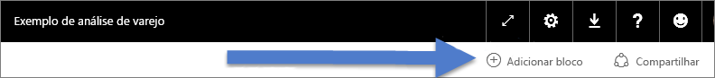
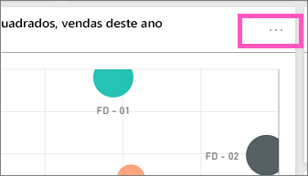
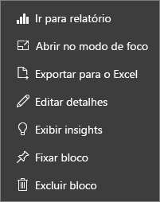

# Blocos de painel no Power BI
Os dashboards e blocos de dashboard são um recurso do serviço do Power BI e não do Power BI Desktop. Os blocos de dashboards não podem ser criados ou fixados no Power BI Mobile, mas [podem ser exibidos e compartilhados](mobile-tiles-in-the-mobile-apps.md). E, no Power BI Mobile, você pode [adicionar imagens ao seu dashboard com seu aplicativo de iPhone](mobile-iphone-app-get-started.md).

## Blocos de painel

Um bloco é um instantâneo dos dados fixados no painel. Um bloco pode ser criado de um relatório, conjunto de dados, painel, da caixa de P e R e do SSRS (SQL Server Reporting Services) e muito mais.  Essa captura de tela mostra vários blocos diferentes fixados a um dashboard.

Além da anexação, blocos autônomos podem ser criados diretamente no dashboard usando a opção [Adicionar bloco](service-dashboard-add-widget.md). Os blocos autônomos incluem: caixas de texto, imagens, vídeos, dados de streaming e conteúdo da Web.

Precisa de ajuda para compreender os blocos de construção que compõem o Power BI?  Veja [Power BI – Conceitos básicos](service-basic-concepts.md).

> [!NOTE]
> Se a visualização original usada para criar o bloco for alterada, o bloco não será alterado.  Por exemplo, se você fixou um gráfico de linhas de um relatório e, em seguida, você alterar o gráfico de linhas para um gráfico de barras, o bloco do dashboard continuará mostrando um gráfico de linhas. Os dados são atualizados, mas o tipo de visualização não.
> 
> 

## Fixe um bloco de...
Há diversas maneiras de adicionar (fixar) um bloco em um dashboard. Os blocos podem ser fixados de:

* [Perguntas e respostas do Power BI](service-dashboard-pin-tile-from-q-and-a.md)
* [um relatório](service-dashboard-pin-tile-from-report.md)
* [outro dashboard](service-pin-tile-to-another-dashboard.md)
* [uma pasta de trabalho do Excel no OneDrive for Business](service-dashboard-pin-tile-from-excel.md)
* [Power BI Publisher para Excel](publisher-for-excel.md)
* [Insights Rápidos](service-insights.md)
* [SSRS](https://msdn.microsoft.com/library/mt604784.aspx)

Além disso, blocos autônomos para imagens, caixas de texto, vídeos, dados de streaming e o conteúdo da Web podem ser criados diretamente no dashboard usando a opção [Adicionar bloco](service-dashboard-add-widget.md).

  

## Interagir com blocos em um painel
### Mover e redimensionar um bloco
Pegue um bloco e [mova-o no dashboard](service-dashboard-edit-tile.md). Passe o mouse e selecione o identificador  para redimensionar o bloco.

### Passe o mouse sobre um bloco para alterar a aparência e o comportamento
1. Passe o mouse sobre o bloco para exibir as reticências.
   
    
2. Selecione as reticências para abrir o menu de ação do bloco.
   
    
   
    A partir daqui, você pode:
   
   * [Abrir o relatório que foi usado para criar este bloco ](service-reports.md)   
   
   * [Abrir a planilha que foi usada para criar este bloco ](service-reports.md)   
     
     * [Exibir no modo de foco ](service-focus-mode.md)   
     * [Exportar os dados usados no bloco](power-bi-visualization-export-data.md) 
     * [Editar o título e o subtítulo, adicionar um hiperlink, exibir o horário da última atualização](service-dashboard-edit-tile.md) 
     * [Executar insights ](service-insights.md) 
     * [Fixar o bloco em outro dashboard](service-pin-tile-to-another-dashboard.md)
       
     * [Remover o bloco](service-dashboard-edit-tile.md)
     
3. Para fechar o menu de ação, selecione uma área em branco na tela.

### Selecionar (clicar em) um bloco
Ao selecionar um bloco, o que ocorre em seguida depende de como o bloco foi criado e se ele tem um [link personalizado](service-dashboard-edit-tile.md). Se ele tiver um link personalizado, a seleção do bloco levará você para esse link. Caso contrário, selecionar o bloco leva você para o relatório, pasta de trabalho do Excel Online, relatório SSRS local ou P & R que foi usada para criar o bloco.

> [!NOTE]
> Os blocos de vídeo criados diretamente no dashboard usando **Adicionar bloco** são a exceção. Selecionar um bloco de vídeo (que foi criado dessa forma) faz com que o vídeo seja reproduzido diretamente no dashboard.   
> 
> 

## Considerações e solução de problemas
* Se o relatório usado para criar a visualização não tiver sido salvo, então selecionar um bloco não produzirá nenhuma ação.
* Se o bloco tiver sido criado de uma pasta de trabalho em Excel Online e se você não tiver permissões pelo menos de Leitura para a pasta de trabalho, selecionar o bloco de dados não abrirá a pasta de trabalho no Excel Online.
* Para os blocos criados diretamente no dashboard usando a opção **Adicionar bloco**, se um hiperlink personalizado tiver sido definido, a seleção do título, subtítulo e/ou bloco abrirá essa URL.  Caso contrário, por padrão, a seleção de um desses blocos criados diretamente no dashboard de uma imagem, um código da Web ou uma caixa de texto não produz nenhuma ação.
* Se você não tiver permissão para o relatório no SSRS, selecionar um bloco criado do SSRS gerará uma página indicando que você não tem acesso (rsAccessDenied).
* Se você não tiver acesso à rede em que se encontra o servidor do SSRS, selecionar um bloco criado do SSRS produzirá uma página que indicará que ele não pode localizar o servidor (HTTP 404). O dispositivo deve ter acesso à rede para o servidor de relatório exibir o relatório.
* Se a visualização original usada para criar o bloco for alterada, o bloco não será alterado.  Por exemplo, se você fixou um gráfico de linhas de um relatório e, em seguida, você alterar o gráfico de linhas para um gráfico de barras, o bloco do painel continuará mostrando um gráfico de linhas. Os dados são atualizados, mas o tipo de visualização não.

## Próximas etapas
[Criar um cartão (bloco de número grande) para seu painel](power-bi-visualization-card.md)

[Dashboards no Power BI](service-dashboards.md)  

[Atualização de dados](refresh-data.md)

[Power BI – conceitos básicos](service-basic-concepts.md)

[Exportar um bloco para o Power Point](http://blogs.msdn.com/b/powerbidev/archive/2015/09/28/integrating-power-bi-tiles-into-office-documents.aspx)

[Fixar itens do Reporting Services em Dashboards do Power BI](https://msdn.microsoft.com/library/mt604784.aspx)

Mais perguntas? [Experimente a Comunidade do Power BI](http://community.powerbi.com/)

