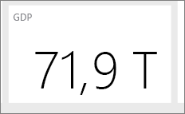

# Dicas para criar um painel bom no Power BI
Agora que você criou um painel e adicionou alguns blocos, pense em como tornar seu painel não apenas bonito, mas também funcional. Em geral, isso significa fazer destacar as informações mais importantes, e torná-las claras e organizadas.

Aqui estão algumas dicas.

> [!TIP]
> Muitos dos princípios de design dos relatórios se aplicam também aos dashboards.  Leia o white paper [Best design principles for reports and visualizations](power-bi-visualization-best-practices.md) (Princípios recomendados para relatórios e visualizações).
>
>

## Assista ao webinar [Dashboard Makeover](https://info.microsoft.com/CO-PowerBI-WBNR-FY16-05May-12-Dashboard-Makeover-Registration.html) (Transformação de dashboards)
Veja Marc Reguera, Gerente-chefe de Programa da Microsoft e especialista em dashboards do Power BI, [conduzir transformações de dashboards](https://info.microsoft.com/CO-PowerBI-WBNR-FY16-05May-12-Dashboard-Makeover-Registration.html).

## Considere seu público-alvo
Quais são as principais métricas que ajudarão a tomar decisões? Como o painel será usado? Quais suposições aprendidas ou culturais podem afetar nas opções de design? Quais informações o público-alvo precisa para ser bem-sucedido?

Tenha em mantel que um painel é uma visão geral, um local para monitorar o estado atual dos dados. O painel é baseado em conjuntos de dados e relatórios subjacentes e pode conter muitos detalhes. Os leitores podem detalhar os relatórios no seu painel. Portanto, não coloque os detalhes no painel, a menos que seja o que seus leitores precisam monitorar.

Onde o painel será exibido? Se ele estiver em um monitor grande, você pode colocar mais conteúdo nele. Se os leitores o visualizarem em seus tablets, menos blocos serão mais legíveis.

## Conte uma história e mantenha-o na tela
Porque os painéis devem mostrar informações importantes em um relance, é melhor ter todas as peças em uma única tela. É possível evitar as barras de rolagem no seu painel?

O painel está muito cheio?  Remova informações que não são essenciais que podem ser facilmente lidas e interpretadas.

## Fazer uso do modo de tela inteira
Exiba o dashboard em [tela inteira](service-fullscreen-mode.md) sem distrações.

## Adicione as informações mais importantes ao seu painel
Se o texto e visualizações no painel são do mesmo tamanho, os leitores terão dificuldade para se concentrar no que é mais importante. Por exemplo, as visualizações de cartão são uma boa maneira de exibir um número importante em destaque:  

Mas não se esqueça de fornecer contexto.  

Leia sobre como [criar um bloco com apenas um número](power-bi-visualization-card.md).

## Colocar as informações mais importantes no canto superior
A maioria das pessoas leem de cima para baixo, colocando o nível mais alto de detalhes na parte superior e mostrando mais detalhes à medida que você move na direção que o público-alvo usa para ler (esquerda para direita, direita para esquerda).

## Usar a visualização da direita para os dados e formatá-la para facilitar a leitura
Evite a variedade de visualização para fins diversos.  As visualizações devem ter uma visão geral e ser fácil de "ler" e interpretar.  Alguns dados e visualizações, uma visualização gráfica simples é suficiente. Mas podem chamar outros dados para uma visualização mais complexa - Certifique-se de fazer uso de títulos e rótulos e outras personalizações para ajudar o leitor.  

* [Escolha visualizações de dados apropriadas](http://blogs.msdn.com/b/microsoft_business_intelligence1/archive/2012/10/08/best-practices-in-data-visualization.aspx). Tenha cuidado ao usar gráficos que distorçam a realidade, ou seja, gráficos em 3D. Tenha em mente que é difícil para o cérebro humano interpretar formas circulares. Gráficos de pizza, gráficos de rosca, medidores e outros tipos de gráfico circular podem parecer muito, mas não são uma prática recomendada de visualização de dados.
* Seja consistente com escalas de gráfico de eixos, ordenação de dimensão do gráfico e também as cores usadas para valores de dimensão em gráficos.
* Certifique-se de codificar os dados quantitativos perfeitamente. Não exceda numerais de três ou quatro ao exibir números. Exibir medidas com um ou dois números à esquerda do ponto decimal e escala de milhares ou milhões, ou seja de 3,4 milhões, não 3.400.000.
* Não misture os níveis de precisão e tempo. Certifique-se de que períodos de tempo são bem compreendidos.  Não é necessário um gráfico que tem o mês passado ao lado de gráficos filtrados de um determinado mês do ano.
* Não misture medidas grandes e pequenas na mesma escala, como em uma linha ou um gráfico de barras.  Por exemplo, uma medida pode ser em milhões e outras medidas em milhares.  Com grande escala, seria difícil ver as diferenças da medida que está em milhares.  Se você precisar combinar, escolha uma visualização que permite o uso de um segundo eixo.
* Não sobrecarregue os gráficos com rótulos de dados que não são necessários. Os valores em gráficos de barras são normalmente bem compreendidos sem exibir o número real.
* Preste atenção em como os [gráficos são classificados](power-bi-report-change-sort.md).  Se você deseja chamar a atenção para o número mais alto ou mais baixo, classifique pela medida.  Se você quiser que as pessoas possam localizar rapidamente uma categoria específica em muitas outras categorias, classifique pelo eixo.  
* Gráficos de pizza são recomendados se eles tiver menos de oito categorias. Porque você não pode comparar valores lado a lado, é mais difícil comparar valores em um gráfico de pizza do que em gráficos de barras e colunas. Os gráficos de pizza pode ser bons para exibir relações de parte de inteiro em vez de comparar as partes. E gráficos de medidor são ótimos para exibir o status atual no contexto de uma meta.

Para obter diretrizes específicas da visualização, veja [Tipos de visualização no Power BI](power-bi-visualization-types-for-reports-and-q-and-a.md).  

## Saiba mais sobre a Melhor Prática do Painel de Design
Para dominar a arte do design do painel excelente, considere a possibilidade de aprendizado princípios básicos de Gestalt de percepção visual e como comunicar claramente as informações acionáveis no contexto. Felizmente, existe uma infinidade de recursos já amplamente disponíveis e espalhados em nossos blogs. Alguns dos nossos livros favoritos incluem:

* *Information Dashboard Design* de Stephen Few  
* *Show Me the Numbers* de Stephen Few  
* *Now You See It* de Stephen Few  
* *Envisioning Information* de Edward Tufte  
* *Advanced Presentations* bay Design de Andrew Abela   

## Próximas etapas
[Criar um painel por meio de um relatório](service-dashboard-create.md)  
[Power BI – conceitos básicos](service-basic-concepts.md)  
Mais perguntas? [Experimente a Comunidade do Power BI](http://community.powerbi.com/)
