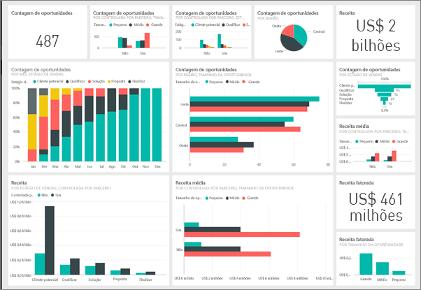
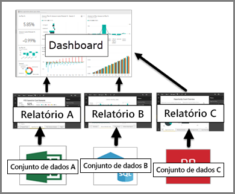

# Dashboards no serviço do Power BI

Um ***dashboard*** do Power BI é uma página única, geralmente chamada de tela, que usa as visualizações para contar uma história. Como ele é limitado a uma página, um dashboard bem projetado contém apenas os elementos mais importantes da história.

As visualizações que você vê no dashboard são chamadas de *blocos* e são *fixadas* ao dashboard de relatórios. Se for novo no Power BI, você poderá obter uma boa base lendo [Conceitos básicos do Power BI](service-basic-concepts.md).

> [!NOTE]
> Os dashboards são um recurso do serviço do Power BI e não estão disponíveis no Power BI Desktop. Os dashboards não podem ser criados em dispositivos móveis, mas podem ser [exibidos e compartilhados](mobile-apps-view-dashboard.md).
> 
> 

As visualizações em um dashboard vêm de relatórios e cada relatório é baseado em um conjunto de dados. Na verdade, uma maneira de pensar em um dashboard é como uma porta de entrada para os relatórios e os conjuntos de dados subjacentes. Selecionar uma visualização leva você para o relatório (e o conjunto de dados) que foi usado para criá-lo.

## Vantagens dos dashboards
Os dashboards são uma ótima maneira de monitorar seus negócios, procurar respostas e ver todas as métricas mais importantes rapidamente. As visualizações em um dashboard podem vir de um conjunto de dados subjacente, ou de muitos, e de um relatório subjacente, ou de muitos. Dashboards combinam dados locais e na nuvem, proporcionando uma exibição consolidada independentemente de onde os dados residem.

Um dashboard não é apenas uma imagem bonita. Ele é altamente interativo e personalizável e os blocos são atualizados à medida que os dados subjacentes são alterados.

## Dashboards versus relatórios
Os [relatórios](service-reports.md) costumam ser confundidos com dashboards, pois eles também são telas preenchidas com visualizações. Mas existem algumas diferenças importantes.

| **Funcionalidade** | **Dashboards** | **Relatórios** |
| --- | --- | --- |
| Páginas |Uma página |Uma ou mais páginas |
| Fontes de dados |Um ou mais relatórios e um ou mais conjuntos de dados por dashboard |Um único conjunto de dados por relatório |
| Disponível no Power BI Desktop |Não |Sim, pode criar e exibir relatórios na área de trabalho |
| Fixação |Pode fixar visualizações existentes (blocos) somente do dashboard atual a outros dashboards |Pode fixar visualizações (como blocos) a qualquer um dos seus dashboards. Pode fixar páginas de relatório inteiras a qualquer um dos seus dashboards. |
| Assinatura |Não é possível assinar um dashboard |É possível assinar páginas de relatório |
| Filtragem |Não é possível filtrar ou fatiar |Diferentes maneiras de filtrar, realçar e fatiar |
| Definir alertas |Pode criar alertas para enviar por email quando determinadas condições forem atendidas |Não |
| Recurso |Pode definir um dashboard como o dashboard "em destaque" |Não é possível criar um relatório em destaque |
| Consultas de linguagem natural |Disponível no dashboard |Não está disponível nos relatórios |
| Pode alterar o tipo de visualização |Não. Na verdade, se o proprietário de um relatório alterar o tipo de visualização do relatório, a visualização fixada no dashboard não será atualizada |Sim |
| Pode ver campos e tabelas do conjunto de dados subjacentes |Não. Pode exportar dados, mas não consegue ver tabelas e campos no dashboard de controle em si. |Sim. Pode ver as tabelas de conjunto de dados e os campos e valores. |
| Pode criar visualizações |Limitado a adicionar widgets ao dashboard usando "Adicionar bloco" |Pode criar muitos tipos diferentes de elementos visuais, adicionar elementos visuais personalizados, editar elementos visuais e muito mais com permissões de edição |
| Personalização |Pode fazer várias coisas com as visualizações (blocos), como mover e organizar, redimensionar, adicionar links, renomear, excluir e exibir a tela inteira. Mas os dados e as visualizações em si são somente leitura. |No modo de exibição de Leitura, você pode publicar, inserir, filtrar, exportar, baixar como .pbix, exibir conteúdo relacionado, gerar códigos QR, analisar no Excel e muito mais.  No modo de exibição de Edição, você pode fazer tudo o que foi mencionado até o momento e muito mais. |

## Criadores de dashboard e consumidores de dashboard
Dependendo da função, você pode ser alguém que cria dashboards para seu próprio uso ou para compartilhar com colegas. Você deseja saber como criar e compartilhar dashboards. Ou pode ser alguém que receba os dashboards de outras pessoas. Você deseja saber como entender e interagir com o dashboard.

Aqui estão alguns tópicos, por função, para ajudá-lo a começar.

O Power BI Pro é necessário para compartilhar dashboards e para exibir dashboards compartilhados.

### Se você for criar e compartilhar dashboards
* Use um dos nossos exemplos para [criar um dashboard em um relatório](service-dashboard-create.md).
* Saiba mais sobre os [blocos de dashboard](service-dashboard-tiles.md) e todas as diferentes maneiras para fixá-los em um dashboard.
* Ajude seus consumidores de dashboard criando dashboards que [funcionem bem com consultas de linguagem natural de P e R](service-prepare-data-for-q-and-a.md) e [Insights rápidos](service-insights-optimize.md).
* Descubra todas as diferentes maneiras que você pode [compartilhar um dashboard com colegas](service-how-to-collaborate-distribute-dashboards-reports.md).

### Se você for receber e consumir dashboards
* Fique à vontade com os dashboards fazendo um tour em um dos nossos [dashboards de exemplo](sample-tutorial-connect-to-the-samples.md).
* Saiba mais sobre [blocos de dashboard](service-dashboard-tiles.md) e o que acontece quando você seleciona um.
* Não gosta da aparência de um dashboard?  Você pode [redimensionar, mover e renomear os blocos](service-dashboard-edit-tile.md).
* Deseja acompanhar um bloco de dashboard individual e receber um email quando ele alcançar um certo limite? [Criar alertas em blocos](service-set-data-alerts.md).
* Divirta-se fazendo perguntas ao seu dashboard. Aprenda como usar o [Power BI Q&A](power-bi-tutorial-q-and-a.md) para fazer perguntas sobre os dados e receba uma resposta na forma de uma visualização.

> [!TIP]
> Se você não encontrar o que está procurando aqui, use o Sumário à esquerda.
> 
> 

## Próximas etapas
[Introdução ao Power BI](service-get-started.md)  
[Power BI – conceitos básicos](service-basic-concepts.md)  
[Power BI Premium – o que é?](service-premium.md)  

Mais perguntas? [Experimente perguntar à Comunidade do Power BI](http://community.powerbi.com/)

