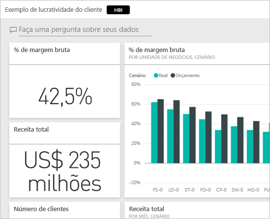
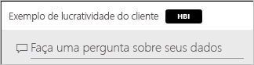
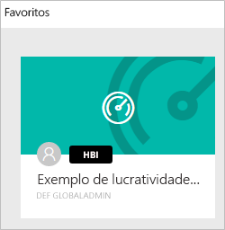
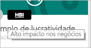
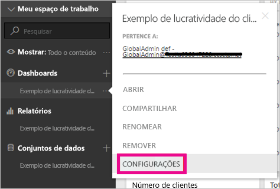
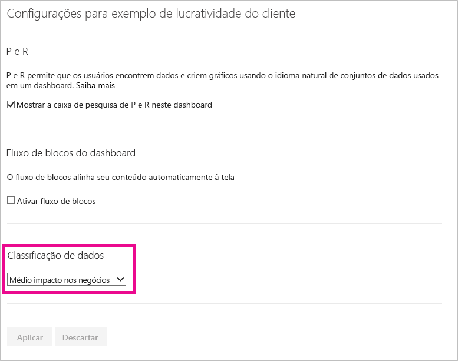
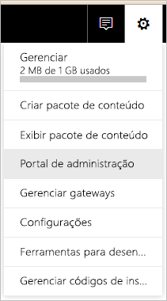
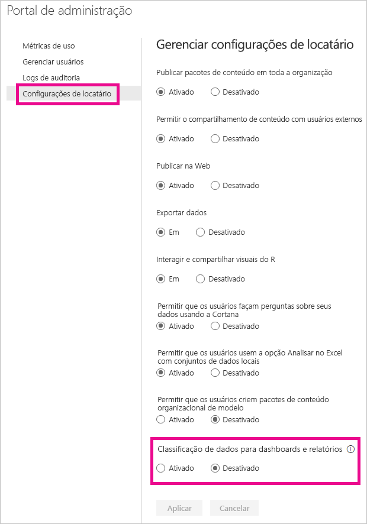
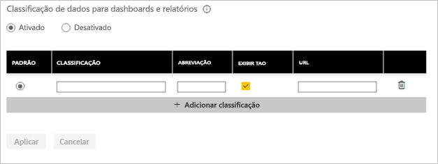
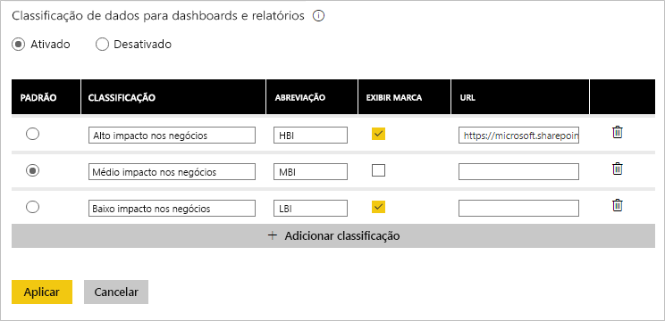

# Classificação de dados no dashboard
Cada dashboard é diferente. Dependendo da fonte de dados à qual se conectar, provavelmente constatará que você e os colegas com os quais compartilha precisarão adotar medidas diferentes dependendo da confidencialidade dos dados. Alguns dashboards nunca devem ser compartilhados com pessoas de fora da sua empresa ou impressos, enquanto outros podem ser compartilhados livremente. Utilizando a classificação de dados no dashboard, você poderá conscientizar as pessoas que estão visualizando seus dashboards em relação ao nível de segurança que deve ser usado. É possível marcar seus dashboards com classificações definidas pelo departamento de TI da sua empresa; portanto, qualquer pessoa que estiver visualizando o conteúdo terá o mesmo nível de compreensão sobre a confidencialidade dos dados.

## Marcas de classificação de dados
As marcas de classificação de dados são exibidas ao lado do nome do dashboard, informando a todos que estiverem visualizando qual nível de segurança deve ser aplicado ao dashboard e aos dados que ele contém.

Elas também aparecerão ao lado do bloco do dashboard na sua lista de Favoritos.

Ao passar o mouse sobre a marca, você verá o nome completo da classificação.

Os administradores também podem definir uma URL para uma marca a fim de fornecer informações adicionais.

> [!NOTE]
> Dependendo das configurações de classificação definidas pelo administrador, alguns tipos de classificação poderão não aparecer como uma marca no dashboard. Se você for um proprietário do dashboard, sempre poderá verificar o tipo de classificação do dashboard nas configurações do dashboard.
> 
> 

## Configuração de classificação de um dashboard
Se a classificação de dados estiver ativada para sua empresa, todos os dashboards começarão com um tipo de classificação padrão; porém, como proprietário de um dashboard, você poderá alterar a classificação para corresponder ao nível de segurança dos seus dashboards.

Para alterar o tipo de classificação, faça o seguinte:

1. Acesse as configurações do dashboard selecionando as **reticências** ao lado do nome do dashboard e selecione **Configurações**.
   
    
2. Nas configurações do dashboard, você poderá ver a classificação atual para seu dashboard e usar a lista suspensa para alterar o tipo de classificação.
   
    
3. Selecione **Aplicar** quando terminar.

Depois de aplicar a alteração, qualquer pessoa com quem você compartilhou verá a atualização na próxima vez que recarregar o dashboard.

## Trabalhando com marcas de classificação de dados como administrador
A classificação de dados é configurada pelo administrador global para sua organização. Para ativar a classificação de dados, faça o seguinte:

1. Selecione a engrenagem de Configurações e selecione **Portal de Administração**.
   
    
2. Mude a **Classificação de dados para dashboards e relatórios** para *Ligado* dentro da guia **Configurações do locatário**.
   
    

Quando estiver ativada, você verá um formulário para criar várias classificações na sua organização.

Cada classificação tem um **nome** e uma **abreviação** que aparecerão no dashboard. Para cada classificação, você pode decidir se a marca abreviada será exibida no dashboard ou não selecionando **Mostrar marca**. Se decidir não mostrar o tipo de classificação no dashboard, o proprietário ainda será capaz de ver o tipo verificando as configurações do dashboard. Além disso, é possível adicionar uma **URL** que contém mais informações sobre as diretrizes de classificação e os requisitos de uso da sua organização.  

A última coisa que você precisa decidir é qual tipo de classificação será o padrão.  

Depois de preencher o formulário com seus tipos de classificação, selecione **Aplicar** para salvar as alterações.

Neste ponto, a classificação padrão será atribuída a todos os dashboards; os proprietários dos dashboards já poderão atualizar o tipo de classificação para a opção adequada para seu conteúdo. Você pode retornar aqui no futuro para adicionar ou remover tipos de classificação ou para alterar o padrão.  

> [!NOTE]
> Há algumas coisas importantes a serem lembradas quando você voltar para fazer alterações:
> 
> * Se você desativar a classificação de dados, nenhuma das marcas será lembrada. Você precisará começar novamente se decidir reativá-la mais tarde.  
> * Se você remover um tipo de classificação, o padrão será atribuído novamente a todos os dashboards cujo tipo de classificação foi removido, até o proprietário defini-lo outra vez.  
> * Se você alterar o padrão, todos os dashboards aos quais um tipo de classificação ainda não foi atribuído pelo proprietário serão alterados para o novo padrão.
> 
> 

