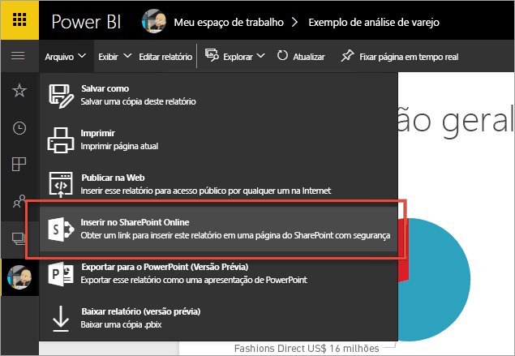
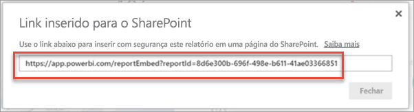
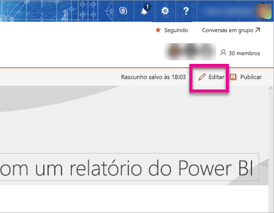
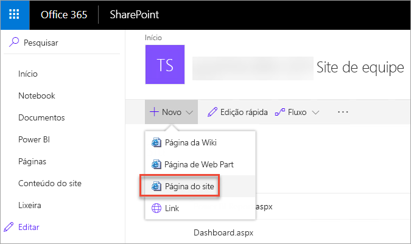
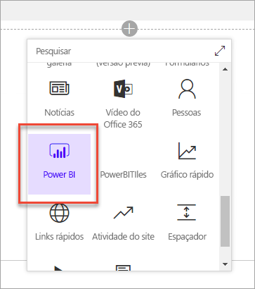
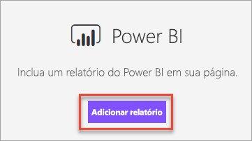
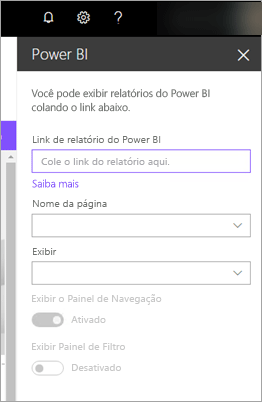
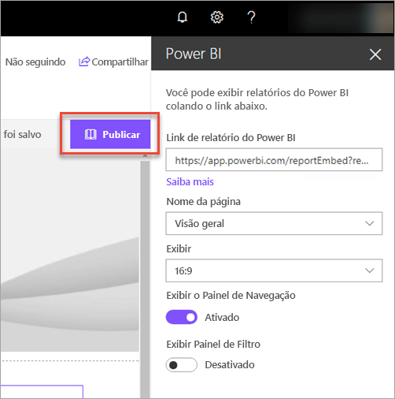
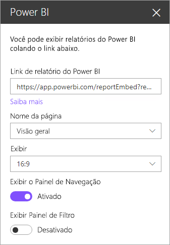
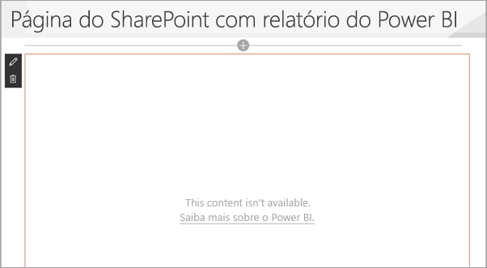

# Inserir com Web Part de Relatório no SharePoint Online
Com a nova Web Part de Relatório do Power BI para o SharePoint Online, você pode facilmente inserir relatórios interativos do Power BI às páginas do SharePoint Online.

Ao usar a nova opção **Inserir ao SharePoint Online**, os relatórios incorporados são totalmente protegidos para que você possa facilmente criar portais internos seguros.

## Requisitos
Há alguns requisitos para que os relatórios da opção **Inserir ao SharePoint Online** funcionem.

* A web part do Power BI (Prévia) para o SharePoint Online requer [Páginas modernas](https://support.office.com/article/Allow-or-prevent-creation-of-modern-site-pages-by-end-users-c41d9cc8-c5c0-46b4-8b87-ea66abc6e63b).

## Insira seu relatório
Para inserir o seu relatório ao SharePoint Online, primeiro você precisa obter a URL do relatório e, em seguida, usar essa URL com a nova web part do Power BI (visualização) no SharePoint Online.

### Obter a URL do relatório
1. Exibir o relatório no serviço do Power BI.
2. Selecionar o item de menu **Arquivo**.
3. Selecionar **Inserir ao SharePoint Online (visualização)**.
   
    
4. Copiar a URL da caixa de diálogo.
   
    
   
   > [!NOTE]
   > Você também pode usar a URL que é exibida na barra de endereços do navegador da Web ao visualizar um relatório. Essa URL conterá a página do relatório que está sendo exibido. Você precisará remover a seção de relatório da URL se quiser usar uma página diferente.
   > 
   > 

### Adicionar o relatório do Power BI a uma página do SharePoint Online
1. Abra a página desejada no SharePoint Online e selecione **Editar**.
   
    
   
    Ou crie uma nova página de site selecionando **+ novo** dentro do SharePoint Online.
   
    
2. Selecione **+** e selecione a web part do **Power BI (visualização)**.
   
    
3. Selecione **Adicionar relatório**.
   
    
4. Cole a URL do relatório no painel de propriedade. Esta é a URL que você copiou nas etapas acima. O relatório será carregado automaticamente.
   
    
5. Selecione **Publicar** para tornar a alteração visível para os usuários do SharePoint Online.
   
    

## Conceder acesso aos relatórios
Incorporar um relatório ao SharePoint Online automaticamente não dá aos usuários permissão para exibir o relatório. As permissões para exibir o relatório são definidas dentro do serviço do Power BI.

> [!IMPORTANT]
> Certifique-se de examinar quem pode ver o relatório dentro do serviço do Power BI e de conceder acesso aos que não aparecem na lista.
> 
> 

Há duas maneiras de conceder acesso ao relatório dentro do serviço do Power BI. Se você estiver usando um grupo do Office 365 para criar seu site de equipe do SharePoint Online, liste o usuário como um membro do espaço de trabalho de aplicativo no serviço do Power BI. Isso assegurará que os usuários podem exibir o conteúdo desse grupo. Para obter mais informações, consulte [Criar e distribuir um aplicativo no Power BI](service-create-distribute-apps.md).

Como alternativa, você pode conceder acesso ao seu relatório aos usuários fazendo o seguinte.

1. Adicione um bloco de seu relatório a um painel.
2. Compartilhe o painel com os usuários que precisam acessar o relatório. Para obter mais informações, consulte [Compartilhar um painel com seus colegas e com outras pessoas](service-share-dashboards.md).
   
    Se você compartilhar um dashboard para um grupo de segurança, os usuários deverão entrar no Power BI pelo menos uma vez para que o usuário tenha acesso ao relatório.

## Permitir que os usuários gratuitos acessem os relatórios
Os usuários gratuitos podem exibir relatórios que são inseridos com a web part do Power BI para o SharePoint Online. Você fornece acesso para os usuários gratuitos da mesma maneira que faria com usuários Pro, conforme descrito em [Conceder acesso a relatórios](#granting-access-to-reports) acima. O espaço de trabalho, no qual o relatório está localizado, também deve ser auxiliado pela capacidade do Power BI Premium. 

Por exemplo, se você tiver um relatório em um espaço de trabalho do aplicativo, você precisará atribuir o espaço de trabalho do aplicativo para uma capacidade do Power BI Premium. Você também precisa adicionar o usuário gratuito à lista de membros desse espaço de trabalho do aplicativo.

## Configurações de Web Part
Abaixo, temos uma descrição das configurações que podem ser ajustadas para a web part do Power BI para o SharePoint Online.

| Propriedade | Descrição |
| --- | --- |
| Nome da página |Define a página padrão que é exibida pela web part. Selecionar um valor na lista suspensa. Se nenhuma página for exibida, o relatório terá uma página ou a URL que você colou conterá um nome de página. Remover a seção de relatório da URL para selecionar uma página específica. |
| Exibição |Opção para ajustar como o relatório é ajustado dentro da página do SharePoint Online. |
| Exibir o Painel de Navegação |Exibe ou oculta o painel de navegação da página. |
| Exibir Painel de Filtro |Exibe ou oculta o painel de filtro. |

## Autenticação multifator
Se seu ambiente do Power BI requer que a sessão seja iniciada usando a autenticação multifator, pode ser que você precise entrar com um dispositivo de segurança para verificar sua identidade. Isso ocorrerá se você não entrou no SharePoint Online usando a autenticação multifator, mas seu ambiente Power BI requer uma conta validada por um dispositivo de segurança.

> [!NOTE]
> O Azure Active Directory 2.0 ainda não dá suporte para autenticação multifator. Os usuários receberão uma mensagem indicando *erro*. Se o usuário entrar novamente no SharePoint Online usando seu dispositivo de segurança, o relatório poderá ser exibido.
> 
> 

## Relatórios que não são carregados
O relatório pode não ser carregado dentro da web part do Power BI (visualização) e a seguinte mensagem pode ser exibida.

*Este conteúdo não está disponível.*

Há duas razões comuns para essa mensagem.

1. Você não tem acesso a este relatório.
2. O relatório foi excluído.

Entre em contato com o proprietário da página do SharePoint Online para ajudá-lo a resolver o problema.

## Limitações e problemas conhecidos
* A web part do Power BI (visualização) para o SharePoint Online não oferece suporte a leitores de tela ou navegação pelo teclado.
* **Erro: "Ocorreu um erro, tente sair, entrar outra vez e visitar esta página novamente. ID de correlação: indefinida, status de resposta http: 400, código de erro do servidor 10001, mensagem: token de atualização inexistente"**
  
  Se você receber esse erro, tente um destes procedimentos.
  
  1. Saia do SharePoint e entre novamente. Certifique-se de fechar todas as janelas do navegador antes de entrar novamente.
  2. Se sua conta de usuário exigir a Autenticação Multifator (MFA), entre no SharePoint usando o dispositivo de Autenticação Multifator (aplicativo de telefone, cartão inteligente, etc.)
* Ao adicionar a web part do Power BI (prévia), será solicitado que você entre, mas não é possível fazer isso. Nessa situação, você vê uma mensagem de erro semelhante a uma das seguintes opções:
  
  * *Você precisa entrar novamente. Depois de entrar, traremos você de volta para esta página.*
  * *Ocorreu um erro, tente sair, entrar outra vez e visitar esta página novamente.*
  
  Para resolver esse problema, verifique se o seu locatário está definido como *primeiro lançamento para todos*, conforme descrito na seção **requisitos** deste artigo. Para habilitar a Single Sign On (SSO), a web part do Power BI se baseia em *APIs de autenticação* que são fornecidas pelo SharePoint, disponíveis somente quando a opção *primeiro lançamento para todos* está selecionada.
* O Power BI não dá suporte aos mesmos idiomas localizados que o SharePoint Online. Como resultado, você não verá a localização correta no relatório inserido.
* Você pode encontrar problemas se usar o Internet Explorer 10. Você pode examinar o [suporte dos navegadores para o Power BI](service-browser-support.md) e para o [Office 365](https://products.office.com/office-system-requirements#Browsers-section).

## Próximas etapas
[Configurar as opções Standard ou de primeiro lançamento do Office 365](https://support.office.com/article/Set-up-the-Standard-or-First-Release-options-in-Office-365-3B3ADFA4-1777-4FF0-B606-FB8732101F47)  
[Permitir ou impedir a criação de páginas de sites modernas pelos usuários finais](https://support.office.com/article/Allow-or-prevent-creation-of-modern-site-pages-by-end-users-c41d9cc8-c5c0-46b4-8b87-ea66abc6e63b)  
[Criar e distribuir um aplicativo no Power BI](service-create-distribute-apps.md)  
[Compartilhar um painel com seus colegas e com outras pessoas](service-share-dashboards.md)  
[Power BI Premium – o que é?](service-premium.md)  

Mais perguntas? [Experimente perguntar à Comunidade do Power BI](http://community.powerbi.com/)

