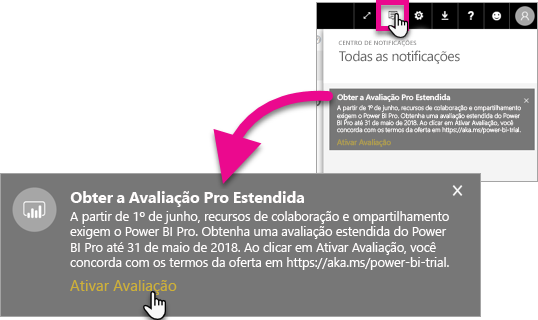
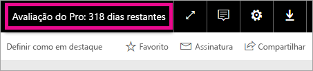

# Ativação da Avaliação Pro Estendida
A partir de 1º de junho de 2017, todos os usuários qualificados poderão aceitar a Avaliação Pro Estendida do serviço do Power BI.

<iframe width="640" height="360" src="https://www.youtube.com/embed/tPsNoPyY9aA?showinfo=0" frameborder="0" allowfullscreen></iframe>

Como parte do [Comunicado sobre o Power BI Premium de 3 de maio de 2017](https://powerbi.microsoft.com/blog/microsoft-accelerates-modern-bi-adoption-with-power-bi-premium/), a Microsoft anunciou alterações no serviço do Power BI gratuito que entram em vigor em 1º de junho de 2017. Essas alterações incluem a extensão do acesso a todas as fontes de dados, maiores limites de armazenamento no espaço de trabalho e maiores taxas de atualização e streaming para o serviço gratuito, tornando-o equivalente ao Power BI Pro.

Foi anunciado também que esses recursos de compartilhamento e colaboração serão exclusivos para usuários do Power BI Pro, incluindo o compartilhamento de dashboard ponto a ponto, espaços de trabalho de grupo (agora chamados de espaços de trabalho do aplicativo), exportar para o PowerPoint e analisar no Excel com aplicativos do Power BI. Exportar para CSV/Excel e PowerPoint foram identificados na comunicação de 3 de maio como uma capacidade limitada ao Power BI Pro, mas, após receber comentários da comunidade ampla de usuários, a estratégia evoluiu para disponibilizar a capacidade também para os usuários do serviço gratuito.

A partir de 1º de junho de 2017, usuários existentes do serviço gratuito que estiveram ativos no último ano (no dia 2 de maio de 2017 ou antes dele) estarão qualificados para uma avaliação gratuita estendida de 12 meses do Power BI Pro. A oferta permitirá que os usuários aproveitem os recursos completos do Power BI Pro durante o próximo ano como um sinal de reconhecimento para a comunidade e para fornecer aos usuários tempo para se ajustar às alterações.

Em 1º de junho de 2017, os usuários qualificados receberão uma notificação quando entrarem no serviço, informando que as alterações entraram em vigor com uma solicitação para se inscrever para a oferta de avaliação estendida do Power BI Pro. O administrador de TI do usuário não controla as notificações no produto, nem tem a capacidade de fazer o registro para a avaliação estendida do Power BI Pro em nome do usuário. Cada usuário qualificado precisará agir individualmente para concluir esse processo.

Os usuários podem optar por se registrar para a oferta a qualquer momento durante o período de 12 meses, mas a versão de Avaliação Pro Estendida será encerrada para todos os usuários em 31 de maio de 2018, independentemente de quando eles aceitarem a oferta. Então, os usuários terão a opção de comprar o Power BI Pro ou de serem convertidos para a versão gratuita do Power BI, sem os recursos de colaboração e compartilhamento, se optarem por não agir e comprar o Power BI Pro.

Nenhuma alteração será feita no Power BI Pro. Esses usuários não serão afetados e não receberão notificações ao entrar no serviço em 1º de junho de 2017 ou depois disso. Os usuários que recusarem a oferta de avaliação estendida do Power BI Pro ou não estiverem qualificados para a oferta continuarão usando a versão gratuita do Power BI, sem os recursos de colaboração e compartilhamento. Eles podem se registrar a qualquer momento para uma avaliação padrão de 60 dias do Power BI Pro visitando o [site](https://powerbi.microsoft.com/get-started/) do Power BI.

## Qualificação para a Avaliação Pro Estendida
Sua conta deve atender aos seguintes requisitos para se qualificar para a oferta de Avaliação Pro Estendida.

* Usuários do Power BI gratuito ativos entre 3 de maio de 2016 e 2 de maio de 2017 estão qualificados para uma Avaliação Pro Estendida.
* Usuários que usaram anteriormente ou que estão usando no momento a *avaliação Pro de 60 dias no produto* ainda estão qualificados para a Avaliação Pro Estendida.

> [!NOTE]
> Usuários que têm licenças atribuídas do Power BI Pro ou assinaturas de avaliação do Power BI Pro no Office 365 estão excluídos desta oferta.
> 
> 

## Como ativar
Há duas maneiras de ativar a Avaliação Pro Estendida. A primeira é quando você entra no Power BI. Se tiver ignorado essa opção, você também verá uma opção dentro da área de notificação.

> [!NOTE]
> As comunicações no produto não são controladas pelo administrador e serão enviadas aos usuários qualificados.
> 
> 

### Experiência na entrada
Quando entrar no serviço do Power BI, se estiver qualificado, você receberá um aviso pop-up. Selecionar **Ativar Avaliação** dará início à Avaliação Pro Estendida. Nenhuma ação adicional será necessária.

Você terá, então, a capacidade de acessar todos os relatórios e dashboards compartilhados existentes enquanto durar a avaliação.

Se você selecionar **Agora Não**, a Avaliação Pro Estendida poderá ser ativada a qualquer momento até o término do período de avaliação em 31 de maio de 2018.

### Ativação em uma data posterior
Se você tiver ignorado o pop-up selecionando **Agora Não**, a Avaliação Pro Estendida poderá ser ativada a qualquer momento até o término do período de avaliação em 31 de maio de 2018. Isso pode ser feito no **Centro de Notificações**.

No Centro de Notificações, você verá uma notificação sobre a Avaliação Pro Estendida. A notificação ficará disponível até que o usuário a ignore.

Dentro da notificação, você pode selecionar **Ativar Avaliação** para iniciar a avaliação. Nenhuma ação adicional será necessária.

Você terá, então, a capacidade de acessar todos os relatórios e dashboards compartilhados existentes enquanto durar a avaliação.

## Após a ativação
Após a ativação, você verá quantos dias restam de sua avaliação no canto superior direito.

Você pode examinar os termos entre os [Termos e condições da oferta de Avaliação Pro Estendida](https://aka.ms/power-bi-trial). A Avaliação Pro Estendida ficará disponível até 31 de maio de 2018 para todos os usuários qualificados.

## Perguntas frequentes
**O que acontece com novos usuários que se inscreveram após 3 de maio de 2017?**

Usuários que se inscreveram no Power BI gratuito no dia 3 de maio de 2017 ou posteriormente não se qualificam para a Avaliação Pro Estendida. No entanto, eles se qualificam para a Avaliação Pro padrão de 60 dias.

**Como posso saber quem na minha organização está qualificado para a Avaliação Pro Estendida?**

Embora não haja uma maneira direta de descobrir isso, você pode exibir o relatório Aplicativos Integrados do Azure Active Directory para o Power BI para ver quem foram os usuários ativos em sua organização nos últimos 30 dias. Isso pode lhe dar uma ideia de quem está qualificado. Para obter mais informações, consulte [Encontrar usuários do Power BI que se conectaram](service-admin-access-usage.md).

Esses usuários ativos no período de qualificação e que usam licenças gratuitas receberão a notificação pop-up. 

> [!NOTE]
> O relatório do Azure AD não indica se um usuário usa a licença gratuita ou Pro no Power BI. Ele informa apenas quais usuários se conectaram ao Power BI e quando eles fizeram logon. Se um usuário estiver listado nesse relatório, isso não significa necessariamente que ele está qualificado para a Avaliação Pro Estendida.
> 
> 

**Administradores podem impedir um usuário de ativar a Avaliação Pro Estendida?**

Não. Os administradores não têm como impedir que os usuários ativem a Avaliação Pro Estendida ou a avaliação de 60 dias no serviço do Power BI Pro.

## Próximas etapas
[Termos e condições da oferta de Avaliação Pro Estendida](https://aka.ms/power-bi-trial)  
[Contrato de Serviço do Power BI para usuários individuais](https://powerbi.microsoft.com/terms-of-service/)  
[Comunicado do Power BI Premium](https://aka.ms/pbipremium-announcement)  
[Encontrar usuários do Power BI que entraram](service-admin-access-usage.md)

Mais perguntas? [Experimente perguntar à Comunidade do Power BI](https://community.powerbi.com/)

