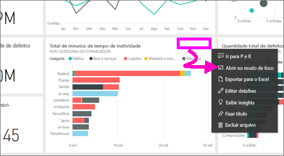
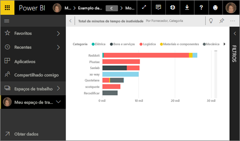
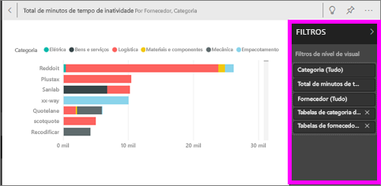
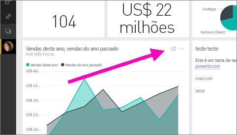
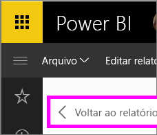

# Exibir um bloco de painéis ou visual do relatório no modo de foco
<iframe width="560" height="315" src="https://www.youtube.com/embed/dtdLul6otYE" frameborder="0" allowfullscreen></iframe>

## O que é o modo de foco?
O modo ***Foco*** permite expandir (destacar) um bloco do dashboard ou um visual do relatório para ver mais detalhes.  No modo de foco, é possível exibir e modificar os filtros que foram aplicados quando esse visual foi criado.  

> [!NOTE]
> Foco é diferente do [modo de tela inteira](service-fullscreen-mode.md).
> 
## Modo de foco para blocos de painéis
1. Passe o mouse sobre a visualização de bloco, selecione as reticências (...) e escolha **Abrir no modo de foco** 

    .
   
2. O bloco é aberto e ocupa toda a tela do relatório. 

   

3. Expanda o painel Filtros para ver todos os filtros aplicados a este visual.
   
   

4. Explore mais modificando os filtros e, se descobrir algo interessante, fixe o visual em um dashboard.

5. Saia do modo de foco e retorne ao painel selecionando **< Sair do modo de foco** (no canto superior esquerdo do visual).
   
        

## Modo de foco para visualizações de relatório

1. Passe o mouse sobre a visualização de relatório e selecione o ícone do **modo de foco** .  
   
   
2. A visualização é aberta e preenche a tela inteira. 

   
   
3. Expanda o painel Filtros para ver todos os filtros aplicados a este visual.
   
   
4. Explore mais modificando os filtros e, se descobrir algo interessante, fixe o visual em um dashboard.   
5. Saia do modo de foco e retorne ao painel selecionando **Voltar ao relatório** (no canto superior esquerdo do visual). 
   
      

## Ir do modo de foco para o modo de tela inteira
No modo de foco, o bloco ou o visual poderá ser [exibido em tela inteira (Modo de TV).](service-fullscreen-mode.md) O modo de tela inteira é exibido sem a distração de menus e de botões de navegação.

## Considerações e solução de problemas
* Ao usar o modo de foco com uma visualização em um relatório, será possível exibir e modificar todos os filtros: de nível de visual, de nível de página e de nível de relatório.    
* Ao usar o modo de foco com uma visualização em um painel, será possível exibir e modificar apenas o filtro de nível de visual.

Mais perguntas? [Experimente a Comunidade do Power BI](http://community.powerbi.com/)

