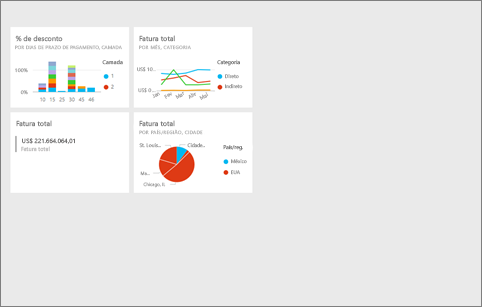
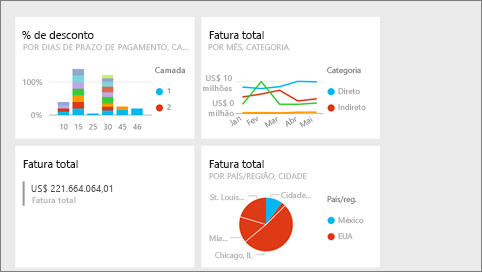
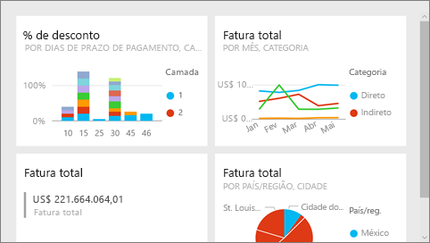

# Modo de tela inteira no serviço do Power BI
## O que é o modo de tela inteira?

Exiba seu conteúdo do Power BI (painéis, páginas de relatório, blocos e visualizações) sem a distração de menus e de barras de navegação.  Você obtém uma visão completa e não adulterada do seu conteúdo instantaneamente, o tempo todo. Isso, às vezes, é chamado de Modo de TV. A funcionalidade disponível no modo de tela inteira varia de acordo com o conteúdo. 

Se você estiver usando o Power BI móvel, a [tela inteira estará disponível para aplicativos móveis do Windows 10](mobile-windows-10-app-presentation-mode.md). O Power BI Desktop não tem um modo de tela inteira para relatórios ou visualizações, mas tem Ajustar página para [exibição de relações](desktop-report-view.md) e [modo de foco para visuais do relatório](service-focus-mode.md).

 

Alguns usos para o modo de tela inteira são:

* apresentar seu dashboard, bloco, visual ou relatório em uma reunião ou conferência
* exibi-lo em um escritório, em uma tela grande ou um projetor dedicado
* exibi-lo em uma tela pequena
* examinar no modo de bloqueio – você pode tocar na tela ou focalizar os blocos sem abrir o relatório ou dashboard subjacente

> **OBSERVAÇÃO**: o modo de tela inteira é diferente do [modo de foco (pop-out)](service-focus-mode.md).
> 
> 

Veja a Amanda abrir e navegar em seu painel no modo de tela inteira e, em seguida, aplicar alguns parâmetros de URL para controlar a exibição padrão. Em seguida, siga as instruções passo a passo abaixo do vídeo para testá-la por conta própria.

<iframe width="560" height="315" src="https://www.youtube.com/embed/c31gZkyvC54" frameborder="0" allowfullscreen></iframe>

## Painéis e páginas de relatório em modo de tela inteira
1. Na barra de menus do Power BI acima do painel ou do relatório, selecione o ícone de **Tela inteira** . Sua tela de dashboard ou página de relatório preenche toda a tela. O exemplo abaixo é um dashboard.
   
      
2. No modo de tela inteira, há várias opções de menu.  Para abrir o menu, basta mover seu mouse ou cursor. 
   
     Menu de dashboards    
         
   
     Menu de páginas de relatório    
        
   
        
    Use o botão **Voltar** para navegar para a página anterior no navegador. Se a página anterior era uma página do Power BI, ela também será exibida no modo de tela inteira.  O modo de tela inteira será mantido até você sair.
   
        
    Use esse botão para imprimir o painel ou a página de relatório em modo de tela inteira. 
   
        
    Use o botão **Ajustar à Tela** para exibir o dashboard no maior tamanho possível sem usar barras de rolagem.     
   
    
   
           
    Às vezes, você não liga para as barras de rolagem, mas quer que o dashboard preencha toda a largura do espaço disponível. Selecione o botão **Ajustar à largura**.    
   
    
   
           
    Em relatórios em tela inteira, use essas setas para se mover entre as páginas do relatório.    
3. Para sair do modo de tela inteira, selecione o ícone **Sair da tela inteira**.
   
      

## Visualizações e blocos de painéis no modo de tela inteira
1. Para exibir blocos de painéis e visualizações de relatório no modo de tela inteira, é necessário iniciar com o bloco ou visualização já no [modo de foco](service-focus-mode.md). 
   
    
2. Em seguida, selecione o ícone de Tela inteira   para esse bloco ou visual. O bloco ou visual será exibido em tela inteira sem menus ou barras de navegação.
   
    

## Próximas etapas
[Dashboards no Power BI](service-dashboards.md)  
[Modo de foco](service-focus-mode.md)    

Mais perguntas? [Experimente a Comunidade do Power BI](http://community.powerbi.com/)

