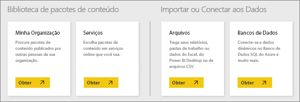
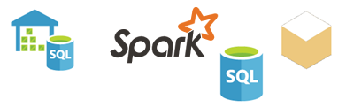

# Fontes de dados do serviço do Power BI
Dados são o coração do Power BI. Sempre que você está explorando dados, criando gráficos e dashboards, fazendo perguntas com P e R, todas essas visualizações e respostas que você vê estão, na verdade, extraindo dados subjacentes de um conjunto de dados. Mas de onde vem esse conjunto de dados? Bem, de uma fonte de dados.

Neste artigo, vamos abordar os diferentes tipos de fontes de dados aos quais você pode se conectar usando o serviço do Power BI. Tenha em mente que há muitos outros tipos de fontes de dados dos quais você pode obter dados. Mas eles podem exigir que você primeiro use o Power BI Desktop ou a consulta avançada de dados e recursos de modelagem do Excel. Veremos mais detalhes posteriormente. Por enquanto, vamos examinar os diferentes tipos de fontes de dados aos quais você pode se conectar diretamente do site do serviço do Power BI.

Você pode obter dados de qualquer uma dessas fontes de dados no Power BI clicando em **Meu Espaço de Trabalho** > **Obter Dados**.

## Arquivos

**Excel** (.xlsx, xlxm) � o Excel é exclusivo no sentido de que uma pasta de trabalho pode conter dados que você mesmo digitou em planilhas e você também pode consultar e carregar dados de fontes de dados externas usando o Power Query (Obter e Transformar no Excel 2016) ou o Power Pivot. Você pode importar dados que estão em tabelas em planilhas (os dados *devem* estar em uma tabela) ou importar dados que são carregados para um modelo de dados. Para saber mais, veja [Obter dados do Excel](service-get-data-from-files.md).

**Power BI Desktop** (.pbix) – É possível usar o Power BI Desktop para consultar e carregar dados de fontes de dados externas, estender o modelo de dados com medidas e relações, bem como criar relatórios. Você pode importar seu arquivo do Power BI Desktop para o site do Power BI. O Power BI Desktop é melhor para usuários mais avançados que tenham uma boa compreensão dos conceitos de fontes de dados, consulta e transformação de dados e modelagem de dados. Para saber mais, veja [Conectar-se a dados no Power BI Desktop](desktop-connect-to-data.md).

**Valores Separados por Vírgula** (.csv) – São arquivos de texto simples com linhas de dados. Cada linha pode conter um ou mais valores, cada um separado por uma vírgula. Por exemplo, um .csv que contém dados de nome e endereço pode ter um número de linhas em que cada linha tem valores para nome, sobrenome, endereço, cidade, estado e assim por diante. Você não pode importar dados para um arquivo .csv, mas muitos aplicativos, como o Excel, podem salvar dados de tabela simples como um arquivo .csv.

Para outros tipos de arquivo, como tabela XML (.xml) ou arquivos de texto (.txt), você pode usar Obter e Transformar para consultar, transformar e carregar dados em um arquivo do Excel ou do Power BI Desktop. Você pode importar o arquivo do Excel ou do Power BI Desktop para o Power BI.

O local onde você armazena seus arquivos também faz muita diferença. O OneDrive for Business fornece maior nível de flexibilidade e integração com o Power BI. Se você mantém os arquivos em sua unidade local não há problemas, mas se precisar atualizar os dados, algumas etapas adicionais serão necessárias. Mais detalhes serão fornecidos nos artigos citados.

## Pacotes de Conteúdo

Pacotes de conteúdo contêm todos os dados e relatórios de que você precisa já preparados para você. No Power BI, há dois tipos de pacotes de conteúdo; os de serviços, como Google Analytics, Marketo ou Salesforce, e os criados e compartilhados por outros usuários na sua organização.

**Serviços** – há, literalmente, dezenas de serviços com pacotes de conteúdo para o Power BI, e mais são adicionados o tempo todo. A maioria dos serviços exige que você tenha uma conta. Para saber mais, veja [Conectar-se a serviços](service-connect-to-services.md).

**Organizacional** – se você e outros usuários da sua organização tiverem uma conta do Power BI Pro, vocês podem criar, compartilhar e usar pacotes de conteúdo. Para saber mais, veja [Pacotes de conteúdo organizacional](service-organizational-content-pack-introduction.md).

## Bancos de Dados

**Bancos de dados na nuvem** – a partir do serviço do Power BI, você pode se conectar em tempo real ao Banco de Dados SQL do Azure, SQL Data Warehouse do Azure, Spark no Azure HD Insight e SQL Server Analysis Services usando DirectQuery. As conexões do Power BI com esses bancos de dados ocorrem em tempo real, ou seja, quando você se conecta, digamos, a um Banco de Dados SQL do Azure e começa a explorar os dados criando relatórios no Power BI, quando você fatia os dados ou adiciona outro campo a uma visualização, é feita uma consulta diretamente ao banco de dados. Para saber mais, veja [Azure e Power BI](service-azure-and-power-bi.md).

**Bancos de dados locais** – a partir do serviço do Power BI, você pode se conectar diretamente aos bancos de dados de modelo de tabela do SQL Server Analysis Services. Um gateway Corporativo do Power BI é necessário. Se você souber como se conectar ao modelo de banco de dados de tabela da sua organização, verifique com o administrador ou o departamento de TI. Para saber mais, veja [Dados de Tabela do SQL Server Analysis Services no Power BI](sql-server-analysis-services-tabular-data.md).

Para outros tipos de bancos de dados em sua organização, você precisará primeiro usar o Power BI Desktop ou o Excel para se conectar, consultar e carregar dados em um modelo de dados. Você pode importar o arquivo para o Power BI, onde um conjunto de dados é criado. Se você configurar a atualização agendada, o Power BI usará as informações de conexão do arquivo em conjunto com as configurações de atualização definidas para se conectar diretamente à fonte de dados e consultar atualizações. Essas atualizações serão, então, carregadas no conjunto de dados no Power BI. Para saber mais, veja [Conectar-se a dados no Power BI Desktop](desktop-connect-to-data.md).

## E se meu dados vierem de uma fonte diferente?
Há, literalmente, centenas de fontes de dados diferentes que você pode usar com o Power BI. Mas, independentemente de onde você obtém seus dados, os dados devem estar em um formato que o serviço do Power BI possa usar para criar relatórios e painéis, responder perguntas com P e R e assim por diante.

Algumas fontes de dados já têm seus dados em um formato pronto para o serviço do Power BI, como pacotes de conteúdo de provedores de serviços como o Google Analytics e o Twilio. Os bancos de dados de modelos de tabela do SQL Server Analysis Services também estão prontos. E você pode se conectar em tempo real a bancos de dados na nuvem, como o Banco de Dados SQL do Azure e o Spark no HDInsight.

Em outros casos, pode ser necessário consultar e carregar os dados em um arquivo. Por exemplo, digamos que você tenha dados de logística em um banco de dados do data warehouse em um servidor da sua organização. No serviço do Power BI, você não pode se conectar diretamente nesse banco de dados e começar a explorar os dados dele (a menos que se trate de um banco de dados de modelo de tabela). No entanto, você pode usar o Power BI Desktop ou o Excel para consultar e carregar dados de logística em um modelo de dados que você salva como um arquivo. Depois, você pode importar esse arquivo para o Power BI, onde um conjunto de dados é criado.

Você deve estar pensando, �Mas esses dados de logística do banco de dados mudam todo dia. Como garantir que meu conjunto de dados no Power BI esteja atualizado? As informações de conexão do arquivo do Power BI Desktop ou Excel são importadas para o conjunto de dados junto com os dados. Se você configurar a atualização agendada ou fazer uma atualização manual do conjunto de dados, o Power BI usará as informações de conexão do conjunto de dados, juntamente com algumas outras configurações, para se conectar diretamente ao banco de dados, consultar atualizações e carregar essas atualizações no conjunto de dados. Um Power BI Gateway provavelmente será necessário para proteger qualquer transferência de dados entre o servidor local e o Power BI. Quaisquer visualizações de relatórios e painéis são atualizadas automaticamente.

Veja bem, só porque você não pode se conectar à sua fonte de dados diretamente do serviço do Power BI, não significa que você não possa colocar esses dados no Power BI. Somente serão necessárias algumas etapas a mais e talvez alguma ajuda do departamento de TI. Veja [Fontes de dados no Power BI Desktop](desktop-data-sources.md) para saber mais.

## Mais alguns detalhes
Você verá os termos conjunto de dados e fonte de dados com muita frequência no Power BI. Geralmente, eles são usados como sinônimos, mas na verdade são duas coisas diferentes, embora relacionadas.

Um ***conjunto de dados*** é criado automaticamente no Power BI quando você usa o recurso Obter Dados para se conectar a dados e importá-los de um pacote de conteúdo ou arquivo ou quando você se conecta a uma fonte de dados dinâmica. Um conjunto de dados contém informações sobre as fontes de dados, credenciais de fonte de dados, e em muitos casos, um sub conjunto de dados copiados da fonte de dados. Na maioria dos casos, quando cria visualizações em relatórios e dashboards, você está analisando dados no conjunto de dados.

Uma ***fonte de dados*** é o local do qual os dados de um conjunto de dados são, de fato, recebidos. Por exemplo, um serviço online, como Google Analytics ou QuickBooks, um banco de dados na nuvem como banco de dados do SQL Azure, ou um banco de dados ou arquivo em um computador local ou servidor em sua própria organização.

### Atualização de dados
Se você salvar os arquivos na unidade local ou em uma unidade em algum lugar na sua organização, um Power BI Gateway poderá ser necessário para atualizar o conjunto de dados no Power BI. E o computador onde o arquivo é salvo deve estar ligado quando ocorre uma atualização. Você também pode importar novamente o arquivo ou usar a publicação do Excel ou do Power BI Desktop, mas esses não são processos automatizados.

Se salvar os arquivos no OneDrive for Business ou no SharePoint – Team Sites e se conectar ou importá-los para o Power BI, seu conjunto de dados, relatórios e painel estarão sempre atualizados. Como o OneDrive e o Power BI estão na nuvem, o Power BI pode se conectar diretamente ao seu arquivo salvo, cerca de uma vez por hora, e verificar se há atualizações. Se alguma for encontrada, o conjunto de dados e quaisquer visualizações são atualizadas automaticamente.

Pacotes de conteúdo de serviços são atualizados automaticamente. Na maioria dos casos, uma vez por dia. Você pode atualizar manualmente, mas a exibição dos dados atualizados depende do provedor de serviço. Pacotes de conteúdo de outras pessoas na sua organização dependerão das fontes de dados usadas e de como a pessoa que criou o pacote de conteúdo configurou a atualização.

O Banco de Dados SQL do Azure, o Azure SQL Data Warehouse e o Spark no Azure HDInsight são únicos no sentido de que são fontes de dados na nuvem. Como o serviço do Power BI também está na nuvem, o Power BI pode se conectar a ele em tempo real, usando o DirectQuery. O que você vê no Power BI está sempre em sincronia e não é necessário configurar a atualização.

O SQL Server Analysis Services é exclusivo no sentido de que você se conecta a ele por meio do Power BI; trata-se de uma conexão em tempo real assim como um banco de dados do Azure na nuvem, mas o banco de dados em si está em um servidor na sua organização. Esse tipo de conexão exige um Power BI Gateway, que geralmente é configurado pelo departamento de TI.

A atualização de dados é uma parte muito importante do Power BI e é muito profunda para ser abordada aqui. Se desejar obter um entendimento completo, não se esqueça de conferir [Atualização de dados no Power BI](refresh-data.md).

## Considerações e limitações
Para todas as fontes de dados usadas no serviço do Power BI, as considerações e limitações a seguir são aplicáveis. Existem outras limitações que se aplicam a recursos específicos, mas a lista a seguir é aplicável ao serviço geral do Power BI:

* **Limite de tamanho do conjunto de dados** – há um limite de 1 GB para cada conjunto de dados no serviço do Power BI.
* **Limite de linha** – o número máximo de linhas no conjunto de dados (quando não estiver usando o DirectQuery) é de dois bilhões, com três dessas linhas reservadas (resultando em um máximo utilizável de 1.999.999.997 linhas); o número máximo de linhas ao usar o DirectQuery é um milhão de linhas.
* **Limite de coluna** – o número máximo de colunas permitido em um conjunto de dados, em todas as tabelas no conjunto de dados, é de 16.000 colunas. Isso se aplica ao serviço do Power BI e aos conjuntos de dados usados no Power BI Desktop. O Power BI usa uma coluna de números de linha interna por tabela incluída no conjunto de dados, o que significa que o número máximo de colunas é 16.000 menos um para cada tabela usada no conjunto de dados.

