# Introdução ao serviço do Power BI (app.powerbi.com)
Esse tutorial ajuda você a começar a usar o ***serviço do Power BI***. Para compreender como o serviço do Power BI se adapta às outras ofertas do Power BI, recomendamos que você comece lendo [O que o é Power BI](guided-learning/gettingstarted.yml?tutorial-step=1).

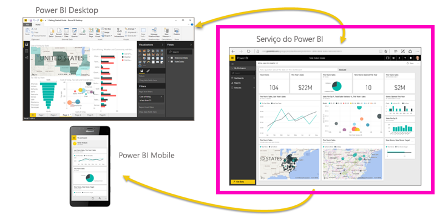

O serviço do Power BI tem uma versão gratuita e uma versão Pro. Não importa qual versão você está usando, *se já tiver uma conta*, abra um navegador e digite app.powerbi.com para abrir o serviço do Power BI. Mas se for um novo usuário, é recomendável começar em www.powerbi.com. Aqui você pode saber mais sobre o Power BI antes de fazer logon no serviço.  Quando estiver pronto para testá-lo, selecione o link **Inscrever-se gratuitamente** no canto superior direito. Caso seu administrador já tenha ativado o Power BI para você, não use esse botão, vá diretamente para app.powerbi.com. 

Se estiver procurando ajuda com o Power BI Desktop, veja [Introdução ao Desktop](desktop-getting-started.md). Se você estiver procurando ajuda para o Power BI para Celulares, consulte [Aplicativos Power BI para dispositivos móveis](mobile-apps-for-mobile-devices.md).

> [!TIP]
> Prefere um curso de treinamento gratuito baseado no seu ritmo? [Registre-se em nosso curso Analisando e visualizando dados no EdX](http://aka.ms/edxpbi).

Visite nossa [playlist no YouTube](https://www.youtube.com/playlist?list=PL1N57mwBHtN0JFoKSR0n-tBkUJHeMP2cP). Um bom vídeo para começar é o Introdução ao serviço do Power BI:
> 
> <iframe width="560" height="315" src="https://www.youtube.com/embed/B2vd4MQrz4M" frameborder="0" allowfullscreen></iframe>
> 
> 
> 

O Microsoft Power BI lhe ajuda a manter-se atualizado com relação às informações importantes para você.  Os ***painéis*** do serviço do Power BI ajudam a controlar o ritmo de sua empresa com um clique.  Seus dashboards exibem ***blocos*** nos quais você pode clicar para abrir ***relatórios*** e explorar mais detalhadamente.  Conecte-se a vários ***conjuntos de dados*** para reunir todos os dados relevantes em um único lugar. Precisa de ajuda para compreender os blocos de construção que compõem o Power BI?  Veja [Power BI – Conceitos básicos](service-basic-concepts.md).

Se você tiver dados importantes em arquivos do Excel ou CSV, é possível criar um painel do Power BI para se manter informado em qualquer lugar e compartilhar informações com outras pessoas.  Você tem uma assinatura de um aplicativo SaaS como o Salesforce?  Comece conectando-se ao Salesforce para criar um dashboard automaticamente com base nesses dados ou [confira todos os outros aplicativos SaaS](service-get-data.md) aos quais você pode se conectar. Se você faz parte de uma organização, veja se algum [aplicativo](service-create-distribute-apps.md) foi publicado para você.

Leia sobre todas as outras maneiras de [obter dados para o Power BI](service-get-data.md).

## Etapa 1: Obter dados
Veja um exemplo de como obter dados de um arquivo CSV. Deseja acompanhar este tutorial? [Baixe este arquivo CSV de exemplo](http://go.microsoft.com/fwlink/?LinkID=521962).

1. [Entre no Power BI](http://www.powerbi.com/). Não tem uma conta? Não se preocupe, você pode se inscrever gratuitamente.
2. O Power BI abre no seu navegador. Selecione **Obter Dados** na parte inferior da barra de navegação esquerda.
   
   
3. Selecione **Arquivos**. 
   
   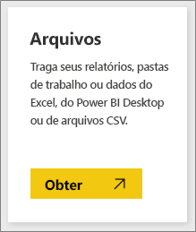
4. Navegue até o arquivo no seu computador e escolha **Abrir**. Se o salvou no OneDrive para Empresas, selecione essa opção. Se o salvou localmente, selecione **Arquivo local**. 
   
   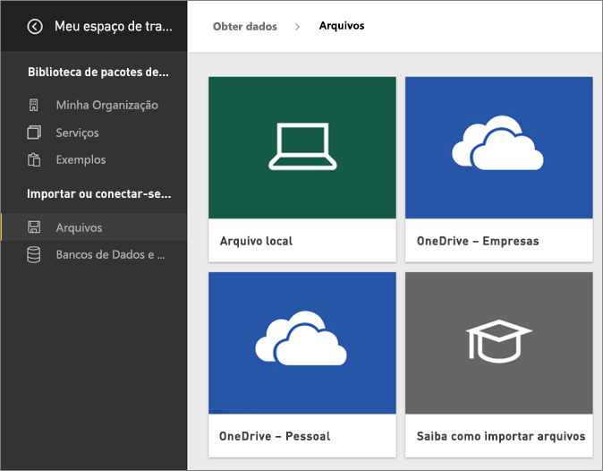
5. Para este tutorial, vamos selecionar **Importar** para adicionar o arquivo do Excel como um conjunto de dados para que possamos usá-lo para criar relatórios e dashboards. Se você selecionar **Carregar**, a pasta de trabalho inteira será carregada no Power BI e você poderá abri-la e editá-la no Excel online.
   
   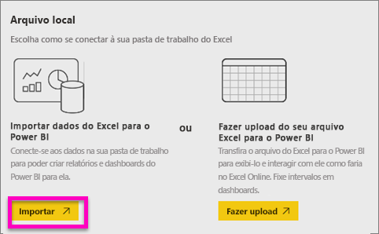
6. Quando seu conjunto de dados estiver pronto, selecione **Exibir conjunto de dados** para abri-lo no editor de relatório. 

    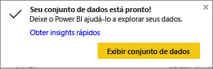

    Já que ainda não foi criada nenhuma visualização, a tela de relatório estará em branco.

    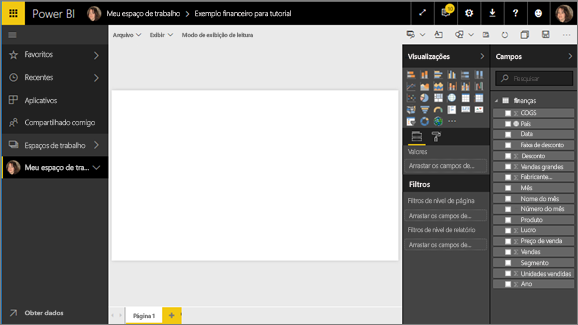

6. Dê uma olhada na barra de menu superior e observe que há uma opção para **Modo de Exibição de Leitura**. Como há a opção de Modo de Exibição de Leitura, isso significa que, atualmente, você está no **Modo de Exibição de Edição**. 

    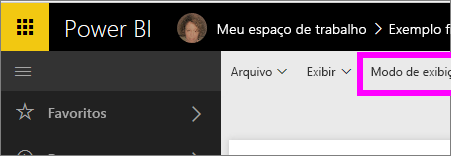

    Enquanto estiver no Modo de Exibição de Edição, você pode criar e modificar seus relatórios por ser *proprietário* do relatório; você está um *criador*. Quando você compartilha seu relatório com seus colegas, eles só conseguirão interagir com o relatório no Modo de Exibição de Leitura; eles são *consumidores*. Saiba mais sobre os [Modos de Exibição de Leitura e de Edição](service-reading-view-and-editing-view.md).
    
    Uma ótima maneira de se familiarizar com o editor de relatório é [fazer um tour](service-the-report-editor-take-a-tour.md)
   > 
 

## Etapa 2: começar a explorar seu conjunto de dados
Agora que você se conectou aos dados, comece a explorar.  Quando encontrar algo interessante, você pode criar um dashboard para monitorá-lo e ver como ele é alterado ao longo do tempo. Vamos ver como isso funciona.
    
1. No editor de relatórios, usaremos o painel **Campos** no lado direito da página para criar uma visualização.  Selecione a caixa de seleção ao lado de **Vendas Brutas** e **Data**.
   
   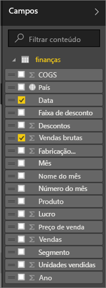

2. O Power BI analisa os dados e cria um elemento de visualização.  Se você selecionou **Data** primeiro, você verá uma tabela.  Se você selecionou **Vendas Brutas** primeiro, você verá um gráfico. Alterne para uma forma diferente de exibição dos dados. Vamos ver esses dados como um gráfico de linhas. Selecione o ícone do gráfico de linhas (também conhecido como modelo) no **Painel de visualizações**.
   
   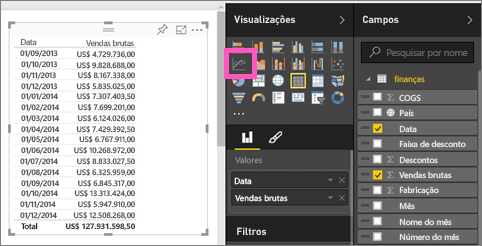

3. Isso parece interessante, então vamos *fixá-lo* em um dashboard. Focalize a visualização e selecione o ícone de **Pino**.  Quando fixar essa visualização, ela será armazenada em seu dashboard e mantida atualizada para que você possa acompanhar rapidamente o valor mais recente.
   
   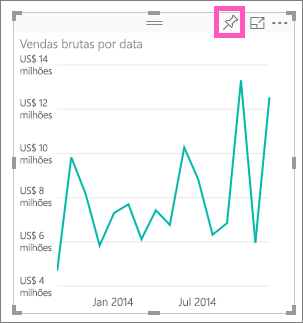

5. Como esse é um novo relatório, será solicitado que você o salve antes de poder fixar uma visualização no painel. Dê um nome ao seu relatório (por exemplo, *Vendas ao longo do tempo*) e selecione **Salvar e Continuar**. 
   
   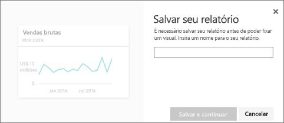
   
6. Vamos fixar o gráfico de linha ao novo painel e nomeá-lo como “Exemplo financeiro para tutorial”. 
   
   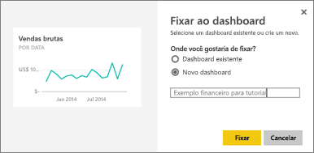
   
 1. Selecione **Fixar**.
   
    Uma mensagem de Êxito (perto do canto superior direito) informa que a visualização foi adicionada, como um bloco, ao painel.
   
    

8. Selecione **Ir para painel** para ver a linha de gráfico fixada, como um bloco, ao seu novo painel. Melhore ainda mais a aparência do seu painel adicionando mais blocos de visualização e [renomeando, redimensionando, vinculando e reposicionando blocos](service-dashboard-edit-tile.md).
   
   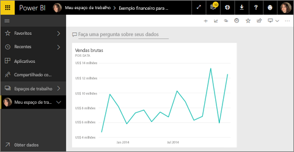
   
   Selecione o novo bloco em seu dashboard para retornar ao relatório a qualquer momento. O Power BI o leva de volta para o editor de relatório no Modo de Exibição de Leitura. Para voltar ao Modo de Exibição de Edição, selecione **Editar relatório** na barra de menus superior. Uma vez no Modo de Exibição de Edição, continue explorando e fixando blocos. 

## Etapa 3: Continuar explorando com P e R (consulta em linguagem natural)
1. Para explorar seus dados rapidamente, tente fazer uma pergunta na caixa P e R. A caixa de pergunta de P e R está localizada na parte superior do painel (**Fazer uma pergunta sobre seus dados**) e na barra de menus superior do seu relatório (**Fazer uma pergunta**). Por exemplo, tente digitar “qual segmento tinha a maior receita”.
   
   

2. O P e R pesquisa uma resposta e a apresenta na forma de visualização. Selecione o ícone fixar  para mostrar esta visualização em seu dashboard também.
3. Fixe a visualização no painel “Exemplo financeiro para tutorial”.
   
    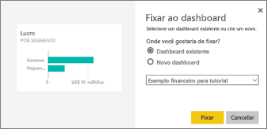

4. Volte ao seu painel, no qual você verá o novo bloco.

   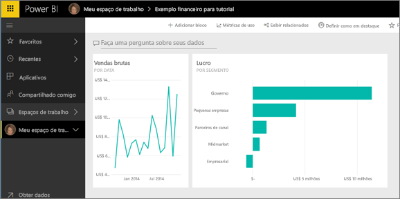

## Próximas etapas
Pronto para experimentar mais?  Aqui estão alguns modos excelentes de explorar o Power BI.

* [Conecte-se a outro conjunto de dados](service-get-data.md).
* [Compartilhe seu dashboard](service-share-dashboards.md) com seus colegas.
* Leia [dicas para a criação de dashboards](service-dashboards-design-tips.md).
* Exibir seus dashboards com um [aplicativo Power BI em um dispositivo móvel](mobile-apps-for-mobile-devices.md)

Ainda não está preparado para ir direto ao ponto? Comece por estes tópicos projetados para ajudá-lo a se familiarizar com o Power BI.

* [Saiba como relatórios, conjuntos de dados, dashboards e blocos todos se conjugam](service-basic-concepts.md)
* Visite nosso site de [Aprendizagem interativa do Power BI](guided-learning/index.md) e faça alguns cursos (bastante curtos)
* Assista a alguns [vídeos do Power BI](videos.md)
* [Veja quais exemplos temos disponíveis para que você utilize](sample-datasets.md)

### Mantenha contato com o Power BI
* Siga [@MSPowerBI no Twitter](https://twitter.com/mspowerbi)
* Assine nosso [canal de vídeos no YouTube](https://www.youtube.com/channel/UCy--PYvwBwAeuYaR8JLmrfg)
* Assista aos nossos [webinars de Introdução ao Power BI](webinars.md) sob demanda
* Não sabe onde procurar ajuda? Consulte nossa página [10 dicas para obter ajuda](service-tips-for-finding-help.md)

Mais perguntas? [Experimente perguntar à Comunidade do Power BI](http://community.powerbi.com/)

