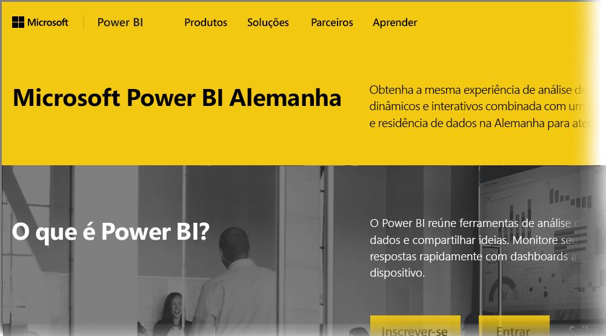

# Perguntas frequentes de clientes do Power BI para Germany Cloud
O **serviço do Power BI** tem uma versão disponível para clientes da UE/EFTA (União Europeia/Associação Europeia de Livre Comércio), geralmente mencionada como MCD (Microsoft Cloud Deutschland). A versão de **serviço do Power BI** discutida neste artigo é específica a clientes da UE/EFTA e separada e diferente da versão comercial do **serviço do Power BI**, ou serviços do Power BI fornecidos a clientes do governo.

As perguntas e respostas a seguir oferecem informações importantes para o serviço do Power BI Pro em MCD (Microsoft Cloud Deutschland), que é a nuvem do serviço do Power BI fornecida especificamente para os clientes da UE/EFTA.

1. **O que é o serviço do Power BI para Germany Cloud?**
   
   O serviço do Power BI para clientes da UE/EFTA, também conhecido como MCD (Microsoft Cloud Deutschland), é uma nuvem em conformidade com a UE/EFTA, com o serviço do Power BI entregue por datacenters da Alemanha. Todos os dados do cliente no serviço do Power BI para a nuvem UE/EFTA são armazenados em repouso na Alemanha com T-Systems trabalhando como administradores de dados independentes alemães e com acesso físico e lógico a dados controlados por leis da Alemanha. O serviço do Power BI para a nuvem da UE/EFTA requer uma conta separada e distinta da versão comercial do serviço do Power BI. Saiba mais sobre o Microsoft Cloud Deutschland [aqui](https://www.microsoft.com/trustcenter/cloudservices/nationalcloud).
2. **Onde encontrar informações de preços e inscrição do Power BI Germany Cloud?**
   
   Você pode encontrar muitas informações na [página inicial do Power BI Germany Cloud](https://powerbi.microsoft.com/power-bi-germany/), incluindo informações de preços. Nessa página, você também pode encontrar um link para se inscrever para uma avaliação de 30 dias do **serviço Power BI Pro** com 25 licenças de usuário. Como parte da avaliação de inscrição, você tem uma opção de comprar ou adicionar licenças, conforme necessário. Também oferecemos EA (Enterprise Agreement), preços de governo e sem fins lucrativos. Entre em contato com o representante do cliente na Microsoft para mais detalhes.
3. **Eu tenho um locatário do Germany Cloud como parte das assinaturas do Azure Germany e/ou Office 365 Germany. Posso usar o locatário existente para me inscrever no Power BI Germany?**
   
   Sim. Como parte do processo de inscrição, você terá uma opção de fazer logon com uma conta de administrador de locatário do Germany Cloud existente e adicionar licenças de serviço do Power BI Pro ao locatário existente no Germany Cloud. Observe que locatários e contas de usuário do Germany Cloud são diferentes do serviço do Power BI para Germany Cloud.
4. **Há um serviço gratuito no serviço do Power BI para Germany Cloud?**
   
   Não. Não oferecemos versões de licença gratuita no serviço do Power BI para Germany Cloud. No entanto, recomendamos que você se inscreva para uma [oferta gratuita do Power BI em nossa nuvem pública](https://powerbi.microsoft.com/get-started/) se suas necessidades de negócios forem atendidas com a oferta gratuita do Power BI.
5. **Posso usar o Power BI Desktop, o Power BI Mobile, o gateway de dados local e o Publisher para Excel com o serviço do Power BI para a nuvem da Alemanha?**
   
   Sim. Nós atualizamos os produtos de cliente do Power BI para funcionar perfeitamente com o serviço do Power BI para Germany Cloud. Faça logon com sua conta de serviço do Power BI para Germany Cloud e comece a usar os mesmos produtos de cliente com o serviço do Power BI para Germany Cloud. Você pode baixar a versão mais recente de produtos de cliente nos seguintes locais:
   
   * [Power BI Desktop](https://powerbi.microsoft.com/desktop/)
   * [Power BI para Celulares](https://powerbi.microsoft.com/mobile/)
   * [Gateway de dados local](https://powerbi.microsoft.com/gateway/)
   * [Power BI Publisher para Excel](https://powerbi.microsoft.com/excel-dashboard-publisher/)
6. **Há limitações de recurso de serviço do Power BI para Germany Cloud?**
   
   Os seguintes recursos não estão disponíveis no momento no serviço do Power BI para Germany Cloud:
   
   * Publicar na Web
   * Mapas de ArcGIS por Esri
   * Power BI Embedded (licenciamento de ISV com medidor separado será oferecido no [Microsoft Azure Germany](https://azure.microsoft.com/overview/clouds/germany/) futuramente)
7. **Onde encontrar informações de configuração específicas de serviço do Power BI para Germany Cloud para uso e integração em meus aplicativos?**
   
   Atualizamos nossos [exemplos de desenvolvedor de incorporação de SaaS](https://github.com/Microsoft/PowerBI-Developer-Samples) com informações de configuração específicas de nuvens da Alemanha e do Power BI. Examine a pasta **Configurações do Cloud** nos exemplos de pontos de extremidade de configuração específica de nuvem. A tabela a seguir lista vários pontos de extremidade de configuração para o serviço do Power BI para Germany Cloud (e nuvem pública para referência cruzada).

| **Nome e/ou uso do ponto de extremidade** | **URL de serviço do Power BI para Germany Cloud** | **URL equivalente na nuvem pública (para referência cruzada)** |
| --- | --- | --- |
| Página inicial, inscrever-se e entrar |[https://powerbi.microsoft.com/power-bi-germany/](https://powerbi.microsoft.com/power-bi-germany/) |[https://powerbi.microsoft.com/](https://powerbi.microsoft.com/) |
| Entrada direta no serviço do Power BI |[https://app.powerbi.de/?noSignUpCheck=1](https://app.powerbi.de/?noSignUpCheck=1) |[https://app.powerbi.com/?noSignUpCheck=1](https://app.powerbi.com/?noSignUpCheck=1) |
| API de serviço |[https://api.powerbi.de/](https://api.powerbi.de/) |[https://api.powerbi.com/](https://api.powerbi.com/) |
| Portal do Office para gerenciamento de licenças de usuário, status de integridade do serviço e solicitações de suporte por administradores |[https://portal.office.de/](https://portal.office.de/) |[https://portal.office.com/](https://portal.office.com/) |
| Uri de autoridade do AAD |[https://login.microsoftonline.de/common/oauth2/authorize/](https://login.microsoftonline.de/common/oauth2/authorize/) |[https://login.microsoftonline.com/common/oauth2/authorize/](https://login.microsoftonline.com/common/oauth2/authorize/) |
| Uri de recurso de serviço do Power BI |[https://analysis.cloudapi.de/powerbi/api](https://analysis.cloudapi.de/powerbi/api) |[https://analysis.windows.net/powerbi/api](https://analysis.windows.net/powerbi/api) |
| Biblioteca de visuais personalizados |[https://app.powerbi.de/visuals/](https://app.powerbi.de/visuals/) |[https://app.powerbi.com/visuals/](https://app.powerbi.com/visuals/) |
| Registrar um aplicativo para o Power BI (Embedded) |[https://app.powerbi.de/apps](https://app.powerbi.de/apps) |[https://app.powerbi.com/apps](https://app.powerbi.com/apps) |
| Portal do Azure (para incorporado) |[https://portal.microsoftazure.de/](https://portal.microsoftazure.de/) |[https://portal.azure.com/](https://portal.azure.com/) |
| Comunidade |[https://community.powerbi.com/](https://community.powerbi.com/) |[https://community.powerbi.com/](https://community.powerbi.com/) |

### Próximas etapas
Você pode fazer muito com o Power BI. Para obter mais informações e aprendizado, incluindo um artigo que mostra como se inscrever para o serviço, confira os seguintes recursos:

* [Aprendizagem Orientada para o Power BI](guided-learning/gettingstarted.yml?tutorial-step=1)
* [Introdução ao serviço do Power BI](service-get-started.md)
* [Introdução ao Power BI Desktop](desktop-getting-started.md)

