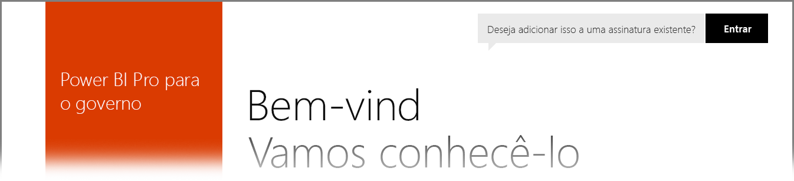

# Power BI para clientes do Governo dos EUA
O **serviço do Power BI** tem uma versão disponível para clientes do Governo dos Estados Unidos como parte das assinaturas da **Comunidade do Governo dos EUA do Office 365**. A versão do **serviço do Power BI** discutida neste artigo é desenvolvida especificamente para clientes do Governo dos EUA e é separada e diferente da versão comercial do **serviço do Power BI**.

As seções a seguir descrevem os *recursos* disponíveis para a versão do Governo dos EUA do **serviço do Power BI**, esclarece algumas das *limitações*, lista as **Perguntas Frequentes** e as respostas (incluindo como fazer a inscrição) e fornece links para obter mais informações.

## Recursos do Power BI para o Governo dos EUA
É importante observar que o **Power BI do Governo dos EUA** só está disponível como uma **licença Pro** e não está disponível como uma licença Gratuita. Alguns recursos do serviço do Power BI estão disponíveis na versão do **Power BI do Governo dos EUA** do serviço.

Os seguintes recursos estão disponíveis para clientes do **Power BI do Governo dos EUA**, pois se aplicam à funcionalidade da licença **Pro**:

* Criar e exibir dashboards e relatórios
* [Limites de capacidade de dados](service-admin-manage-your-data-storage-in-power-bi.md)
* [Atualização de dados agendada](refresh-data.md)
* Dashboards de equipe atualizáveis
* Grupos do Active Directory para compartilhar e gerenciar o controle de acesso
* [Importar dados](service-get-data.md) e relatórios de arquivos do Excel, CSV e Power BI Desktop
* Gateway de Gerenciamento de Dados
* Todos os dados são criptografados no SQL Azure e no Armazenamento de Blobs para o Power BI
* Conectar serviços a [pacotes de conteúdo](service-connect-to-services.md)

## Limitações do Power BI para o Governo dos EUA
Alguns dos recursos disponíveis na versão comercial do **serviço do Power BI** *não* estão disponíveis no **serviço do Power BI** para clientes do Governo dos EUA. Equipe do Power BI está trabalhando ativamente para tornar esses recursos disponíveis para clientes do Governo dos EUA e atualizará este artigo quando esses recursos estiverem disponíveis.

* O **Power BI do Governo dos EUA** só está disponível como uma licença **Pro**. Todas as referências a licenças do Power BI (Gratuito) em um portal de administrador (ou como usuários) estão em execução em uma nuvem de serviço do Power BI comercial.
* **Auditoria** – auditoria não está disponível por meio do portal de Segurança e Conformidade do Office 365.

Se você tem licenças Gratuitas do **Power BI** atribuídas à sua conta, essas contas estão em execução em uma versão comercial do serviço do **Power BI** e não fazem parte da oferta do **Power BI do Governo dos EUA**. Para essas contas Gratuitas, você poderá se deparar com os seguintes problemas:

* Gateway, Móvel e Desktop não podem ser autenticados
* Você não pode acessar as fontes de dados comerciais do Azure
* Arquivos PBIX devem ser carregados manualmente do comercial
* Os aplicativos móveis do Power BI não estão disponíveis

Para resolver os problemas, contate seu representante de conta.

## Perguntas Frequentes para a versão do Governo dos EUA do serviço do Power BI
As seguintes perguntas (e respostas) são fornecidas para ajudá-lo a obter rapidamente as informações necessárias sobre o serviço.

**Pergunta:** como migrar meus dados do **Power BI** comercial para o **serviço do Power BI** para o Governo dos EUA?

**Resposta:** o administrador deve criar uma nova instância do **Power BI** em uma assinatura específica do Governo dos EUA separada. Você poderá replicar seus dados comerciais no **serviço do Power BI** para o Governo dos EUA, remover sua licença comercial e associar seu domínio existente ao novo serviço específico para o Governo dos EUA.

**Pergunta:** por que não consigo me conectar a um pacote de conteúdo específico?

**Resposta:** garanta que a sua assinatura esteja habilitada para poder conectar-se a esse pacote de conteúdo.

**Pergunta:** estou interessado em obter o **Power BI** para minha organização do Governo dos EUA. Como faço para começar?

**Resposta:** a inscrição (geralmente chamada de *integração*) pode ser diferente dependendo da sua licença e assinatura existentes. Consulte o artigo [Inscrever-se no Power BI para o Governo dos EUA](service-govus-signup.md) para obter mais informações.

**Pergunta:** a URL para conectar-se ao **Power BI** para o Governo dos EUA é diferente da URL do **Power BI** comercial?

**Resposta:** sim, as URLs são diferentes. A tabela a seguir mostra cada URL:

| URL da versão comercial | URL de versão do Governo dos EUA |
| --- | --- |
| https://app.powerbi.com/ |[https://app.powerbigov.us](https://app.powerbigov.us) |

## Próximas etapas
Você pode fazer muito com o Power BI. Para obter mais informações e aprendizado, incluindo um artigo que mostra como se inscrever para o serviço, confira os seguintes recursos:

* [Inscrever-se para o Power BI para o Governo dos EUA](service-govus-signup.md)
* <a href="https://channel9.msdn.com/Blogs/Azure/Cognitive-Services-HDInsight-and-Power-BI-on-Azure-Government">Demonstração do governo dos EUA do Power BI</a>
* [Aprendizagem Orientada para o Power BI](guided-learning/gettingstarted.yml#step-1)
* [Introdução ao serviço do Power BI](service-get-started.md)
* [Introdução ao Power BI Desktop](desktop-getting-started.md)

