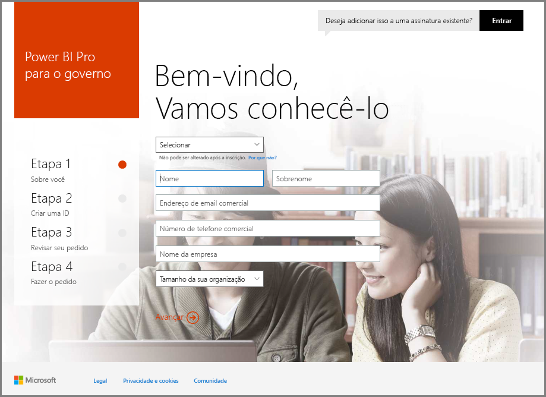
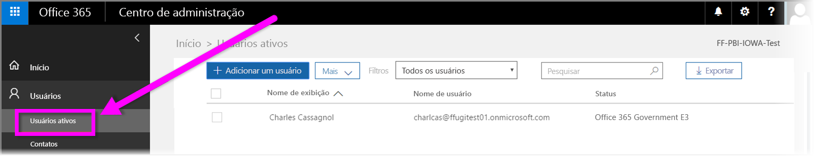

# Registrar sua organização do Governo dos EUA no serviço do Power BI
O **serviço do Power BI** tem uma versão disponível para clientes do Governo dos Estados Unidos como parte das assinaturas da **Comunidade do Governo dos EUA do Office 365**. A versão do **serviço do Power BI** discutida neste artigo é desenvolvida especificamente para clientes do Governo dos EUA e é separada e diferente da versão comercial do **serviço do Power BI**.

Para saber mais sobre o **serviço do Power BI** para o Governo dos EUA, incluindo seus recursos e limitações, confira [Power BI for United States Government customers – Overview](service-govus-overview.md) (Power BI para clientes do Governo dos Estados Unidos – visão geral).

> [!NOTE]
> Este artigo destina-se a administradores com autoridade para inscreverem sua organização do Governo dos EUA para o Power BI. Se você for um usuário final, contate o administrador sobre como obter uma assinatura do Power BI para o Governo dos EUA.
> 
> 

## Selecione o processo de inscrição certo para a sua organização do Governo dos EUA
Sua organização do Governo dos EUA pode ser nova na **Nuvem do Governo do Office**, ou talvez já tenha uma assinatura. As seções a seguir detalham as etapas de inscrição dependendo do ponto em que você está na Nuvem do Governo do Office e no Power BI e são diferentes conforme sua assinatura existente.

Depois inscrever-se no Power BI para o Governo dos EUA, alguns recursos podem não funcionar até que o representante de vendas ou de suporte conclua seu processo de integração. Para saber mais sobre esses recursos, consulte a [Visão geral do Power BI para clientes do Governo dos Estados Unidos](service-govus-overview.md). Para concluir o processo de integração para habilitar esses recursos, entre em contato com o representante de vendas ou de suporte.

### Órgãos do Governo dos EUA que são novos clientes da Nuvem do Office
Se a sua organização for um cliente novo da **Nuvem do Governo do Office**, siga estas etapas:

> [!NOTE]
> Essas etapas devem ser realizadas pelo administrador do portal.
>

1. Vá para [https://products.office.com/en-us/government/office-365-web-services-for-government](https://products.office.com/en-us/government/office-365-web-services-for-government).

>[!NOTE]
>Se você não quiser se inscrever na Nuvem do Governo do Office nesse momento, entre em contato com o representante de vendas.
>

2. Selecione Office G3 e preencha o formulário para obter uma versão de avaliação do Office
3. Quando você for um cliente da Nuvem do Office continue nas etapas abaixo para "Clientes atuais da Nuvem de Governo do Office"

### Clientes atuais da Nuvem de Governo do Office
Se a sua organização for um cliente atual da **Nuvem do Governo do Office**, mas você não tiver uma assinatura (Gratuita ou não) do **Power BI**, siga estas etapas:

> [!NOTE]
> Essas etapas devem ser realizadas pelo administrador do portal.
> 
> 

1. Faça logon em sua conta existente da Nuvem de Governo do Office e vá até o portal de administração
2. Selecione **Cobrança**.
3. Selecione **Comprar Serviço**.
4. Selecione a Opção de Governo do Power BI Pro e escolha entre **Experimentar** e **Comprar Agora**
5. Conclua o seu pedido
6. Atribua usuários à conta.
   
   
7. Faça logon no **serviço do Power BI** para clientes do Governo dos EUA em [https://app.powerbigov.us](https://app.powerbigov.us)

## Informações adicionais de inscrição
A seguir estão informações adicionais para se inscrever no **Power BI do Governo dos EUA** em vários casos de migração de licenciamento.

### Integração de cliente direto da versão de avaliação do Power BI para a versão Pro
* Clique e prossiga para Cobrança > Serviço de Compra > Power BI Pro Gov e selecione Comprar, e não Avaliação
* Preencha o necessário e obtenha as licenças
* Remova a Avaliação do Power BI Pro ou as licenças antigas e Atribua as novas aos usuários
* Fazer logon em [https://app.powerbigov.us](https://app.powerbigov.us)

### Integração de cliente de revendedor da versão de avaliação do Power BI para a versão Pro
Acesse **Cobrança > Assinaturas** e selecione a assinatura do **Power BI Pro para Governo**. Lá você verá:

* Disponível
* Atribuído
* Atribuir a links de usuários
* Se você ainda tiver a versão de avaliação atribuída:
  * Clique em **Atribuído** em Assinatura de avaliação e remova os usuários que você deseja adicionar à versão paga
  * Vá para a Assinatura paga e atribua esses usuários

### Instruções de Lista de Permissões
A *Lista de Permissões* é um processo que a equipe de engenharia do Power BI usa para mover clientes do ambiente de nuvem comercial para o ambiente de nuvem seguro de Governo. Isso garante que os recursos disponíveis na nuvem do Governo dos EUA funcionem conforme o esperado. Todos os clientes US Government existentes (ou novos) que comprarem os serviços do **Power BI** US Government pela primeira vez *deverão* iniciar o seguinte processo de lista de permissões. O processo deve ser executado antes da instalação ou da migração para os serviços do **Power BI** US Government. 

Para incluir seu locatário em uma *lista de permissões* para a nuvem do Governo dos EUA, entre em contato com a equipe de conta da Microsoft para obter assistência com a inclusão na lista. Observe que somente administradores podem fazer esta solicitação. O processo de *Lista de Permissões* leva aproximadamente três semanas, durante o qual a equipe de engenharia do Power BI faz as alterações apropriadas para garantir que seu locatário opere adequadamente na nuvem do Governo dos EUA.

Os clientes que estão migrando de licenças do Power BI **Gratuito** para o **Power BI do Governo dos EUA** (e, por definição, migrando para os recursos associados da licença **Pro**, descritos anteriormente neste artigo) encontrarão os problemas descritos na seção a seguir deste artigo, até que seu locatário seja adicionado à *lista de permissões* pela equipe de engenharia do Power BI.

### Licenças do Gratuito e do Pro misturadas nos locatários do Governo dos EUA
Se você tiver tanto a licença Gratuita quanto a licença Pro do Governo dos EUA em seu locatário, as duas permanecerão presentes, mas um dos tipos de licença não funcionará corretamente. Se seu locatário passar com êxito pelo processo de *Lista de Permissões*, ocorrerá o seguinte:

* Os usuários de licença Gratuita não poderão mais fazer logon no Power BI usando o **Power BI Desktop** e experimentarão as falhas de funcionalidade descritas na seção a seguir.
* Todos os clientes atribuídos às licenças Pro do Governo dos EUA terão o funcionamento conforme o esperado, incluindo o uso de gateways, do Power BI Desktop e de Aplicativos móveis.

Ao usar uma combinação de licenças Gratuitas e Pro em um locatário do Governo dos EUA e passar pelo processo de *Lista de Permissões*, o seguinte poderá ocorrer:

**Antes do *processo de lista de permissões***:

* Os usuários com licenças Gratuitas estão em execução na nuvem comercial
* As licenças Pro do Governo dos EUA aparecem no portal e o administrador pode atribuir essas licenças aos usuários. Usuários da Pro do Governo dos EUA não perderão dados de suas licenças Gratuitas depois que o administrador atribuir uma licença Pro do Governo dos EUA. Os usuários atribuídos terão acesso aos recursos do Power BI Pro para clientes do Governo dos EUA, mas a seguinte lista de falhas de funcionalidade existirá até que o locatário seja adicionado à *lista de permissões* com êxito:
  
  * Gateway, Móvel e Power BI Desktop não podem ser autenticados
  * Você não pode acessar as fontes de dados comerciais do Azure
  * Arquivos PBIX devem ser carregados manualmente do serviço do Power BI comercial
  * Os aplicativos móveis do Power BI não estão disponíveis

**Depois do *processo de lista de permissões***:

* Usuários gratuitos em execução no serviço do Power BI comercial podem continuar em execução, mas eles deixarão de autenticar conforme o esperado.
* Os usuários Pro em execução na nuvem do Governo dos EUA podem usar o serviço do **Power BI para clientes do Governo dos EUA** conforme o esperado.

Para identificar os usuários que estão executando a licença Gratuita do Power BI no locatário, os administradores podem executar o relatório de licença e, ao final, os usuários da licença Gratuita aparecerão como **Power BI Standard**.

## Próximas etapas
Você pode fazer muito com o Power BI. Para obter mais informações e aprendizado, incluindo um artigo que mostra como se inscrever para o serviço, confira os seguintes recursos:

* [Visão geral do Power BI para o Governo dos EUA](service-govus-overview.md)
* [Aprendizagem Orientada para o Power BI](guided-learning/gettingstarted.yml#step-1)
* [Introdução ao serviço do Power BI](service-get-started.md)
* [Introdução ao Power BI Desktop](desktop-getting-started.md)

