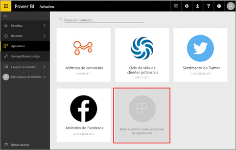
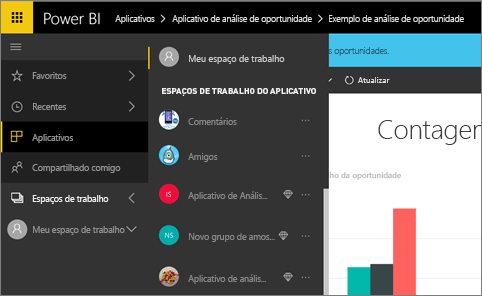
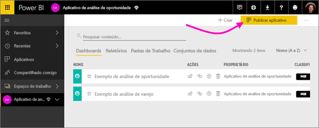
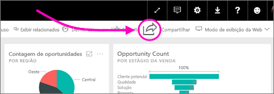
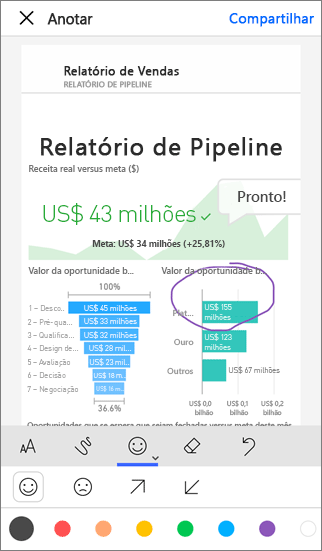

# Como devo colaborar e compartilhar relatórios e dashboards no Power BI?
Você cria dashboards e relatórios. Talvez você colabore neles com seus colegas também. Depois, você quer que outros usuários tenham acesso a eles. Qual é a melhor maneira de distribuí-los?

Nesse artigo, comparamos essas opções para colaborar e compartilhar no Power BI: 

* Colaborando com colegas para criar relatórios e dashboards significativos em *espaços de trabalho do aplicativo*.
* O agrupamento desses dashboards e relatórios em *aplicativos* e sua publicação para um grupo maior ou para toda a organização.
* Compartilhamento de dashboards e relatórios com algumas pessoas, por meio do serviço ou de aplicativos móveis do Power BI.
* Publicando na Web, em que qualquer pessoa pode ver e interagir com eles.
* Imprimindo. 

Não importa qual opção você escolher, para compartilhar um dashboard, você precisa de uma [licença do Power BI Pro](service-free-vs-pro.md) ou então o conteúdo precisa estar em uma [capacidade Premium](service-premium.md). Os requisitos de licença variam para os colegas que exibem seus dashboards, dependendo da opção escolhida. As seções a seguir apresentam mais detalhes. Sugestões? A equipe do Power BI sempre está interessada em seus comentários. Portanto, acesse o [site da Comunidade do Power BI](https://community.powerbi.com/).

*Aplicativos de serviço do Power BI*

## Colaborar com colegas para criar um aplicativo
Digamos que você e seus colegas de equipe querem publicar insights do Power BI para a organização. A melhor maneira de fazer isso é criar um *aplicativo*. Um aplicativo é uma coleção de dashboards e relatórios criados para fornecer métricas importantes para sua organização. 

Para criar um aplicativo, você precisa de um *espaço de trabalho de aplicativo*, com seus colegas de equipe como membros. Considere o espaço de trabalho de aplicativo como uma área de preparo em que você e seus colegas podem colaborar com seus dashboards e relatórios do Power BI. Todos vocês podem criar relatórios no Power BI Desktop e publicá-los no espaço de trabalho do aplicativo e todos vocês precisam de licenças do Power BI Desktop.

**Se você desejar apenas compartilhar um dashboard concluído com seus colegas, não adicione-os ao espaço de trabalho do aplicativo.** Em vez disso, [crie o dashboard em um espaço de trabalho de aplicativo](service-create-distribute-apps.md) e publique o aplicativo para eles. 

## Publicar o aplicativo para um público amplo
Digamos que você deseja distribuir seu dashboard para um público amplo. Você e seus colegas criaram um *espaço de trabalho do aplicativo* e, em seguida, criaram e refinaram dashboards, relatórios e conjuntos de dados no espaço de trabalho do aplicativo. Agora você seleciona o dashboards e relatórios desejados e os publica como um aplicativo &#151; aos membros de uma lista de distribuição ou grupo de segurança, ou para toda a organização. 

Os aplicativos são fáceis de descobrir e instalar no serviço do Power BI ([https://powerbi.com](https://powerbi.com)). Você pode enviar aos usuários corporativos um link direto para o aplicativo ou eles podem pesquisar por ele no AppSource. Leia mais sobre [publicação de aplicativos](service-create-distribute-apps.md#publish-your-app). 

Após instalarem um aplicativo, eles poderão vê-lo em seu navegador ou dispositivo móvel.

Para que seus usuários exibam seu aplicativo, eles também precisam ter uma licença do Power BI Pro ou o aplicativo precisa ser armazenado em uma capacidade do Power BI Premium. Leia [O que é o Power BI Premium?](service-premium.md) para obter detalhes.

## Compartilhar dashboards e relatórios
Digamos que você tenha finalizado um dashboard e um relatório em seu próprio Meu Espaço de Trabalho ou em um espaço de trabalho do aplicativo e deseje que outras pessoas tenham acesso a ele. Uma maneira de fazer isso é *compartilhá-lo*. 

Você precisa ter uma licença do Power BI Pro para compartilhar o conteúdo e as pessoas com quem você o compartilha também precisam ou então o conteúdo precisa estar em uma [capacidade Premium](service-premium.md). Quando você compartilha um dashboard ou um relatório, elas podem exibi-lo e interagir com ele, mas não podem editá-lo. Elas veem os mesmos dados que você no dashboard e nos relatórios, a menos que a RLS (Segurança em Nível de Linha) seja aplicada ao conjunto de dados subjacente. Os colegas com quem você o compartilha podem compartilhá-lo com os colegas deles, se você permitir. 

Você também pode compartilhar com pessoas de fora da sua organização. Eles também podem exibir e interagir com o dashboard, mas não podem compartilhá-lo. 

Saiba mais sobre [como compartilhar um dashboard](service-share-dashboards.md) no serviço do Power BI.

Você também pode [compartilhar um link direto para um relatório](service-share-reports.md)e ignorar o dashboard. Você pode adicionar um filtro ao link para que os destinatários vejam uma exibição filtrada do relatório.

## Anotar e compartilhar dos aplicativos móveis do Power BI
Nos aplicativos móveis do Power BI para dispositivos iOS e Android, você pode fazer anotações em um bloco, relatório ou visual e, em seguida, compartilhar isso com qualquer pessoa por email. 

Você está compartilhando um instantâneo do bloco, relatório ou visual e seus destinatários veem exatamente como ele era quando você enviou o email. O email também contém um link para o dashboard ou relatório. Se eles tiverem uma licença do Power BI Pro ou se o conteúdo estiver em uma [capacidade Premium](service-premium.md) e você já tiver compartilhado o objeto com eles, eles poderão abri-lo. Envie instantâneos de blocos para qualquer pessoa &#151; não apenas para seus colegas, no mesmo domínio de email.

Mais informações sobre [anotação e compartilhamento de blocos, relatórios e visuais](mobile-annotate-and-share-a-tile-from-the-mobile-apps.md) nos aplicativos móveis do iOS e Android.

Também é possível [compartilhar um instantâneo de um bloco](mobile-share-tile-windows-10-phone-app.md) no aplicativo do Power BI para dispositivos Windows 10.

## Publicar na Web
Você pode publicar relatórios do Power BI em toda a Internet inserindo elementos visuais interativos em postagens de blog, sites, mídia social e outras comunicações online, em qualquer dispositivo. Qualquer pessoa na Internet pode ver seus relatórios, e você não tem controle sobre quem pode ver o que você publicou. Eles não precisam de uma licença do Power BI. A publicação na Web só está disponível para relatórios que você pode editar. Você não pode publicar relatórios na Web se eles são compartilhados com você ou se estiverem em um aplicativo. Mais sobre a [publicação na Web](service-publish-to-web.md).

## Imprimir ou salvar como PDF ou outro arquivo estático
Você pode imprimir ou salvar como PDF (ou outro formato de arquivo estático) um dashboard inteiro, um bloco do dashboard, uma página de relatório ou uma visualização do serviço do Power BI. Relatórios podem ser impressos somente com uma página por vez – não é possível imprimir o relatório inteiro ao mesmo tempo. Mais sobre como [imprimir ou salvar como um arquivo estático](service-print.md).

## Próximas etapas
* Tem comentários? Vá para o [site da comunidade do Power BI](https://community.powerbi.com/) para fazer sugestões.
* [Compartilhar dashboards com colegas e outras pessoas](service-share-dashboards.md)
* [Criar e publicar um aplicativo no Power BI](service-create-distribute-apps.md)
* Mais perguntas? [Experimente a Comunidade do Power BI](http://community.powerbi.com/).

