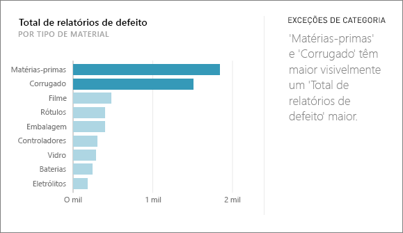
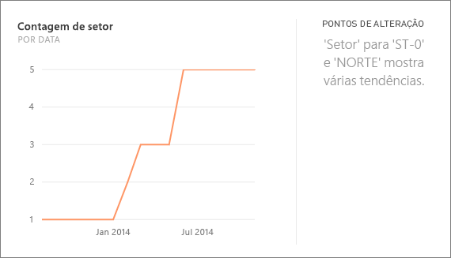
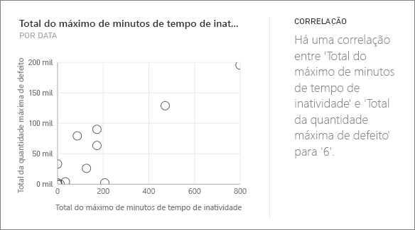
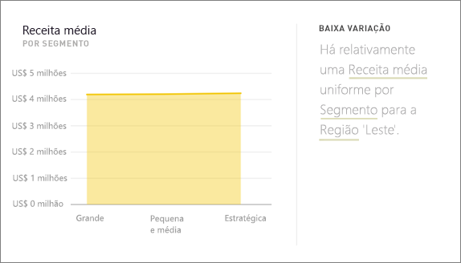
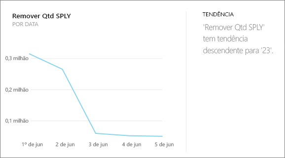
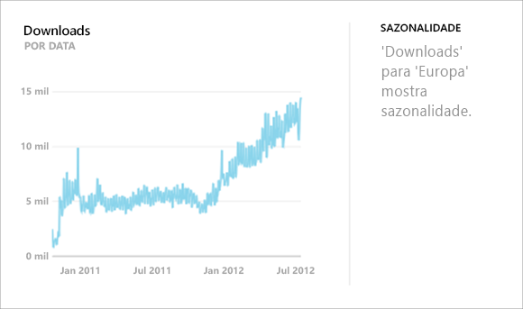
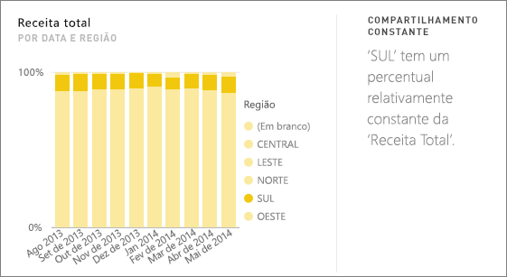
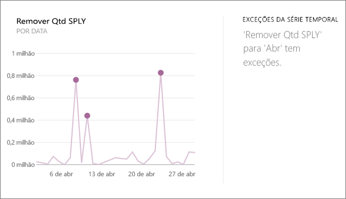

# Tipos de Quick Insights com suporte do Power BI
## Como o Quick Insights funciona?
O Power BI pesquisa com rapidez diferentes subconjuntos do conjunto de dados durante a aplicação de um conjunto de algoritmos sofisticados para descobrir informações que possam ser interessantes. Ele examina ao máximo possível um conjunto de dados no período de tempo designado.

Você pode executar Insights Rápidos em um conjunto de dados ou bloco (Insights relacionados).   

## Que tipos de Insights Rápidos podemos encontrar?
Estes são alguns dos algoritmos que usamos:

## Exceções de categoria (superior/inferior)
Realça os casos em que, para uma medida no modelo, um ou dois membros de uma dimensão têm valores muito mais altos do que outros membros da dimensão.  

## Alterar os pontos em uma série temporal
Realça os casos em que há alterações significativas nas tendências em uma série temporal de dados.

## Correlação
Detecta os casos em que várias medidas mostram uma correlação entre si quando plotadas em uma dimensão no conjunto de dados.

## Baixa variância
Detecta os casos em que os pontos de dados não estão distantes da média.

## Maioria (Principais fatores)
Encontra casos em que a maioria de um valor total pode ser atribuída a um único fator quando dividida por outra dimensão.  

## Tendências gerais na série temporal
Detecta as tendências ascendentes ou descendentes em dados de série temporal.

## Periodicidade na série temporal
Encontra padrões periódicos nos dados de série temporal, como periodicidade semanal, mensal ou anual.

## Compartilhamento constante
Realça os casos em que há uma correlação de pai-filho entre o compartilhamento de um valor do filho em relação ao valor geral do pai em uma variável contínua.

## Exceções da série temporal
Para dados em uma série temporal, detecta quando há datas ou horas específicas com valores significativamente diferentes dos outros valores de data/hora.

## Próximas etapas
[Power BI Quick Insights](service-insights.md)

Se você é proprietário de um conjunto de dados, [otimize-o para os Insights Rápidos](service-insights-optimize.md)

Mais perguntas? [Experimente a Comunidade do Power BI](http://community.powerbi.com/)

