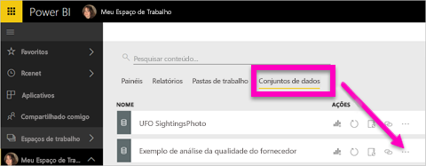
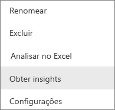
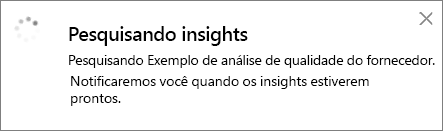
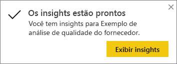
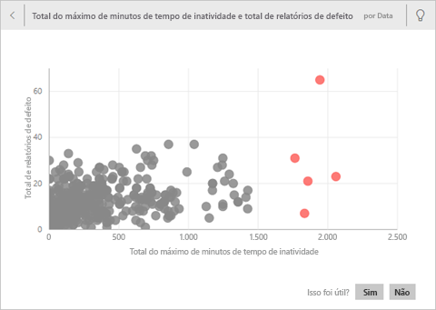
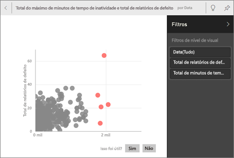
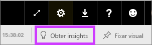
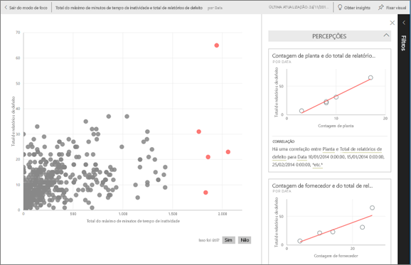
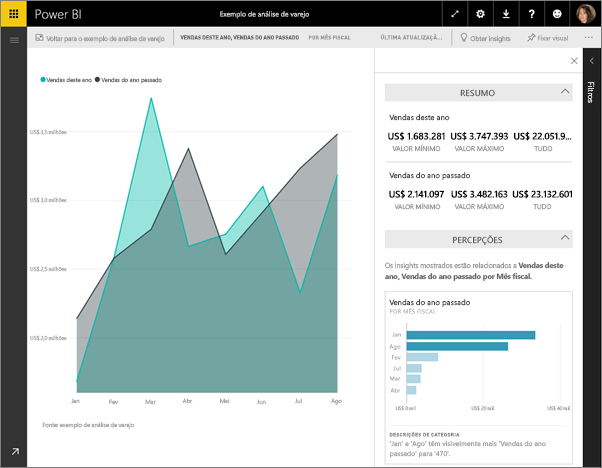

# Gerar automaticamente as informações sobre os dados com o Power BI
Tem um novo conjunto de dados e não sabe exatamente por onde começar?  Você precisa criar um painel rapidamente?  Deseja procurar informações que você pode ter perdido?

Execute insights rápidos para gerar visualizações interativas e interessantes com base em seus dados. Os Insights Rápidos podem ser executados em um conjunto de dados inteiro (insights rápidos) ou em um bloco de painéis específico (insights com escopo). Você pode até mesmo executar insights em um insight!

> **Observação**: insights não funcionam com DirectQuery; eles funcionam somente com os dados carregados no Power BI.
> 
> 

O recurso de insights tem como base um crescente [conjunto de algoritmos analíticos avançados](service-insight-types.md) desenvolvido em conjunto com a Microsoft Research, os quais continuaremos a utilizar para permitir que mais pessoas encontrem informações em seus dados de maneiras novas e intuitivas.

## Executar insights rápidos em um conjunto de dados
Veja a Amanda executar insights rápidos em um conjunto de dados, abrir um insight no modo de foco, fixar um desses insights como um bloco no painel dela e, em seguida, obter insights para um bloco do painel.

<iframe width="560" height="315" src="https://www.youtube.com/embed/et_MLSL2sA8" frameborder="0" allowfullscreen></iframe>

Agora é sua vez. Explore insights usando o [exemplo de análise de qualidade de fornecedor](sample-supplier-quality.md).

1. Na guia **Conjuntos de dados**, selecione as reticências (...) e escolha **Obter insights**.
   
    
   
    
2. O Power BI usa [vários algoritmos](service-insight-types.md) para pesquisar tendências no conjunto de dados.
   
    
3. Em poucos segundos, suas informações estão prontas.  Selecione **Exibir insights** para exibir as visualizações.
   
    
   
   > **OBSERVAÇÃO**: alguns conjuntos de dados não podem gerar insights porque os dados não são estatisticamente significativos.  Para saber mais, veja [Otimizar seus dados para insights](service-insights-optimize.md).
   > 
   > 
1. As visualizações são exibidas em uma tela especial dos **Insights Rápidos** com até 32 cartões de insights separados. Cada cartão contém um gráfico e uma breve descrição.
   
    

## Interagir com os cartões de insights
  

1. Passe o mouse sobre um cartão e selecione o ícone de alfinete para adicionar a visualização a um dashboard.
2. Passe o mouse sobre um cartão, selecione as reticências (...) e escolha **Exibir insights**. Isso abre a tela de insights.
   
    
3. No modo de Foco você pode:
   
   * Filtrar as visualizações.  Para exibir os filtros, no canto superior direito, selecione a seta para expandir o painel Filtros.
        
   * Fixe o cartão de insight em um dashboard selecionando o ícone fixar  ou **Fixar visual**.
   * Execute os insights no próprio cartão. Geralmente, isso é chamado de **insights com escopo**. No canto superior direito, selecione o ícone de lâmpada  ou **Obter insights**.
     
       
     
     O insight é exibido à esquerda e novos cartões, com base apenas nos dados daquele único insight, são exibidos à direita.
     
       
4. Para voltar à tela original de insights, no canto superior esquerdo, selecione **Sair do modo de foco**.

## Executar insights em um bloco do painel
Em vez de buscar insights em um conjunto de dados inteiro, restrinja sua pesquisa aos dados usados para criar um único bloco de painel. Geralmente, isso também é chamado de **insights com escopo**.

1. Abra um dashboard.
2. Passe o mouse sobre um bloco. selecione as reticências (...) e escolha **Exibir insights**. O bloco é aberto no [modo de foco](service-focus-mode.md) com os cartões de insights exibidos à direita.    
   
        
4. Algum insight desperta seu interesse? Selecione esse cartão de insights para se aprofundar ainda mais. O insight selecionado aparece à esquerda e novos insights, com base apenas nos dados daquele único insight, são exibidos à direita.    
6. Continue examinando seus dados e, quando encontrar um insight interessante, fixe-o ao seu painel selecionando **Fixar visual** no canto superior direito.

## Próximas etapas
Se você é proprietário de um conjunto de dados, [otimize-o para os Insights Rápidos](service-insights-optimize.md)

Saiba mais sobre os [tipos de Insights Rápidos disponíveis](service-insight-types.md)

Mais perguntas? [Experimente a Comunidade do Power BI](http://community.powerbi.com/)

