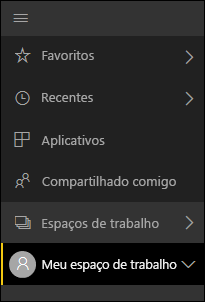
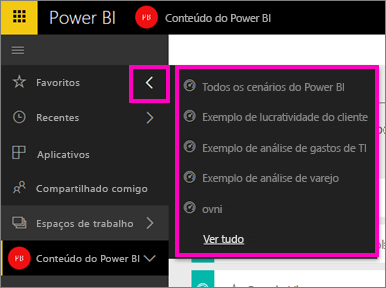
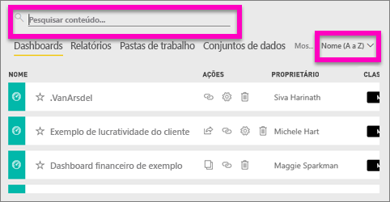
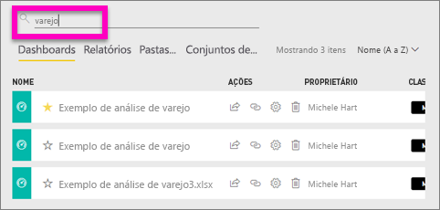
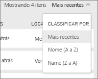

# Pesquisa e classificação de conteúdo no Power BI
Uma combinação de organização automatizada do Power BI, marcação de usuário, pesquisa e classificação permite que você localize rapidamente o que você precisa no serviço do Power BI.

## Como o Power BI ajuda você a navegar em seu conteúdo
O serviço do Power BI organiza o conteúdo de várias maneiras.  Primeiro, ele separa o conteúdo em dashboards, relatórios, pastas de trabalho e conjuntos de dados. Você verá essa organização em muitas das telas do Power BI. Em seguida, o serviço do Power BI classifica o conteúdo de forma a tornar ainda mais fácil para você encontrar rapidamente o que precisa. Dê uma olhada no seu menu de navegação à esquerda.

O conteúdo que você cria para seu próprio uso está disponível em **Meu espaço de trabalho**, o conteúdo que você cria e compartilha com um grupo está disponível em um **espaço de trabalho de aplicativo**, o conteúdo que você deseja acessar rapidamente é salvo em **Favoritos**, o conteúdo que é compartilhado com você está disponível em **Compartilhado comigo** e o conteúdo que você exibiu por último também está disponível em **Recente**.

Para obter mais informações, consulte [Como o conteúdo é organizado no serviço do Power BI](service-basic-concepts.md)

> **OBSERVAÇÃO**: outra maneira de organizar o conteúdo é escolher um dashboard que você deseja exibir com mais frequência e defini-lo como seu dashboard *em destaque*. Cada vez que você abrir o serviço do Power BI, esse é o dashboard que será exibido em primeiro. Para saber mais, consulte [Dashboard em destaque](service-dashboard-featured.md).
> 
> 

## Aplicativos e dashboards favoritos
Você tem uma série de dashboards e aplicativos que visita com frequência? Ao [defini-los como *favoritos*](service-dashboard-favorite.md), eles ficarão sempre disponíveis na sua barra de navegação à esquerda.

.

O trabalho com favoritos é descrito mais detalhadamente no artigo [Favoritos no serviço do Power BI](service-dashboard-favorite.md).

## Pesquisa e classificação em espaços de trabalho
Um espaço de trabalho tem quatro guias de conteúdo: Dashboards, Relatórios, Pastas de trabalho e Conjuntos de dados.  Cada uma dessas guias contém um campo de pesquisa e um botão de classificação.  Quando você estiver começando com o serviço do Power BI, talvez não ache esses recursos úteis, porque você terá apenas um ou dois itens por guia.  No entanto, ao longo do tempo você poderá ter que lidar com longas listas de conteúdo.  Use a pesquisa e classificação para encontrar facilmente o que você precisa.

* Inserir um termo de pesquisa para localizar uma correspondência na tela atual
  
   
* Selecione o botão de classificação para exibir opções para a página atual. As opções são: classificar por nome ou por proprietário.
  
   

## Considerações e solução de problemas
* Para conjuntos de dados, a opção **Classificar por** não está disponível por proprietário.

## Próximas etapas
[Power BI – conceitos básicos](service-basic-concepts.md)

Mais perguntas? [Experimente a Comunidade do Power BI](http://community.powerbi.com/)

