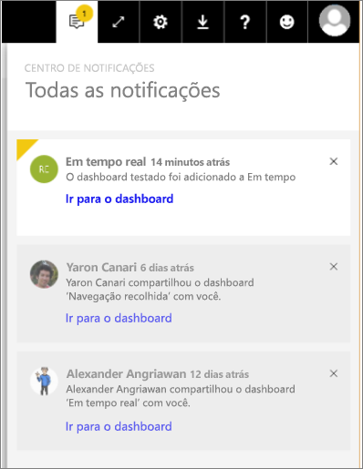

# Notificações do Power BI
O Centro de Notificações é um feed sequencial de informações relacionadas à sua experiência do Power BI. Abra-o para ver mensagens sobre novos painéis que foram compartilhados com você, alterações no espaço do Grupo, informações sobre reuniões e eventos do Power BI, alertas que você definiu e muito mais. Você pode [definir alertas no serviço do Power BI](service-set-data-alerts.md) e também nos aplicativos móveis do Power BI.

Veja Amanda examinando as notificações que recebeu, gerenciando suas notificações e respondendo a elas. Em seguida, siga as instruções abaixo do vídeo para experimentar por conta própria.

<iframe width="560" height="315" src="https://www.youtube.com/embed/bZMSv5KAlcE" frameborder="0" allowfullscreen></iframe>

1. Quando você faz logon no Power BI, as novas notificações enviadas a você enquanto estava offline são adicionadas a seu feed. Se você tem novas notificações, o Power BI exibe uma bolha amarela com o número de novos itens.
   
   
2. Na barra de menu do Power BI, selecione o ícone de Notificações.
   
   
3. As notificações são exibidas com as mensagens mais recentes na parte superior e as mensagens não lidas realçadas. As notificações são mantidas por 90 dias, a menos que você as exclua antes ou quando elas atingirem o limite máximo de 100.
   
   
4. Para descartar uma notificação, selecione o ícone X.

### Próximas etapas
* [Alertas de dados no serviço do Power BI](service-set-data-alerts.md)
* [Criar um Microsoft Flow que é disparado por um alerta de dados do Power BI](service-flow-integration.md)
* [Definir alertas de dados no aplicativo de iPhone (Power BI para iOS)](mobile-set-data-alerts-in-the-mobile-apps.md)
* [Definir alertas de dados no aplicativo móvel do Power BI para Windows 10](mobile-set-data-alerts-in-the-mobile-apps.md)
* Mais perguntas? [Experimente a Comunidade do Power BI](http://community.powerbi.com/)

