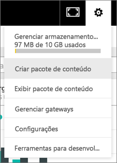
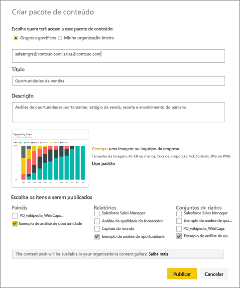
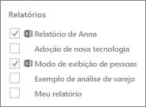
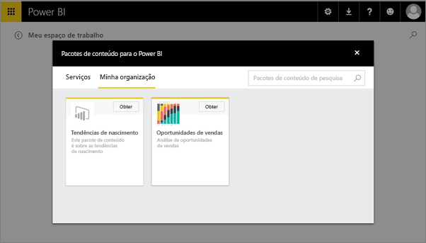

# Criar e publicar um pacote de conteúdo organizacional do Power BI (tutorial)
> [!NOTE]
> Você já ouviu a respeito dos novos *aplicativos*? Os aplicativos são a nova maneira para distribuir conteúdo a um grande público no Power BI. Estamos planejando desativar os pacotes de conteúdo organizacional em breve, portanto, recomendamos o uso de aplicativos. Saiba [mais sobre os aplicativos](service-install-use-apps.md).
> 
> 

Neste tutorial, você criará um pacote de conteúdo organizacional, dará acesso a um grupo específico e o publicará na biblioteca do pacote de conteúdo de sua organização no Power BI.

Criar pacotes de conteúdo é diferente de compartilhar dashboards ou colaborar neles em um grupo. Leia [Como devo colaborar e compartilhar relatórios e dashboards?](service-how-to-collaborate-distribute-dashboards-reports.md) para decidir sobre a melhor opção para sua situação.

> [!NOTE]
> A criação de um pacote de conteúdo organizacional requer uma [conta Power BI Pro](https://powerbi.microsoft.com/pricing) para você e seus colegas.
> 
> 

Imagine que você é o Gerente de Versão da Contoso e está se preparando para o lançamento de um novo produto.  Você criou um painel com relatórios que você gostaria de compartilhar com outros funcionários que estão gerenciando o lançamento. Você quer uma maneira de empacotar o dashboard e os relatórios como uma solução para uso de seus colegas. 

Quer me acompanhar? Em [Serviço do Power BI](https://powerbi.com), acesse **Obter Dados > Amostras > Amostra de Análise de Oportunidades** > **Conectar** para obter sua própria cópia. 

1. No painel de navegação à esquerda, selecione o painel **Exemplo de Análise de oportunidade** .
2. Na barra de navegação superior, selecione o ícone de engrenagem  > **Criar pacote de conteúdo**.    
   
3. Na janela **Criar Pacote de Conteúdo** , insira as seguintes informações.  
   
   Tenha em mente que a biblioteca de pacotes de conteúdo de sua organização pode acabar com centenas de pacotes de conteúdo publicados para a organização ou para os grupos. Reserve um tempo para dar um nome significativo ao seu pacote de conteúdo, adicionar uma descrição válida e selecionar o público-alvo correto.  Use palavras que tornarão seu pacote de conteúdo fácil de encontrar por meio de pesquisa.
   
   1.  Selecione **Grupos Específicos** e insira os endereços de email completos dos indivíduos, [grupos do Office 365](https://support.office.com/article/Create-a-group-in-Office-365-7124dc4c-1de9-40d4-b096-e8add19209e9), grupos de distribuição ou grupos de segurança. Por exemplo:
      
         salesmgrs@contoso.com; sales@contoso.com
      
      Para este tutorial, tente usar seu próprio ou seu endereço de email do grupo.
   
   2.  Nomeie o pacote de conteúdo como **Oportunidades de Vendas**.
   
      > [!TIP]
      > Considere incluir o nome do dashboard no nome do pacote de conteúdo. Dessa forma, seus colegas encontrarão o dashboard mais facilmente depois que se conectarem ao pacote de conteúdo.
      > 
      > 
   
   3.  Recomendável: adicionar uma **descrição**. Isso ajuda os colegas de trabalho a localizar mais facilmente os pacotes de conteúdo que eles precisam. Além de uma descrição, adicione palavras-chave que nossos colegas de trabalho possam usar para pesquisar neste pacote de conteúdo. Inclua informações de contato, caso seus colegas de trabalho tenham alguma dúvida ou precisem de ajuda.
   
   4.  **Carregue uma imagem ou um logotipo** para facilitar a localização do pacote de conteúdo pelos membros do grupo &#151; é mais rápido verificar se há uma imagem do que encontrar um texto. Usamos uma imagem do bloco de gráfico de coluna 100% de Contagem de Oportunidade na captura de tela abaixo.
   
   5.  Selecione o painel **Exemplo de Análise de Oportunidade** para adicioná-lo ao pacote de conteúdo.  O Power BI adiciona automaticamente o relatório associado e um conjunto de dados. Você poderá adicionar outros, se desejar.
   
      > [!NOTE]
      >  São listados apenas dashboards, relatórios, conjuntos de dados e pastas de trabalho que você pode editar. Assim, qualquer um que foi compartilhado com você não está na lista.
      > 
      > 
   
       
   
   6. Se você tiver pastas de trabalho do Excel, veja-as em Relatórios, com um ícone do Excel. Você também pode adicioná-las ao pacote de conteúdo.
   
     
   
      > [!NOTE]
      > Se os membros do grupo não conseguirem exibir a pasta de trabalho do Excel, [compartilhe a pasta de trabalho com eles no OneDrive for Business](https://support.office.com/en-us/article/Share-documents-or-folders-in-Office-365-1fe37332-0f9a-4719-970e-d2578da4941c).
      > 
      > 
4. Selecione **Publicar** para adicionar o pacote de conteúdo à biblioteca de pacote de conteúdo organizacional do grupo.  
   
   Você vê uma mensagem de êxito quando ele é publicado com êxito. 
5. Quando os membros do seu grupo vão para **Obter Dados > Minha Organização**, eles tocam na caixa de pesquisa e digitam “Oportunidades de Vendas”.
   
    
6. Eles veem seu pacote de conteúdo.  
    
   
   > [!TIP]
   > A URL exibida no navegador é um endereço exclusivo para esse pacote de conteúdo.  Quer dizer a seus colegas de trabalho sobre esse novo pacote de conteúdo?  Cole a URL em um email.
   > 
   > 
7. Eles selecionam **Conectar** e agora podem [exibir e trabalhar com seu pacote de conteúdo](service-organizational-content-pack-copy-refresh-access.md). 

### Próximas etapas
* [Introdução aos pacotes de conteúdo organizacional](service-organizational-content-pack-introduction.md)  
* [Gerenciar, atualizar e excluir pacotes de conteúdo organizacional](service-organizational-content-pack-manage-update-delete.md)  
* [Criar um grupo no Power BI](service-create-distribute-apps.md)  
* [O que é o OneDrive for Business?](https://support.office.com/en-us/article/What-is-OneDrive-for-Business-187f90af-056f-47c0-9656-cc0ddca7fdc2)
* Mais perguntas? [Experimente a Comunidade do Power BI](http://community.powerbi.com/)

