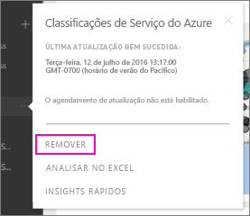

# Remover a conexão de um pacote de conteúdo organizacional do Power BI
Um colega de trabalho criou um pacote de conteúdo. Você o descobriu no AppSource e adicionou-o ao seu espaço de trabalho do Power BI. Mas você não precisa mais disso.  Como removê-lo?

Para remover um pacote de conteúdo, você remove seu conjunto de dados.  

* No painel de navegação esquerdo, selecione as reticências à direita do conjunto de dados e selecione **Remover \> Sim**.  
  
  

A remoção do conjunto de dados também remove todos os relatórios e dashboards associados. No entanto, a remoção da conexão com o pacote de conteúdo não exclui o pacote de conteúdo do AppSource de sua organização.  Você sempre pode retornar ao AppSource e adicionar o pacote de conteúdo novamente ao espaço de trabalho. Você só poderá [excluir um pacote de conteúdo do AppSource](service-organizational-content-pack-manage-update-delete.md) se for o criador dele.

## Próximas etapas
* [Introdução aos pacotes de conteúdo organizacional](service-organizational-content-pack-introduction.md) 
* [Criar e distribuir um aplicativo no Power BI](service-create-distribute-apps.md) 
* [Conceitos básicos do Power BI](service-basic-concepts.md)  
* Mais perguntas? [Experimente a Comunidade do Power BI](http://community.powerbi.com/)

