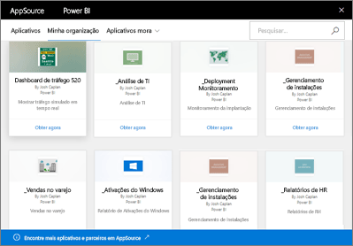

# Introdução aos pacotes de conteúdo organizacional no Power BI
> [!NOTE]
> Você já ouviu a respeito dos novos *aplicativos*? Os aplicativos são a nova maneira para distribuir conteúdo a um grande público no Power BI. É recomendável usar aplicativos em vez de espaços de trabalho somente leitura ou pacotes de conteúdo organizacional. Saiba [mais sobre os aplicativos](service-install-use-apps.md).
> 
> 

Você distribui regularmente relatórios por email para a sua equipe? Tente o seguinte: junte seus dashboards, relatórios, pastas de trabalho do Excel e conjuntos de dados em pacotes e publique-os em sua equipe como um *pacote de conteúdo organizacional*. Os pacotes de conteúdo que você criar são fáceis de serem encontrados por sua equipe &#151; todos eles estão no AppSource. Por fazerem parte do Power BI, eles usam todos os recursos do Power BI, incluindo a exploração interativa de dados, novas visualizações, P e R, integração com outras fontes de dados, atualização de dados e muito mais.

A criação de pacotes de conteúdo é diferente do compartilhamento de dashboards ou da colaboração neles em um espaço de trabalho de aplicativo. Leia [Como devo colaborar e compartilhar relatórios e dashboards?](service-how-to-collaborate-distribute-dashboards-reports.md) para decidir sobre a melhor opção para sua situação. 

No AppSource, procure ou pesquise os pacotes de conteúdo publicados em toda a organização, em grupos de distribuição ou de segurança e nos [grupos do Office 365 dos quais você faz parte](https://support.office.com/article/Create-a-group-in-Office-365-7124dc4c-1de9-40d4-b096-e8add19209e9). Se você não é um membro de um grupo específico, não verá os pacotes de conteúdo compartilhados com esse grupo. Todos os membros do grupo têm o mesmo acesso somente leitura aos dados do pacote de conteúdo, relatórios, pastas de trabalho e painéis (a menos que eles sejam uma fonte de dados do SSAS (SQL Server Analysis Services); nesse caso, os privilégios são herdados com a fonte de dados).

Os dashboards, relatórios e pastas de trabalho do Excel são somente leitura, mas você pode copiar e usar os dashboards e os relatórios como um ponto de partida para criar sua versão personalizada do pacote de conteúdo.

> [!NOTE]
> Os pacotes de conteúdo organizacional estão disponíveis somente quando você e seus colegas têm o [Power BI Pro](service-free-vs-pro.md).
> 
> 

## O que é o *AppSource*?
A publicação de um pacote de conteúdo organizacional o adiciona ao AppSource.  Este repositório centralizado facilita para os membros navegar e descobrir painéis, relatórios e conjuntos de dados publicados para eles.  

* Para exibir o AppSource, selecione **Obter Dados** > **Minha Organização** > **Obter**.

Leia mais sobre como [encontrar e abrir pacotes de conteúdo organizacional](service-organizational-content-pack-find-and-open.md).

## O ciclo de vida de um pacote de conteúdo organizacional
Qualquer usuário do Power BI Pro pode criar, publicar e acessar pacotes de conteúdo organizacional. Apenas o criador do pacote de conteúdo pode modificar a pasta de trabalho e o conjunto de dados, bem como agendar a atualização e exclui-la.

O ciclo de vida é parecido com este:

1. No Power BI Pro, João cria um pacote de conteúdo e o publica no grupo de distribuição Marketing. As configurações de atualização são herdadas com o conjunto de dados e só podem ser alteradas por João.
   
   > [!NOTE]
   > Se João criar o pacote de conteúdo em um [espaço de trabalho de aplicativo do Power BI](service-create-distribute-apps.md) do qual ele faz parte, mesmo se ele sair do espaço de trabalho, os outros usuários que estiverem no espaço de trabalho do Power BI poderão assumir a propriedade.
   > 
   > 
2. João envia um email ao grupo de distribuição, informando-os sobre o novo pacote de conteúdo.
3. No Power BI Pro, Júlia, membro do grupo de distribuição Marketing, pesquisa e se conecta a esse pacote de conteúdo no AppSource. Agora, ela tem uma cópia somente leitura.  Ela sabe que ele é somente leitura, porque no Painel de Navegação esquerdo há um ícone de compartilhamento à esquerda do nome do painel e o nome do relatório. E quando ela seleciona o painel, um ícone de cadeado informará Julia que ela está observando um painel do pacote de conteúdo. 
4. Digamos que ela decida personalizá-lo. Ela agora está trabalhando em sua própria cópia do painel e dos relatórios. Seu trabalho não afeta a fonte, o pacote de conteúdo original, nem outros membros do grupo de distribuição. Ela agora está trabalhando em sua própria cópia do painel e do relatório.
5. João faz atualizações no painel e, quando estiver pronto, publica uma nova versão do pacote de conteúdo.
   
   * Julio, outro membro do grupo de distribuição, não personalizou o pacote de conteúdo original. As novas alterações são aplicadas automaticamente a sua versão do pacote de conteúdo.  
   * Julia personalizou o pacote de conteúdo. Ela recebe uma notificação de que há uma nova versão.  Ela pode acessar o AppSource e obter o pacote de conteúdo atualizado sem perder sua versão personalizada. Agora, ela terá as duas versões: sua versão personalizada e o pacote de conteúdo atualizado.
6. Digamos que altere as configurações de segurança. Julio e Julia não têm mais acesso ao conteúdo. Digamos que eles foram removidos do grupo de distribuição Marketing.
   
   * Julio não personalizou o pacote de conteúdo original, por tanto, o conteúdo será removido automaticamente. 
   * Julia personalizou o pacote de conteúdo. Na próxima vez que ela abrir o painel todos os blocos do pacote de conteúdo original sumiram, mas os blocos de outros relatórios que ela fixou (se ela ainda tiver permissão para usá-lo) serão exibidos. Os relatórios e o conjunto de dados associados não estarão mais disponíveis (e não aparecerão em seu painel de navegação à esquerda).
7. Ou então, João exclui o pacote de conteúdo.
   
   * Julio não personalizou o pacote de conteúdo original, por tanto, o conteúdo será removido automaticamente. 
   * Julia personalizou o pacote de conteúdo. Na próxima vez que ela abrir o dashboard, todos os blocos do pacote de conteúdo original terão desaparecido, mas os blocos de outros relatórios que ela fixou ainda serão exibidos. Os relatórios e o conjunto de dados associados não estarão mais disponíveis (e não aparecerão em seu painel de navegação à esquerda).

## Segurança de dados
Todos os membros do grupo de distribuição têm as mesmas permissões para os dados que o criador do pacote de conteúdo. A única exceção são os conjuntos de dados de tabela locais do SSAS (SQL Server Analysis Services). Como os relatórios e dashboards se conectam dinamicamente ao modelo SSAS local, as credenciais de cada membro individual do grupo de distribuição são usadas para determinar os dados que ele poderá acessar.

## Próximas etapas
* [Criar e publicar um pacote de conteúdo organizacional](service-organizational-content-pack-create-and-publish.md)
* [Criar e distribuir um aplicativo no Power BI](service-create-distribute-apps.md) 
* [Power BI – conceitos básicos](service-basic-concepts.md)
* Mais perguntas? [Experimente a Comunidade do Power BI](http://community.powerbi.com/)

