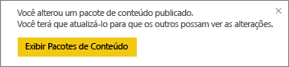
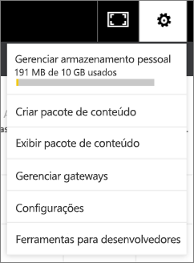

# Gerenciar, atualizar e excluir pacotes de conteúdo organizacional
> [!NOTE]
> Você já ouviu a respeito dos novos *aplicativos*? Os aplicativos são a nova maneira para distribuir conteúdo a um grande público no Power BI. Estamos planejando desativar os pacotes de conteúdo organizacional em breve, portanto, recomendamos o uso de aplicativos. Saiba [mais sobre os aplicativos](service-install-use-apps.md).
> 
> 

Você pode empacotar e compartilhar seus painéis, relatórios, pastas de trabalho do Excel e conjuntos de dados com seus colegas em [pacotes de conteúdo organizacional](service-organizational-content-pack-introduction.md). Seus colegas podem usá-los como estiverem ou podem criar suas próprias cópias.

Criar pacotes de conteúdo é diferente de compartilhar dashboards ou colaborar neles em um grupo. Leia [Como devo colaborar e compartilhar relatórios e dashboards?](service-how-to-collaborate-distribute-dashboards-reports.md) para decidir sobre a melhor opção para sua situação.

Você só poderá realizar algumas tarefas do pacote de conteúdo organizacional se for o criador do pacote de conteúdo:

* Republicar.
* Restringir ou expandir o acesso ao pacote de conteúdo.
* Definir e alterar a atualização agendada.
* Excluir o pacote de conteúdo.

## Modificar e republicar um pacote de conteúdo organizacional
Se você fizer alterações no painel original do pacote de conteúdo, relatório ou pasta de trabalho do Excel, o Power BI solicitará que você publique novamente. Além disso, como criador do conteúdo do pacote, você pode atualizar qualquer uma das opções selecionadas na janela de criação de pacote de conteúdo, ao criar o pacote de conteúdo original. 

## Republicar com novo conteúdo
Ao fazer ou salvar uma alteração no painel que você incluiu em um pacote de conteúdo, o Power BI lembrará você de atualizá-lo para que outros possam ver as alterações. Por exemplo, se você fixa um novo bloco ou simplesmente altera o nome do painel.

1. Selecione **Exibir Pacotes de Conteúdo** na mensagem.
   
   
2. Se preferir, selecione o ícone de engrenagem no canto superior direito  e selecione **Exibir Pacote de Conteúdo**.
   
   
   
   Observe o ícone de aviso .  Assim, você sabe que modificou o pacote de conteúdo de alguma forma e ele não coincide mais com o que foi publicado.
3. Selecione **Editar**.  
4. Faça as alterações necessárias na janela **Pacote de atualização de conteúdo** e selecione **Atualização**. Será exibida uma mensagem de **êxito** .
   
   * Para membros do grupo que não personalizaram o pacote de conteúdo, a atualização é aplicada automaticamente.
   * Os membros do grupo que personalizaram o pacote de conteúdo receberão uma notificação de que há uma nova versão.  Eles podem acessar o AppSource e obter o pacote de conteúdo atualizado sem perder sua versão personalizada.  Agora eles terão as duas versões: a versão personalizada e o pacote de conteúdo atualizado.  Na versão personalizada, todas as peças do pacote de conteúdo original serão eliminadas.  Mas os blocos fixados de outros relatórios ainda serão renderizados.    

## Atualizar o público: expandir ou restringir o acesso
Outra modificação para criadores de pacote de conteúdo está expandindo e restringindo o acesso ao pacote de conteúdo.  Talvez você tenha publicado um pacote de conteúdo para um público amplo e decidiu restringir o acesso a um grupo menor.  

1. Selecione o ícone de engrenagem  e escolha **Exibir Pacotes de Conteúdo**.
2. Selecione **Editar**. 
3. Faça as alterações necessárias na janela **Pacote de atualização de conteúdo** e selecione **Atualização**. Por exemplo, exclua o grupo de distribuição original no campo **Grupos Específicos** e substitua-o por um grupo de distribuição diferente (que tem menos membros).
   
   Será exibida uma mensagem de êxito.
   
   Para qualquer colaborador que não faz parte do novo alias:
   
   * Para os membros do grupo que não personalizaram o pacote de conteúdo, o painel e os relatórios associados a esse pacote de conteúdo não estarão mais disponíveis e o pacote de conteúdo não será exibido no Painel de Navegação.
   * Para os membros do grupo que personalizaram o pacote de conteúdo, na próxima vez que eles abrirem o painel personalizado, todos os blocos do pacote de conteúdo original desaparecerão.  Mas os blocos fixados de outros relatórios ainda serão renderizados. Os relatórios e o conjunto de dados do pacote de conteúdo original não estarão mais disponíveis, e o pacote de conteúdo não aparecerá no painel de Navegação.   

## Atualizar um pacote de conteúdo organizacional
Como o criador do pacote de conteúdo, você pode [agendar a atualização dos conjuntos de dados](refresh-data.md).  Quando você cria e carregar o pacote de conteúdo, essa agenda de atualização é carregada com os conjuntos de dados. Se você alterar o agendamento de atualização, você precisará publicar novamente o pacote de conteúdo (veja acima).

## Excluir um pacote de conteúdo organizacional do AppSource
Você só poderá excluir um pacote de conteúdo do AppSource se o tiver criado. Se você criar um pacote de conteúdo organizacional em um espaço de trabalho do aplicativo e, depois, decidir excluir esse espaço de trabalho, lembre-se de excluir o pacote de conteúdo primeiro. Se você excluir o espaço de trabalho sem excluir o pacote de conteúdo primeiro, você perderá todo o acesso a esses pacotes de conteúdo e terá que entrar em contato com o Suporte da Microsoft para obter ajuda. 

> [!TIP]
> É possível [excluir a conexão com um pacote de conteúdo](service-organizational-content-pack-disconnect.md) que você não criou. Isso não exclui o pacote de conteúdo do AppSource.
> 
> 

1. Para excluir um pacote de conteúdo do AppSource, acesse o espaço de trabalho de aplicativo em que você criou o pacote de conteúdo, selecione o ícone de engrenagem  e escolha **Exibir Pacotes de Conteúdo**.
2. Selecione **Excluir \> Excluir**. 
   
   * Para os membros do grupo que não personalizaram o pacote de conteúdo, o painel e os relatórios associados a esse pacote de conteúdo serão removidos automaticamente. Eles não estarão disponíveis, e o pacote de conteúdo não aparecerá no Painel de Navegação.
   * Para os membros do grupo que personalizaram o pacote de conteúdo, na próxima vez que eles abrirem o painel personalizado, todos os blocos do pacote de conteúdo original desaparecerão.  Mas os blocos fixados de outros relatórios ainda serão renderizados. Os relatórios e o conjunto de dados do pacote de conteúdo original não estarão mais disponíveis, e o pacote de conteúdo não aparecerá no painel de Navegação.   

## Próximas etapas
* [Introdução aos pacotes de conteúdo organizacional](service-organizational-content-pack-introduction.md)
* [Criar e distribuir um aplicativo no Power BI](service-create-distribute-apps.md) 
* Mais perguntas? [Experimente a Comunidade do Power BI](http://community.powerbi.com/)

