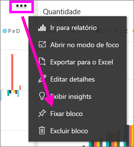
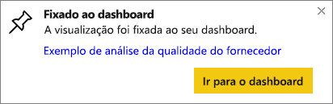

# Fixar um bloco de um painel para outro painel
Uma maneira de adicionar um novo [bloco de painel](service-dashboard-tiles.md) é copiando-o de outro painel. Ao clicar em cada um desses blocos, haverá um link para onde foi criado – em P e R ou em um relatório. 

> [!NOTE]
> Não é possível fixar blocos de painéis compartilhados.

## Fixar um bloco em outro dashboard
1. [Obter dados](service-get-data.md). Este modelo usa o [Exemplo de Análise de Gastos de TI](sample-it-spend.md).
2. Abrir um [painel](service-dashboards.md)
3. Passe o mouse sobre o bloco que você deseja fixar, selecione as reticências (...) e escolha o **Bloco de pino**.  
   
   
4. Fixe o bloco em um painel existente ou em um novo painel. 
   
   * **Painel existente**: selecione o nome do painel no menu suspenso.
   * **Novo painel**: digite o nome do novo painel.
   
   
5. Selecione **Fixar**.
   Uma mensagem de êxito (perto do canto superior direito) informa que a visualização foi adicionada, como um bloco, ao painel selecionado.
   
   
6. Selecione **Ir para o dashboard** para ver o bloco fixado. Nele, você poderá [renomear, redimensionar, vincular e mover](service-dashboard-edit-tile.md) a visualização fixada.

## Próximas etapas
[Blocos no Power BI](service-dashboard-tiles.md)  
[Dashboards no Power BI](service-dashboards.md)  
Mais perguntas? [Experimente a Comunidade do Power BI](http://community.powerbi.com/)

