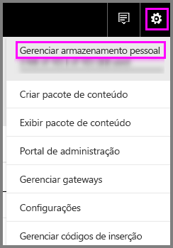
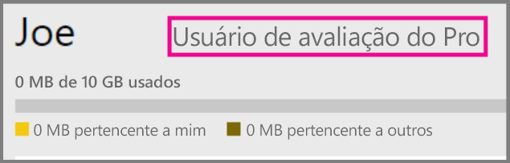
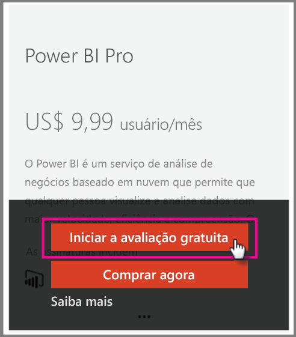

# Power BI Pro em sua organização

O Power BI Pro é uma licença paga que habilita mais recursos. Licenças do Power BI Pro são para uma equipe que deseja compartilhar e colaborar com outras pessoas para tomar decisões controladas por dados.  Cada membro da equipe criando ou exibindo o conteúdo compartilhado do Power BI deve ter uma licença Pro, a menos que o conteúdo esteja associado com uma capacidade dedicada usando o Power BI Premium.

Estes recursos exigem uma licença do Power BI Pro:

* **Analisar dados no Excel ou Power BI Desktop** – use o Excel ou o Power BI Desktop para ver e interagir com um conjunto de dados publicados no Power BI. Para obter mais informações, consulte [Analisar no Excel](service-analyze-in-excel.md).

* **Compartilhar dashboards e colaborar com espaços de trabalho** – espaços de trabalho do Power BI facilitam a colaboração com colegas em dashboards, relatórios e conjuntos de dados. Para obter mais informações, confira o artigo [Colaborar em seu espaço de trabalho de aplicativo do Power BI](service-collaborate-power-bi-workspace.md).

* **Ver conteúdo compartilhado** – os usuários Pro podem ver, interagir e compartilhar novamente dashboards e relatórios compartilhados com eles (se permitido). No entanto, um usuário Pro não pode editar esses dashboards ou relatórios. Para obter mais informações, consulte [Compartilhar seus dashboards e relatórios do Power BI com colegas e outras pessoas](service-share-dashboards.md).

* **Integrar o conteúdo com o Microsoft Teams** – você pode adicionar uma guia do Power BI em um canal do Microsoft (MS) Teams. O MS Teams detecta automaticamente todos os relatórios no espaço de trabalho. Para obter mais informações, consulte [O Power BI junta-se ao Microsoft Teams](https://powerbi.microsoft.com/en-us/blog/power-bi-teams-up-with-microsoft-teams/). 

## Avaliação de 60 dias do Power BI Pro para indivíduos

Depois de se inscrever em sua conta gratuita, você pode optar por experimentar o Pro gratuitamente por 60 dias. Você terá acesso a todos os recursos do Pro durante o período da avaliação. O Power BI Pro tem todos os recursos da versão gratuita do Power BI, bem como recursos adicionais de colaboração e compartilhamento. Para obter mais informações, veja [Preços do Power BI](https://powerbi.microsoft.com/en-us/pricing/). Para experimentar uma avaliação gratuita de 60 dias do Power BI Pro, entre no Power BI e experimente um desses recursos do Power BI Pro.

* [Criar um espaço de trabalho](service-create-distribute-apps.md)
* [Compartilhar um dashboard](service-share-dashboards.md)

Quando experimentar um desses recursos, você precisará iniciar sua avaliação gratuita. Você também pode optar por usá-lo indo até o ícone de engrenagem e selecionando Gerenciar armazenamento pessoal. Em seguida, selecione Experimentar o Pro gratuitamente à direita.

   
    
   

Em seguida, é possível selecionar Iniciar avaliação.

   

> [!NOTE]
> Os usuários que aproveitam esta avaliação do Power BI Pro dentro do produto não aparecem no portal de administração do Office 365 como usuários da Avaliação do Power BI Pro (eles aparecem como usuários da versão gratuita do Power BI). No entanto, eles aparecerão como usuários da versão de Avaliação do Power BI Pro na página gerenciar armazenamento do Power BI.
>

> [!NOTE]
> Se você é um Administrador de TI que deseja adquirir e implantar licenças de avaliação do Power BI para vários usuários em sua organização sem que os usuários individuais aceitem os termos da avaliação individualmente, é possível se inscrever em uma avaliação de assinatura do Power BI Pro. Você precisará ser um Administrador Global ou de Cobrança do Office 365 ou criar um novo locatário para se inscrever em uma avaliação de administrador. Para obter mais informações, consulte [Comprando o Power BI Pro](service-admin-purchasing-power-bi-pro.md).
>

Quando estiver conectado ao serviço, será possível verificar se você tem uma conta de avaliação Pro indo até o ícone de engrenagem e selecionando Gerenciar armazenamento pessoal.

   

## Assinatura de avaliação no Office 365

Você pode obter o Power BI Pro como uma versão de avaliação para sua organização. Assim que tiver a assinatura, você pode atribuir licenças do Power BI Pro para seus usuários. Para obter mais informações sobre como atribuir licenças, consulte [Atribuir licenças a usuários no Office 365](https://support.office.com/en-us/article/assign-licenses-to-users-in-office-365-for-business-997596b5-4173-4627-b915-36abac6786dc?ui=en-US&rs=en-US&ad=US).

> [!NOTE]
> Há um limite de uma avaliação organizacional por locatário. Isso significa que se alguém já aplicou a Avaliação do Power BI Pro para o seu locatário, você não poderá aplicar novamente. Se precisar de assistência com isso, contate o [suporte de cobrança do Office 365](https://support.office.microsoft.com/en-us/article/contact-support-for-business-products-admin-help-32a17ca7-6fa0-4870-8a8d-e25ba4ccfd4b?CorrelationId=552bbf37-214f-4202-80cb-b94240dcd671&ui=en-US&rs=en-US&ad=US).
>

Siga estas etapas para obter uma assinatura de avaliação no Office 365:

1. Navegue até o [Centro de administração do Office 365](https://portal.office.com/adminportal/home#/homepage).
2. No painel de navegação esquerdo, selecione Cobrança e depois clique em Assinaturas.

   

3. Selecione Adicionar assinaturas no lado direito.

   

4. Em Outros Planos, passe o mouse sobre a elipse (...) para o Power BI Pro e selecione Iniciar avaliação gratuita.

    

5. Na tela de confirmação do seu pedido, selecione Experimentar agora.
6. Selecione Continuar no recibo do pedido.

## Comprando o Power BI Pro

Você pode comprar o Power BI Pro por meio do Microsoft Office 365 ou de um parceiro certificado da Microsoft. Para obter mais informações sobre como comprar o Power BI Pro, consulte [Comprar o Power BI Pro](service-admin-purchasing-power-bi-pro.md).

## Próximas etapas
[Inscrição de autoatendimento no Power BI](service-admin-signing-up-for-power-bi-with-a-new-office-365-trial.md)
 
[Power BI (gratuito) em sua organização](service-admin-service-free-in-your-organization.md)
 
[Compra do Power BI Pro](service-admin-purchasing-power-bi-pro.md)
 
[Ativação da Avaliação Pro Estendida](service-extended-pro-trial.md)
 
[Atribuir licenças do Power BI Pro](service-assigning-power-bi-pro-licenses.md)
 
[Power BI Premium – o que é?](service-admin-premium-manage.md)
 
[Como comprar o Power BI Premium](service-admin-premium-purchase.md)
 
[White paper do Power BI Premium](https://aka.ms/pbipremiumwhitepaper)

Mais perguntas? [Experimente perguntar à Comunidade do Power BI](https://community.powerbi.com/)