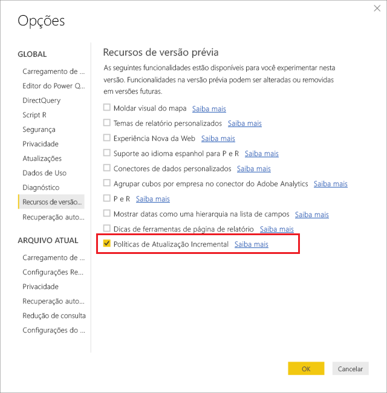
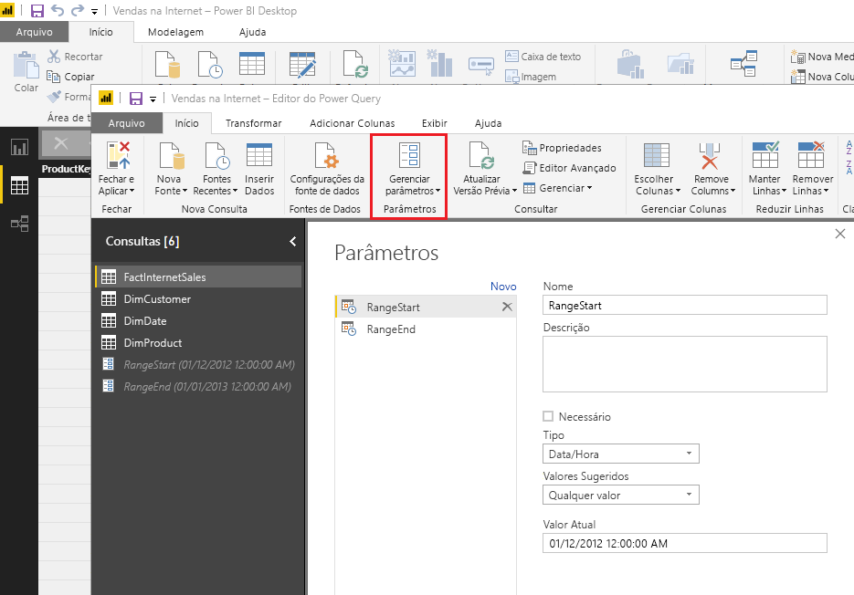
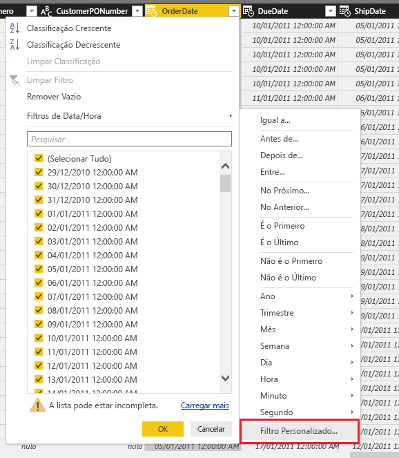
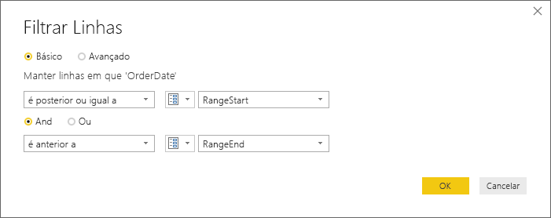
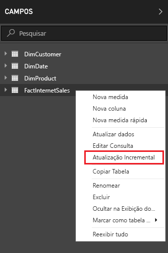
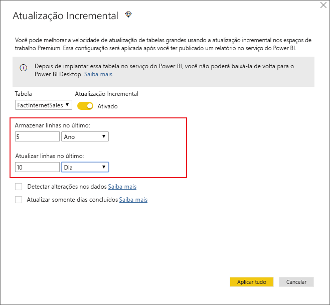
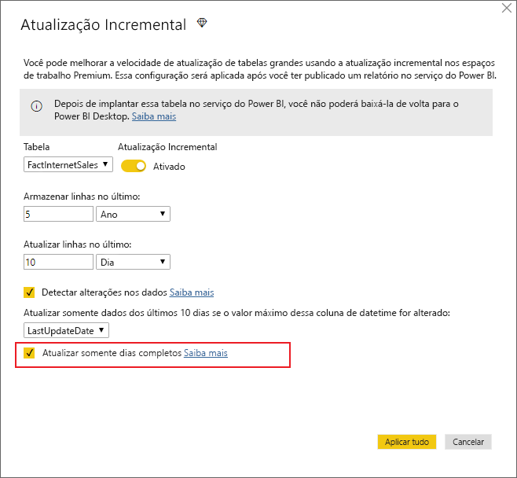
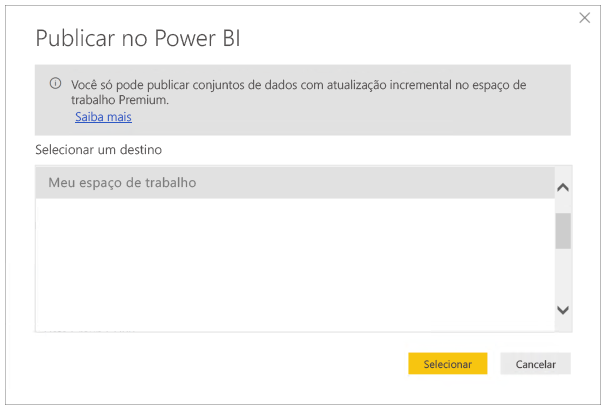

# <a name="incremental-refresh-in-power-bi-premium"></a>Atualização incremental no Power BI Premium

A atualização incremental permite conjuntos de dados muito grandes no serviço do Power BI Premium com os seguintes benefícios:

- **As atualizações são mais rápidas.** Somente os dados que foram alterados precisam ser atualizados. Por exemplo, atualizar somente os últimos cinco dias de um conjunto de dados de 10 anos.

- **As atualizações são mais confiáveis.** Por exemplo, não é necessário manter conexões longas com sistemas de origem voláteis.

- **O consumo de recursos é reduzido.** Menos dados para atualizar reduz o consumo geral de memória e de outros recursos.

## <a name="how-to-use-incremental-refresh"></a>Como usar a atualização incremental

As políticas de atualização incremental são definidas no Power BI Desktop e aplicadas quando são publicadas no serviço do Power BI.

Comece permitindo a atualização incremental nos recursos de versão prévia.



### <a name="filter-large-datasets-in-power-bi-desktop"></a>Filtrar conjuntos de dados grandes no Power BI Desktop

Os conjuntos de dados grandes, com possíveis bilhões de linhas, podem não caber no Power BI Desktop porque normalmente ele é limitado pelos recursos disponíveis no computador desktop do usuário. Portanto, normalmente, esses conjuntos de dados são filtrados após a importação para caber no Power BI Desktop. Esse mesmo caso ocorre se a atualização incremental estiver sendo usada ou não.

#### <a name="rangestart-and-rangeend-parameters"></a>Parâmetros RangeStart e RangeEnd

Para aproveitar a atualização incremental no serviço do Power BI, a filtragem precisa ser feita usando os parâmetros de data/hora do Power Query com os nomes reservados, que diferenciam maiúsculas de minúsculas **RangeStart** e **RangeEnd**.

No Editor Power Query, selecione **Gerenciar Parâmetros** para definir os parâmetros com valores padrão.



Com os parâmetros definidos, você pode aplicar o filtro selecionando a opção de menu **Filtro Personalizado** para uma coluna.



Verifique se as linhas são filtradas com o valor da coluna *após ou igual a* **RangeStart** e *antes de* **RangeEnd**.



> [!TIP]
> Embora o tipo de dados dos parâmetros precise ser data/hora, é possível convertê-los para corresponder aos requisitos da fonte de dados. Por exemplo, a função do Power Query a seguir converte um valor de data/hora para se parecer com uma chave alternativa de inteiro no formato *aaaammdd*, que é comum para data warehouses. A função pode ser chamada pela etapa de filtro.
>
> `(x as datetime) => Date.Year(x)*10000 + Date.Month(x)*100 + Date.Day(x)`

Selecione **Fechar e Aplicar** no Editor Power Query. Um subconjunto do conjunto de dados estará presente no Power BI Desktop.

> [!NOTE]
> Depois de publicado, os valores de parâmetro serão substituídos automaticamente pelo serviço do Power BI. Não é necessário defini-los nas configurações do conjunto de dados.

### <a name="define-the-refresh-policy"></a>Definir a política de atualização

A atualização incremental está disponível no menu de contexto das tabelas, exceto para modelos de conexão dinâmica.



#### <a name="incremental-refresh-dialog"></a>Caixa de diálogo de atualização incremental

A caixa de diálogo de atualização incremental é exibida. Use o botão de alternância para habilitar a caixa de diálogo.


> [!NOTE]
> Se a expressão do Power Query para a tabela não se referir aos parâmetros com nomes reservados, o botão de alternância estará desabilitado.

O texto do cabeçalho explica o seguinte:

-   A atualização incremental apenas é compatível com espaços de trabalho na capacidade Premium. As políticas de atualização são definidas no Power BI Desktop e são aplicadas por operações de atualização no serviço.

-   Se o arquivo PBIX que contém uma política de atualização incremental ainda puder ser baixado do serviço do Power BI, ele não será aberto no Power BI Desktop. Em breve não será mais possível baixá-lo. Embora isso possa ter suporte futuramente, tenha em mente que esses conjuntos de dados podem ficar tão grandes a ponto de não poderem mais ser baixados e abertos em um computador desktop comum.

#### <a name="refresh-ranges"></a>Intervalos de atualização

O exemplo a seguir define uma política de atualização para armazenar cinco anos de dados no total e atualizar incrementalmente 10 dias de dados. Se o conjunto de dados for atualizado diariamente, o seguinte será executado para cada operação de atualização.

-   Adicione um novo dia de dados.

-   Atualize 10 dias até a data atual.

-   Remova os anos civis com mais de cinco anos antes da data atual. Por exemplo, se a data atual for 1º de janeiro de 2019, o ano de 2013 será removido.

A primeira atualização no serviço do Power BI pode demorar mais para importar todos os cinco anos. As próximas atualizações podem ser concluídas em uma fração desse tempo.



**Talvez você precise apenas da definição desses intervalos e, nesse caso, você pode ir diretamente para a etapa de publicação abaixo. As listas suspensas adicionais são para recursos avançados.**

#### <a name="detect-data-changes"></a>Detectar alterações nos dados

A atualização incremental de 10 dias é obviamente muito mais eficiente do que uma atualização completa de cinco anos. No entanto, é possível fazer ainda melhor. Se você marcar a caixa de seleção **Detectar alterações nos dados**, será possível selecionar uma coluna de data/hora usada para identificar e atualizar somente os dias em que os dados foram alterados. Isso pressupõe que uma coluna dessa exista no sistema de origem, normalmente para fins de auditoria. O valor máximo dessa coluna é avaliado para cada um dos períodos no intervalo incremental. Se ele não foi alterado desde a última atualização, não é necessário atualizar o período. No exemplo, isso poderia reduzir ainda mais os dias atualizados incrementalmente de 10 para, talvez, 2.


> [!TIP]
> O projeto atual requer que a coluna que detecta alterações nos dados seja persistente e fique armazenada em cache na memória. É interessante considerar uma das técnicas a seguir para reduzir a cardinalidade e o consumo de memória.
>
> Persista apenas o valor máximo dessa coluna no momento da atualização, talvez usando uma função do Power Query.
>
> Reduza a precisão a um nível aceitável considerando seus requisitos de frequência de atualização.
>
> Estamos planejando permitir a definição de consultas personalizadas para detecção de alteração nos dados em uma data futura. Essa opção poderá ser usada para evitar que o valor da coluna persista completamente.

#### <a name="only-refresh-complete-periods"></a>Atualizar somente períodos concluídos

Digamos que sua atualização esteja agendada para ser executada às 4h, todas as manhãs. Se os dados aparecerem no sistema de origem durante essas 4 horas, não será necessário considerá-los. Algumas métricas de negócios, como barris por dia no setor de petróleo e gás, não fazem sentido com partes de dias.

Outro exemplo é a atualização de dados de um sistema financeiro no qual os dados do mês anterior são aprovados no dia 12 do mês. Você pode definir o intervalo incremental para um mês e agendar a atualização para ser executada no dia 12 do mês. Com essa opção marcada, os dados de janeiro seriam atualizados em 12 de fevereiro.



> [!NOTE]
> As operações de atualização no serviço são executadas em hora UTC. Assim, é possível determinar a data de efetivação e afetar períodos concluídos. Estamos planejando adicionar a capacidade de substituir a data de efetivação de uma operação de atualização.

## <a name="publish-to-the-service"></a>Publicar no serviço

Como a atualização incremental é um recurso somente Premium, a caixa de diálogo Publicar apenas permite a seleção de um espaço de trabalho na capacidade Premium.



Agora você pode atualizar o modelo. A primeira atualização pode demorar mais para importar os dados históricos. As próximas atualizações poderão ser muito mais rápidas porque elas usarão a atualização incremental.

## <a name="query-timeouts"></a>Tempos limite de consulta

O artigo [Solucionando problemas de atualização](https://docs.microsoft.com/power-bi/refresh-troubleshooting-refresh-scenarios) explica que as operações de atualização no serviço do Power BI estão sujeitas a tempos limite. As consultas também podem ser limitadas pelo tempo limite padrão da fonte de dados. A maioria das fontes relacionais permitem a substituição de tempos limite na expressão M. Por exemplo, a expressão abaixo usa a [função de acesso a dados do SQL Server](https://msdn.microsoft.com/query-bi/m/sql-database) para defini-lo para 2 horas. Cada período definido pelos intervalos de política envia uma consulta observando a configuração de tempo limite do comando.

```
let
    Source = Sql.Database("myserver.database.windows.net", "AdventureWorks", [CommandTimeout=#duration(0, 2, 0, 0)]),
    dbo_Fact = Source{[Schema="dbo",Item="FactInternetSales"]}[Data],
    #"Filtered Rows" = Table.SelectRows(dbo_Fact, each [OrderDate] >= RangeStart and [OrderDate] < RangeEnd)
in
    #"Filtered Rows"
```
