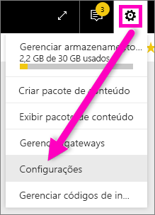
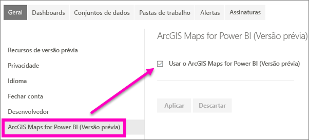

# Aceitar recursos de visualização do Power BI
## O que é a *versão prévia dos recursos*?
À medida que fizermos melhorias no Power BI, lançaremos novas funcionalidades como *versão prévia dos recursos*. A versão prévia dos recursos pode ser ligada e desligada, oferecendo a você a oportunidade de experimentá-la.

> [!TIP]
> Tem dúvidas ou comentários? [Acesse o fórum da comunidade do Power BI](http://community.powerbi.com/t5/Navigation-Preview-Forum/bd-p/NavigationPreview).
> 
> 

## Versões prévias atuais disponíveis
**Versão prévia do ArcGIS Maps para o Power BI** A combinação do ArcGIS Maps e do Power BI leva o mapeamento para além da apresentação de pontos em um mapa para um nível totalmente novo.
[Faça um tour no ArcGIS Maps pelo ESRI no serviço do Power BI e no Power BI Desktop](power-bi-visualization-arcgis.md).

## Ative (e desative) o novo recurso de visualização do ArcGIS
1. Abra o menu Configurações selecionando o ícone de engrenagem no canto superior direito da tela do Power BI e escolhendo **Configurações**.
   
   .
2. Selecione a guia **Geral** e escolha **Versão prévia dos recursos**.
   
   
3. Selecione o botão de opção **Ativar** para experimentar a nova experiência. Clique em **Aplicar**.
4. Para desligar a versão prévia dos recursos, siga as etapas 1 e 2 acima e, na etapa 3, selecione **Desligar** > **Aplicar**.

## Próximas etapas
[Nova experiência de navegação com o Power BI](service-the-new-power-bi-experience.md)

Tem dúvidas ou comentários? [Acesse o fórum da comunidade do Power BI](http://community.powerbi.com/t5/Navigation-Preview-Forum/bd-p/NavigationPreview).

