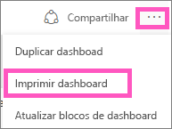
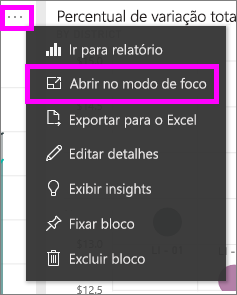
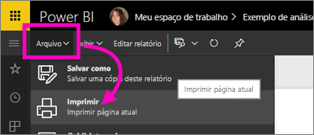

# Imprimir usando o serviço do Power BI
Imprima um dashboard inteiro, um bloco do dashboard, uma página de relatório ou um visual de relatório no serviço do Power BI. Relatórios podem ser impressos somente com uma página por vez – não é possível imprimir o relatório inteiro ao mesmo tempo.

> [!NOTE]
> A impressão só está disponível no serviço do Power BI e não no Power BI Desktop.
> 
> 

Observe Amanda imprimir do dashboard e do relatório. Em seguida, siga as instruções passo a passo abaixo do vídeo para testá-la por conta própria.

<iframe width="560" height="315" src="https://www.youtube.com/embed/jtlLGRKBvXY" frameborder="0" allowfullscreen></iframe>

## Imprimir um painel
1. Abra o dashboard que você deseja imprimir.
2. No canto superior direito, selecione as reticências (...) e escolha **Imprimir painel**.
   
    
3. A janela Imprimir do navegador é aberta. Escolha as configurações e o destino de impressão, então selecione **Imprimir**.
   
   > [!NOTE]
   > A caixa de diálogo de impressão que você verá depende do navegador que está usando.
   > 
   > 
   
    

## Imprimir um bloco do dashboard
1. [Abra o bloco no modo de foco](service-focus-mode.md) selecionando as reticências e escolhendo o ícone de Foco .
   
    
2. Abra o bloco em [modo de tela inteira](service-fullscreen-mode.md), selecionando o ícone de tela inteira  na barra de navegação superior.
3. Focalize o bloco para revelar o menu Opções.
   
    
4. Selecione o ícone de Impressão .     
   
   > [!NOTE]
   > A caixa de diálogo de impressão que você verá depende do navegador que está usando.
   > 
   > 

## Imprima uma página de relatório
Somente uma página de relatório pode ser impressa por vez.

1. Abra o relatório no Modo de Exibição de Leitura ou Modo de Exibição de Edição.
2. Selecione **Arquivo** > **Imprimir** para imprimir a página do relatório atual.
   
    
3. A janela Imprimir do navegador é aberta.
   
   > [!NOTE]
   > A caixa de diálogo de impressão que você verá depende do navegador que está usando.
   > 
   > 

## Imprimir um visual de relatório
1. [Abra o visual no Modo de foco](service-focus-mode.md), focalizando no bloco e selecionando o ícone de Foco  no canto superior direito.
2. Siga as etapas 2-3 em *Imprimir uma página de relatório* acima.

## Considerações e solução de problemas
* P: Não consigo encontrar o botão **Imprimir**.    
* R: Se você estiver usando o Power BI Desktop, não haverá suporte para impressão.  A impressão só funciona no serviço do Power BI.
* P: Não consigo imprimir todas as páginas do relatório de uma vez.    
* R: Isso está correto. As páginas do relatório só podem ser impressas uma página por vez.
* P: Não consigo imprimir em PDF.    
* R: Você só verá essa opção se já tiver configurado o driver de PDF em seu navegador.    
* P: O que vejo quando seleciono **Imprimir** não corresponde ao que é mostrado aqui.    
* R: As telas de Impressão variam de acordo com o navegador e a versão do software.
* P: Minha cópia impressa não está escalada corretamente.  Meu dashboard não se ajusta à página. Outras perguntas sobre escala e orientação.    
* R: não é possível assegurar que a cópia impressa seja exatamente a mesma exibida no serviço do Power BI. Itens como escala, margens, detalhes visuais, orientação e tamanho não são controlados pelo Power BI. Para obter ajuda com problemas como esse, consulte a documentação de seu navegador específico.      

## Próximas etapas
[Compartilhar relatórios e dashboards com seus colegas e outras pessoas](service-share-dashboards.md)

Mais perguntas? [Experimente a Comunidade do Power BI](http://community.powerbi.com/)

