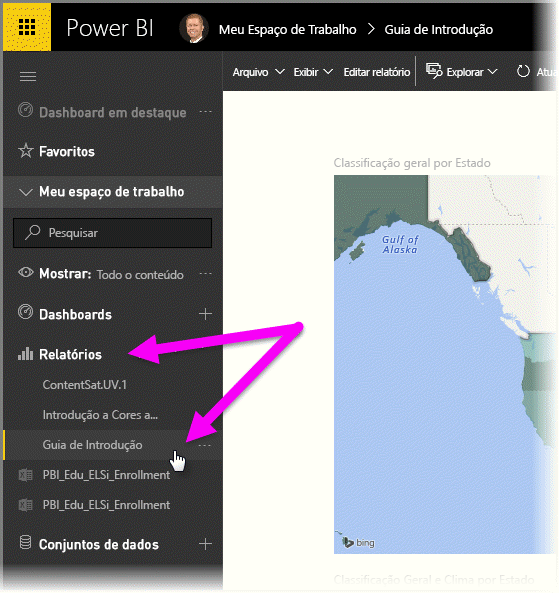
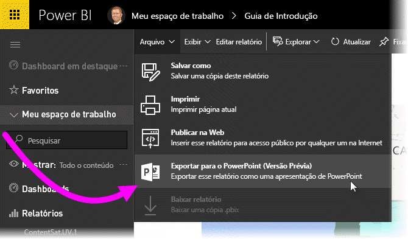
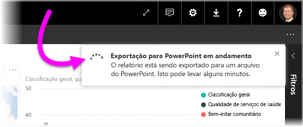
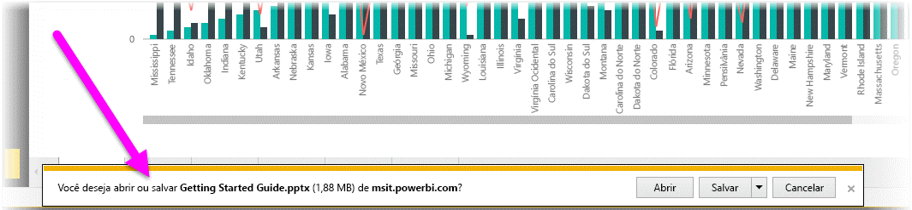
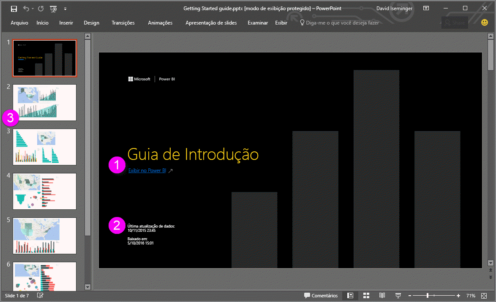
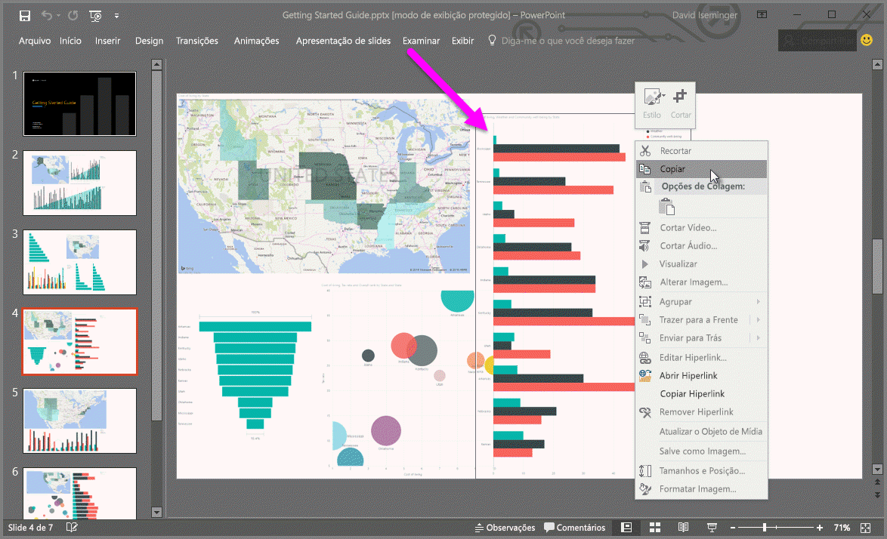

# Exportar relatórios do Power BI para o PowerPoint (Visualização)
Com o Power BI, agora você pode publicar seu relatório no **Microsoft PowerPoint** e criar facilmente um conjunto de slides com base em seu relatório do Power BI. Quando você **exporta para o PowerPoint**, ocorre o seguinte:

* Cada página no relatório do Power BI se torna um slide individual no PowerPoint
* Cada página no relatório do Power BI é exportada como uma única imagem de alta resolução no PowerPoint
* As caixas de texto no relatório do Power BI se tornam caixas de texto editáveis no PowerPoint
* É criado um link no PowerPoint que é vinculado ao relatório do Power BI

Obter o **relatório do Power BI** exportado no **PowerPoint** é fácil. Basta seguir as etapas descritas na próxima seção.

## Como exportar um relatório do Power BI para o PowerPoint
No serviço do Power BI, selecione a seção **Relatórios** no painel de navegação esquerdo para expandir essa seção e selecione o relatório para exibi-lo na tela. Você também poderá selecionar um relatório da sua seção **Meu Espaço de Trabalho** ou de seus **Favoritos** se o relatório estiver em uma dessas localizações.

Quando o relatório que você deseja exportar para o PowerPoint for exibido na tela, selecione **Arquivo > Exportar para o PowerPoint (Visualização)** na barra de menus do serviço do Power BI, conforme mostrado na imagem a seguir.

Você verá uma faixa de notificação no canto superior direito da janela do navegador de serviço do Power BI de que o relatório está sendo exportado para o PowerPoint. Isso pode levar alguns minutos e você pode continuar a trabalhar no Power BI enquanto o relatório está sendo exportado.

Depois de concluído, o banner de notificação muda para informá-lo de que o serviço do Power BI terminou o processo de exportação.

O arquivo estará disponível quando o navegador exibir os arquivos baixados. Na imagem a seguir, ele é mostrado como uma faixa de download na parte inferior da janela do navegador.

E isso é tudo para ele. Você pode baixá-lo, abri-lo com o PowerPoint e, em seguida, modificá-lo ou aprimorá-lo exatamente como faria com qualquer outro material do PowerPoint.

## Verificando o arquivo do PowerPoint exportado
Quando você abre o arquivo do PowerPoint que o Power BI exportou, encontra alguns elementos interessantes e úteis. Dê uma olhada na imagem a seguir e veja os elementos numerados abaixo dela que descrevem alguns desses recursos interessantes.

1. A primeira página do conjunto de slides inclui o nome do relatório e um link para que você possa **Exibir no Power BI** o relatório no qual o conjunto de slides se baseia.
2. Você também obtém algumas informações úteis sobre o relatório, incluindo a *última atualização dos dados* em que o relatório exportado é baseado e a hora e data do *download*, que é a hora e a data em que o relatório do Power BI foi exportado para um arquivo PowerPoint.
3. Cada página do relatório é um slide separado, conforme mostrado no painel de navegação esquerdo.
4. O relatório publicado é renderizado no idioma de acordo com as configurações do Power BI ou pela configuração de localidade do seu navegador. Para obter ou definir sua preferência de idioma, selecione o ícone de engrenagem  **> Configurações > Geral > Idioma**. Para obter informações sobre localidade, confira [Idiomas com suporte e países/regiões do Power BI](supported-languages-countries-regions.md).
5. A apresentação do PowerPoint inclui um slide de rosto com a hora de exportação no fuso horário correto.

Quando você entrar em um slide individual, perceberá que cada página de relatório é uma imagem independente.

>[!NOTE]
> Ter um visual para cada página do relatório é um novo comportamento. O comportamento anterior, que fornecia uma imagem independente para cada visual, não está mais implementado. 
 

O que fazer com seu material do PowerPoint daí em diante, ou com qualquer uma das imagens em alta resolução, cabe a você!

## Limitações
Há algumas considerações e limitações para ter em mente ao trabalhar com o recurso **Exportar para o PowerPoint**.

* No momento, não há suporte para **visuais do R**. Esses visuais são exportados como uma imagem em branco para o PowerPoint com uma mensagem de erro que afirma que não há suporte para o visual.
* Há suporte para **visuais personalizados** que foram **certificados**. Para obter mais informações sobre visuais personalizados certificados, incluindo como obter um visual personalizado certificado, consulte [Certificando um visual personalizado](power-bi-custom-visuals-certified.md). Não há suporte para visuais personalizados que não foram certificados e eles são exportados como uma imagem em branco para o PowerPoint com uma mensagem de erro que afirma que não há suporte para o visual.
* Há suporte para **visuais personalizados certificados**. Um visual personalizado certificado foi aprovado para uso com o Power BI, atende a determinados requisitos de código e foi aprovado em testes de segurança rigorosos. Você pode [saber mais sobre **visuais personalizados certificados**](power-bi-custom-visuals-certified.md).
* No momento, não é possível exportar relatórios com mais de 15 páginas de relatório.
* O processo de exportar o relatório para o PowerPoint pode levar alguns minutos para ser concluído, seja paciente. Os fatores que podem afetar o tempo necessário incluem a estrutura do relatório e a carga atual no serviço do Power BI.
* Se o item de menu **Exportar para o PowerPoint (Visualização)** não estiver disponível no serviço do Power BI, provavelmente será porque seu administrador de locatários desabilitou o recurso. Entre em contato com seu administrador de locatários para obter detalhes.
* As imagens da tela de fundo serão cortadas com a área delimitadora do gráfico. É altamente recomendável que você remova as imagens de tela de fundo antes de exportar para o PowerPoint.
* A **interatividade na sessão**, assim como o realce e filtragem, drill down e assim por diante, ainda não têm suporte ao exportar para o PowerPoint. O PowerPoint exportado mostra os visuais originais como eles tivessem sido salvos no relatório.
* As páginas no PowerPoint sempre são criadas com o tamanho padrão 9:16, independentemente do tamanho ou das dimensões da página original no relatório do Power BI.
* Os relatórios que são propriedade de um usuário fora de seu domínio de locatário do Power BI (como um relatório de alguém fora de sua organização e compartilhado com você) não podem ser publicados no PowerPoint.
* Se você compartilhar um dashboard com alguém fora de sua organização (e, portanto, um usuário que não está em seu locatário do Power BI), esse usuário não poderá exportar os relatórios associados ao dashboard compartilhado para o PowerPoint. Por exemplo, se você for aaron@contoso.com, poderá compartilhar com david@cohowinery.com. No entanto, david@cohowinery.com não poderá exportar os relatórios associados para o PowerPoint.
* Conforme mencionado anteriormente, cada página do relatório é exportada como uma única imagem no arquivo do PowerPoint.
* O serviço Power BI usa a configuração de idioma do Power BI como o idioma para a exportação do PowerPoint. Para obter ou definir sua preferência de idioma, selecione o ícone de engrenagem  **> Configurações > Geral > Idioma**.
* A informação de **Baixado em** (horário) no slide capa para o arquivo exportado do PowerPoint é definido de acordo com o fuso horário do computador no momento da exportação.

## Próximas etapas
[Analisar no Excel](service-analyze-in-excel.md)

[Dados do Excel no Power BI](service-excel-workbook-files.md)

[Certificando um visual personalizado](power-bi-custom-visuals-certified.md)

