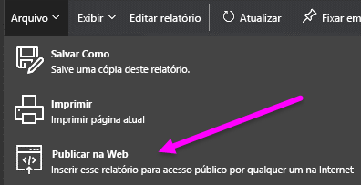
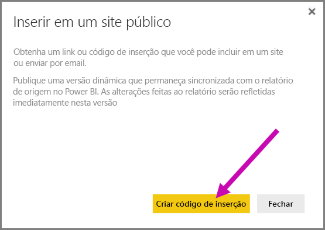
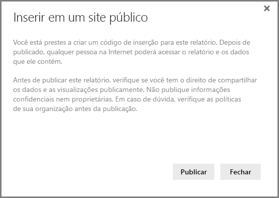
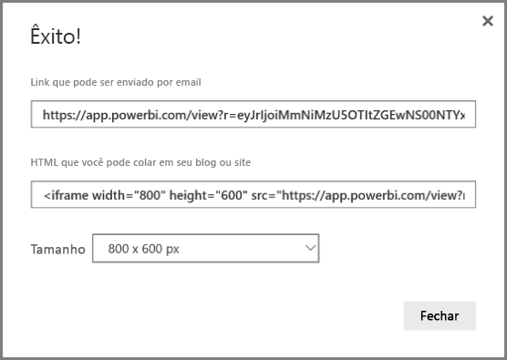
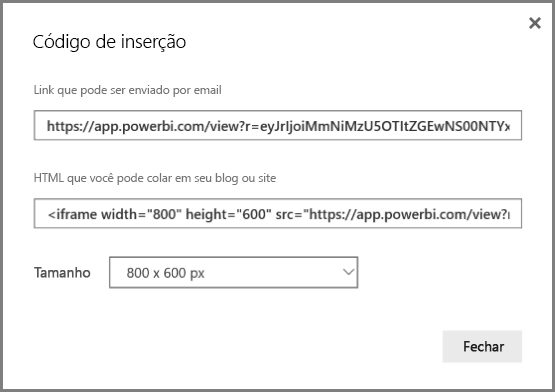
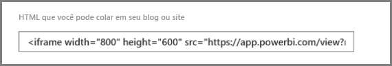
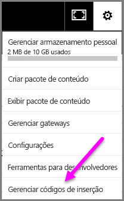
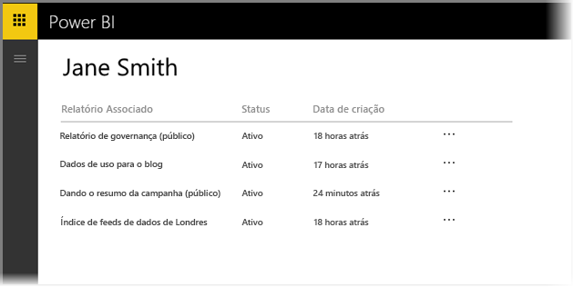
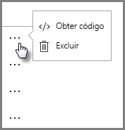
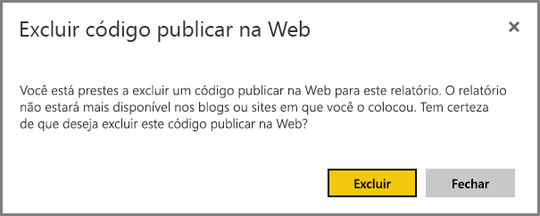

# Publicar na Web por meio do Power BI

Com o recurso **Publicar na Web** do Power BI, você pode inserir facilmente visualizações interativas online do Power BI, como postagens no blog e sites, por meio de emails ou mídia social, em qualquer dispositivo.

Também é possível editar, atualizar ou descompartilhar com facilidade os visuais publicados.

> [!WARNING]
> Quando você usa **Publicar na Web**, o relatório ou visual publicado pode ser exibido por qualquer pessoa na Internet. Não há nenhuma autenticação usada ao exibir esses relatórios. Somente use Publicar na Web com relatórios e dados que qualquer pessoa na Internet (membros não autenticados do público) possa ver. Isso inclui dados com nível de detalhe que são agregados nos relatórios. Antes de publicar este relatório, verifique se você tem o direito de compartilhar os dados e as visualizações publicamente. Não publique informações confidenciais nem proprietárias. Em caso de dúvida, verifique as políticas de sua organização antes da publicação.

## Como usar o recurso Publicar na Web

**Publicar na Web** está disponível nos relatórios de seus espaços de trabalho pessoais ou de grupo que você pode editar.  Você não pode usar o recurso Publicar na Web em relatórios que foram compartilhados com você ou em relatórios que se baseiam na segurança em nível de linha para proteger os dados. Veja a seção **Limitações** abaixo para obter uma lista completa de casos em que não há suporte para o recurso Publicar na Web. Leia o **Aviso** indicado acima neste artigo antes de usar o recurso Publicar na Web.

Você pode ver como esse recurso funciona no *breve vídeo*a seguir. Depois, siga as etapas abaixo para testá-lo por conta própria.

<iframe width="560" height="315" src="https://www.youtube.com/embed/UF9QtqE7s4Y" frameborder="0" allowfullscreen></iframe>

As etapas a seguir descrevem como usar o recurso **Publicar na Web**.

1. Em um relatório de seu espaço de trabalho que você pode editar, selecione **Arquivo > Publicar na Web**
   
   

2. Examine o conteúdo da diálogo e selecione **Criar código de inserção** , conforme mostrado no diálogo a seguir.
   
   

3. Leia o aviso, mostrado no diálogo a seguir, e confirme se os dados estão corretos para ser inseridos em um site público. Em caso afirmativo, selecione **Publicar**.
   
   

4. Será exibido um diálogo que fornece um link que pode ser enviado por email, inserido no código (como um iFrame) ou colado diretamente em sua página da Web ou em seu blog.
   
   

5. Se você tiver criado anteriormente um código de inserção para o relatório, ele será exibido rapidamente. Você pode criar apenas um código de inserção para cada relatório.
   
   

## Dicas e truques para modos de Exibição

Quando você insere o conteúdo em uma postagem no blog, normalmente, é necessário ajustá-lo em um tamanho específico da tela.  Você também pode ajustar a altura e a largura na marca iFrame, conforme necessário, mas também precisa garantir que seu relatório se ajuste na área determinada do iFrame; por isso, é necessário definir um Modo de Exibição apropriado ao editar o relatório.

A tabela a seguir fornece diretrizes sobre o Modo de Exibição e como ele aparecerá quando for inserido.

| Modo de Exibição | Sua aparência quando inserido |
| --- | --- |
|  |**Ajustar à página** respeitará a altura e a largura da página de seu relatório. Se você definir sua página como taxas “Dinâmicas”, tais como 16:9 ou 4:3, seu conteúdo será ajustado para caber no iFrame fornecido. Quando inserido em um iFrame, o uso de **Ajustar à página** pode resultar na **aplicação do formato letterbox**, no qual uma tela de fundo cinza é mostrada nas áreas do iFrame depois que o conteúdo é ajustado para caber no iFrame. Para minimizar a aplicação do formato letterbox, defina a altura/largura do iFrame de modo condizente. |
|  |**Tamanho real** garantirá que o relatório preserve seu tamanho, conforme definido na página do relatório. Isso pode resultar na exibição de barras de rolagem no iFrame. Defina a altura e a largura do iFrame para evitar o uso de barras de rolagem. |
|  |**Ajustar à largura** garante que o conteúdo se ajusta na área horizontal do iFrame. Uma borda ainda será mostrada, mas o conteúdo será dimensionado para usar todo o espaço horizontal disponível. |

## Dicas e truques para a altura e largura do iFrame

O código de inserção recebido depois que você Publicar na Web será semelhante ao seguinte:

É possível editar a largura e a altura manualmente para garantir que o código se ajuste exatamente da forma como você deseja na página em que é inserido.

Para obter um ajuste ideal, tente adicionar 56 pixels à dimensão de altura do iFrame. Isso acomoda o tamanho atual da barra inferior. Se sua página de relatório usar o tamanho Dinâmico, a tabela abaixo fornecerá alguns tamanhos que podem ser usados para obter um ajuste sem a aplicação do formato letterbox.

| Taxa | Tamanho | Dimensões (Largura x Altura) |
| --- | --- | --- |
| 16:9 |Pequeno |640 x 416 px |
| 16:9 |Médio |800 x 506 px |
| 16:9 |Grande |960 x 596 px |
| 4:3 |Pequeno |640 x 536 px |
| 4:3 |Médio |800 x 656 px |
| 4:3 |Grande |960 x 776 px |

## Gerenciando códigos de inserção

Depois de criar um código de inserção no recurso **Publicar na Web** , será possível gerenciar os códigos criados no menu **Configurações** do serviço do Power BI. O gerenciamento de códigos de inserção inclui a capacidade de remover o visual ou relatório de destino de um código (tornando o código de inserção inutilizável) ou de obter o código de inserção novamente.

1. Para gerenciar seus códigos de inserção de **Publicar na Web** , abra a engrenagem **Configurações** e selecione **Gerenciar códigos de inserção**.
   
   

2. A lista de códigos de inserção que você criou será exibida, conforme mostrado na imagem a seguir.
   
   

3. Para cada código de inserção de **Publicar na Web** na lista, é possível recuperar ou excluir o código de inserção e, portanto, fazer com que todos os links para esse relatório ou visual não funcionem mais.
   
   

4. Se você selecionar **Excluir**, será solicitado que você confirme se deseja excluir o código de inserção.
   
   

## Atualizações em relatórios e atualização de dados

Depois de criar seu código de inserção de **Publicar na Web** e compartilhá-lo, o relatório será atualizado com todas as alterações feitas. No entanto, é importante saber que pode levar algum tempo até que a atualização esteja visível para os usuários. As atualizações em um relatório ou visual levam aproximadamente uma hora para serem refletidas nos códigos de inserção de Publicar na Web.

Quando você usa inicialmente o recurso **Publicar na Web** para obter um código de inserção, o link do código de inserção fica imediatamente ativo e pode ser exibido por qualquer pessoa que abrir o link.  Após a ação inicial de Publicar na Web, as atualizações posteriores em relatórios ou visuais para os quais um link Publicar na Web é apontado podem levar aproximadamente uma hora para estar visíveis para os usuários.

Para saber mais, veja a seção **Como isso funciona** mais adiante neste artigo. Se você precisar que as atualizações sejam disponibilizadas imediatamente, poderá excluir o código de inserção e criar um novo.

## Atualização de dados

As atualizações de dados são refletidas automaticamente no relatório ou visual inserido. Pode levar aproximadamente uma hora para que os dados atualizados estejam visíveis nos códigos de inserção. Você pode desabilitar a atualização automática selecionando **não atualizar** no agendamento do conjunto de dados usado pelo relatório.  

## Elementos visuais personalizados

Há suporte para visuais personalizados no recurso **Publicar na Web**. Quando você usa Publicar na Web, os usuários com os quais você compartilha seu visual publicado não precisam habilitar visuais personalizados para exibir o relatório.

## Limitações

Há suporte para o recurso **Publicar na Web** para a maioria das fontes de dados e relatórios no serviço do Power BI; no entanto, veja abaixo o que não tem suporte ou o que não está disponível atualmente com o Publicar na Web:

1. Relatórios que usam a segurança em nível de linha.
2. Relatórios que usam o Analysis Services de Tabela hospedado localmente.
3. Relatórios compartilhados com você diretamente ou por meio de um pacote de conteúdo organizacional.
4. Relatórios em um grupo no qual você não é um membro de edição.
5. Atualmente, não há suporte para os visuais do “R” em relatórios Publicar na Web.

## Configuração de locatário

Os administradores do Power BI podem habilitar ou desabilitar o recurso de publicar na Web. Eles também podem restringir o acesso a grupos específicos. Sua capacidade de criar um código de inserção altera conforme essa configuração.

|Recurso |Habilitado para toda a organização |Desabilitado para toda a organização |Especificar grupos de segurança   |
|---------|---------|---------|---------|
|**Publicar na Web** no menu **Arquivo** do relatório.|Habilitado para todos|Não visível para todos|Visível somente para usuários ou grupos autorizados.|
|**Gerenciar códigos de inserção** em **Configurações**|Habilitado para todos|Habilitado para todos|Habilitado para todos  Opção * **Excluir** somente para usuários ou grupos autorizados. * **Obter códigos** habilitados para todos.|
|**Códigos de inserção** no portal de administração|O status refletirá o seguinte: * Ativo * Sem suporte * Bloqueado|O status exibirá **Desabilitado**|O status refletirá o seguinte: * Ativo * Sem suporte * Bloqueado  Se um usuário não estiver autorizado conforme a configuração do locatário, o status exibirá **violado**.|
|Relatórios publicados existentes|Tudo habilitado|Tudo desabilitado|Os relatórios continuam a ser renderizados para todos.|

## Noções básicas sobre a coluna de status do código de inserção

Ao exibir a página **Gerenciar códigos de inserção** de seus códigos de inserção de **Publicar na Web** , uma coluna de status será fornecida. Os códigos de inserção estão ativos por padrão, mas você pode encontrar qualquer um dos estados listados abaixo.

| Status | Descrição |
| --- | --- |
| **Ativo** |O relatório está disponível para que os usuários da Internet o vejam e interajam com ele. |
| **Bloqueado** |O conteúdo do relatório viola os [Termos de Serviço do Power BI](https://powerbi.microsoft.com/terms-of-service). Ele foi bloqueado pela Microsoft. Entre em contato com o suporte se acreditar que o conteúdo foi bloqueado por engano. |
| **Sem suporte** |O conjunto de dados do relatório está usando a segurança em nível de linha ou outra configuração sem suporte. Veja a seção **Limitações** para obter uma lista completa. |
| **Violado** |O código de inserção está fora da política de locatário definida. Isso normalmente ocorre quando um código de inserção foi criado e, em seguida, a configuração Publicar na Web foi alterada para excluir o usuário que possui o código de inserção. Se a configuração de locatário estiver desabilitada ou o usuário não tem mais permissão para criar códigos de inserção, os códigos de inserção existentes mostrarão o status de **Violado**. |

## Como relatar um problema com o conteúdo de Publicar na Web

Para relatar um problema relacionado ao conteúdo de **Publicar na Web** inserido em um site ou blog, use o ícone **Sinalizador** na barra inferior, mostrada na imagem a seguir. Será solicitado que você envie um email à Microsoft explicando o problema. A Microsoft avaliará o conteúdo com base nos Termos de Serviço do Power BI e tomará as devidas providências.

Para relatar um problema, selecione o ícone **sinalizador** na barra inferior do relatório de Publicar na Web exibido.

## Licenciamento e preços

Você precisa ser um usuário do Microsoft Power BI para usar o recurso **Publicar na Web**. Os consumidores de seu relatório (os leitores, as pessoas que verão o relatório) não precisam ser usuários do Power BI.

## Como isso funciona (detalhes técnicos)

Quando você cria um código de inserção usando **Publicar na Web**, o relatório fica visível para os usuários na Internet. Está disponível publicamente e, portanto, você pode esperar que as pessoas que verão seu relatório o compartilhem com facilidade por meio da mídia social no futuro. Conforme os usuários exibem o relatório, abrindo a URL pública direta ou exibindo-o inserido em uma página da Web ou em um blog, o Power BI armazena em cache a definição do relatório e os resultados das consultas necessárias para exibi-lo. Essa abordagem garante que o relatório pode ser exibido por milhares de usuários simultâneos, sem nenhum impacto sobre o desempenho.  

O cache é duradouro; portanto, se você atualizar a definição do relatório (por exemplo, se alterar seu modo de Exibição) ou se atualizar os dados do relatório, poderá levar aproximadamente uma hora até que as alterações sejam refletidas na versão do relatório exibida pelos usuários. Portanto, é recomendável que você teste seu trabalho antecipadamente e crie o código de inserção de **Publicar na Web** somente quando estiver satisfeito com as configurações.

Mais perguntas? [Experimente a Comunidade do Power BI](http://community.powerbi.com/)