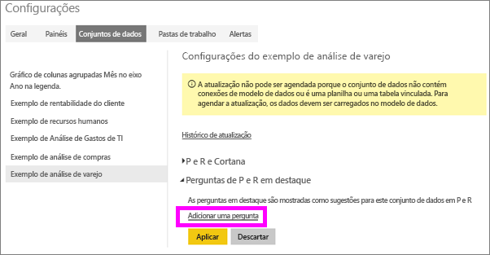
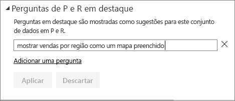
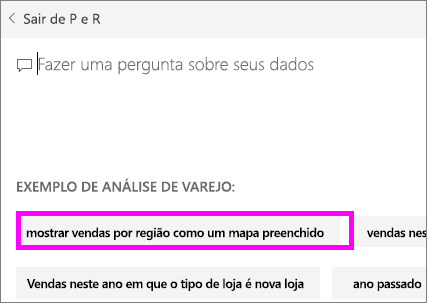
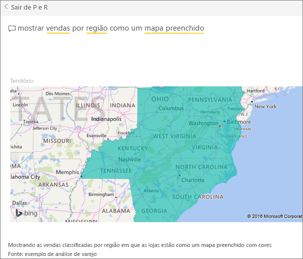

# Criar perguntas em destaque para as P e R do Power BI
Se você possui um conjunto de dados, você pode adicionar suas próprias perguntas em destaque a esse conjunto de dados.  E a P e R do Power BI mostrará essas perguntas para seus colegas que usam (*consomem*) seu conjunto de dados.  As perguntas em destaque fornecem aos seus colegas algumas ideias sobre os tipos de perguntas que eles podem fazer sobre o conjunto de dados. As perguntas em destaque que você adiciona cabe a você – adicione perguntas populares, perguntas que exibem resultados interessantes ou perguntas que podem ser difíceis de formular.

Veja Will adicionar algumas perguntas em destaque à P e R do Power BI e usar essas perguntas em destaque para explorar seu conjunto de dados. Em seguida, siga as instruções passo a passo abaixo do vídeo para testá-la por conta própria.

<iframe width="560" height="315" src="https://www.youtube.com/embed/E1mIAyEXuF4" frameborder="0" allowfullscreen></iframe>

> [!NOTE]
> P e R em destaque estão disponíveis para uso no [aplicativo do Microsoft Power BI para iOS nos dispositivos iPod Touch, iPhones e iPads](mobile-apps-ios-qna.md) e no Power BI Desktop Q&A Preview. Mas, criar as perguntas só está disponível no serviço do Power BI (app.powerbi.com).
> 

Este artigo usa a [amostra de Vendas de Análise de Varejo](sample-datasets.md).

1. No painel, selecione a caixa de pergunta de P e R.   Observe que a P e R já está sendo útil, exibindo uma lista de termos que aparecem no conjunto de dados.
2. Para adicionar a esta lista, selecione o ícone de engrenagem no canto superior direito do Power BI.  
   
3. Selecione **Configurações** &gt; **Conjuntos de Dados** &gt; **amostra de Análise de Varejo** &gt; **Perguntas da P e R em Destaque**.  
4. Selecione **Adicionar uma pergunta**.
   
   
5. Digite sua pergunta na caixa de texto e selecione **Aplicar**.   Opcionalmente, adicione outra pergunta selecionando **Adicionar uma pergunta**.  
   
6. Navegue de volta até o dashboard do Power BI para o Exemplo de Análise de Varejo e coloque o cursor na caixa de pergunta P e R.   
   
7. A nova pergunta em destaque, **Vendas por território como um mapa**, é a primeira na lista. Selecione-a.  
8. A resposta é exibida como uma visualização de mapa coroplético.  
   

### Próximas etapas
[P e R no Power BI](power-bi-q-and-a.md)  
[Tutorial: Introdução a P e R do Power BI](power-bi-visualization-introduction-to-q-and-a.md)  
[Power BI – conceitos básicos](service-basic-concepts.md)  
Mais perguntas? [Experimente a Comunidade do Power BI](http://community.powerbi.com/)

