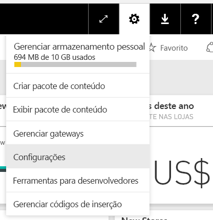
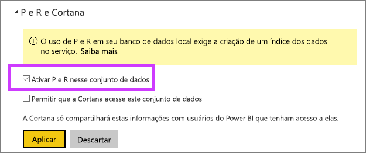

# Habilitar P e R para conexões dinâmicas
## O que é o Gateway de Dados Local?  O que é uma conexão dinâmica?
Os conjuntos de dados no Power BI podem ser importados para o Power BI, ou você pode criar uma conexão dinâmica com eles. Conjuntos de dados com conexão dinâmica são, geralmente, chamados de “locais”. As conexões dinâmicas são gerenciadas usando um [gateway](service-gateway-onprem.md) e os dados e as consultas são enviados e recebidos usando consultas dinâmicas.

## Perguntas e respostas para conjuntos de dados do Gateway de Dados Local
Se você quiser usar a P e R com conjuntos de dados que você acessa por meio de um gateway, será necessário habilitá-los primeiro.

Depois de habilitados, o Power BI criará um índice da fonte de dados e carregará um subconjunto desses dados no Power BI para habilitar a troca de perguntas. Pode demorar vários minutos para a criação do índice inicial, e o Power BI mantém e atualiza o índice automaticamente conforme os dados são alterados. O uso da P e R com esses conjuntos de dados tem o mesmo comportamento observado com os dados publicados no Power BI. Em ambos os casos, há suporte para o conjunto completo de recursos disponíveis na experiência de P e R, incluindo o uso da fonte de dados com a Cortana.

À medida que você faz perguntas no Power BI, a P e R determina o melhor visual a ser construído ou a folha de relatório a ser usada para responder à sua pergunta usando um índice do conjunto de dados. Depois de determinar a melhor resposta possível, o P e R usa o DirectQuery para buscar dados dinâmicos da fonte de dados por meio do gateway para popular gráficos e grafos. Isso garante que os resultados da P e R do Power BI sempre mostram os dados mais atualizados diretamente da fonte de dados subjacente.

Como a P e R do Power BI usa os valores de texto e de esquema da fonte de dados para determinar como consultar o modelo subjacente em busca de respostas, as pesquisas por valores de texto específicos novos ou excluídos (por exemplo, perguntar um nome de cliente relacionado a um registro de texto recém-adicionado) dependem de o índice estar atualizado com os últimos valores. O Power BI mantém automaticamente o índice de texto e de esquema atualizado em uma janela de 60 minutos de alterações.

Para obter mais informações, veja:

* O que é o [Gateway de Dados Local](service-gateway-onprem.md)?
* [Introdução a P e R do Power BI](service-q-and-a.md)

## Habilitar a P e R
Depois que o gateway de dados estiver configurado, conecte-se aos seus dados por meio do Power BI.  Crie um dashboard usando seus dados locais ou carregue um arquivo .pbix que usa dados locais.  Talvez você também já tenha dados locais em dashboards, relatórios e conjuntos de dados que foram compartilhados com você.

1. No canto superior direito do Power BI, selecione o ícone de engrenagem  e escolha **Configurações**.
   
   
2. Selecione **conjuntos de dados** e escolha o conjunto de dados que será habilitado para a P e R.
   
   
3. Expanda **P e R e Cortana**, marque a caixa de seleção **Ativar P e R neste conjunto de dados** e escolha **Aplicar**.
   
    

## Quais dados são armazenados em cache e como a privacidade é protegida?
Quando você habilita a P e R para seus dados locais, um subconjunto dos dados é armazenado em cache no serviço. Isso é feito para garantir que a P e R funcione com um desempenho razoável. Excluímos valores com mais de 24 caracteres do cache. O cache é excluído em algumas horas quando você desabilita a P e R desmarcando **Ativar P e R neste conjunto de dados** ou quando você exclui o conjunto de dados.

## Considerações e solução de problemas
Durante a fase de Visualização deste recurso, existem várias limitações:

* Inicialmente, o recurso só está disponível para fontes de dados tabulares do SQL Server 2016 Analysis Services. O recurso é otimizado para funcionar com dados de tabela. Algumas funcionalidades estão disponíveis para fontes de dados multidimensionais, mas ainda não há suporte para a experiência completa de P e R para dados multidimensionais. Fontes de dados adicionais com suporte do Gateway de dados local serão lançadas durante a visualização pública.
* O suporte completo para a segurança em nível de linha definida no SQL Server Analysis Services não está disponível inicialmente na visualização pública. Ao fazer perguntas na P e R, o “preenchimento automático” de perguntas durante a digitação pode mostrar valores de cadeia de caracteres aos quais um usuário não tem acesso. No entanto, a RLS definida no modelo é respeitada em relação a visuais de relatório e de gráfico e, portanto, nenhum dado numérico subjacente pode ser exposto. Opções para controlar esse comportamento serão lançadas em atualizações futuras.
* Há suporte para as conexões dinâmicas somente com o Gateway de dados local. Sendo assim, elas não podem ser usadas com o gateway pessoal.

## Próximas etapas
[Gateway de dados local](service-gateway-onprem.md)  
[Gerenciar sua fonte de dados – Analysis Services](service-gateway-enterprise-manage-ssas.md)  
[Power BI Quick Insights](service-insights.md)  
[Otimizar seus dados para o Power BI Quick Insights](service-insights-optimize.md)  
[Power BI – conceitos básicos](service-basic-concepts.md)  
[Dashboards no Power BI](service-dashboards.md)  

Mais perguntas? [Experimente perguntar à Comunidade do Power BI](http://community.powerbi.com/)

