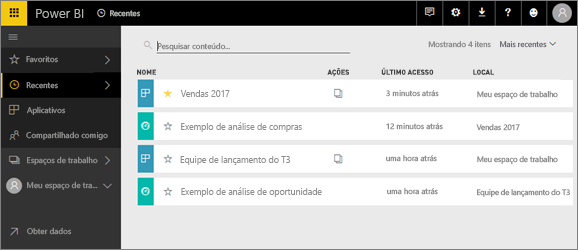
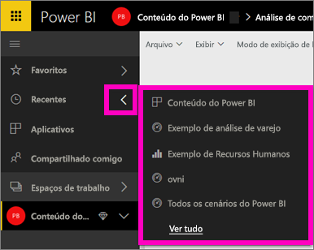
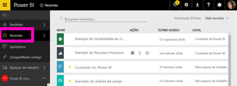

# Conteúdo **recente** no serviço do Power BI

## O que é o conteúdo recente
O conteúdo recente corresponde aos últimos 20 itens que você visitou.  Isso inclui: dashboards, relatórios, aplicativos e pastas de trabalho.

Assista à Amanda demonstrar como as lista de conteúdo **Recente** são preenchidas e, em seguida, siga as instruções passo a passo abaixo do vídeo para testar por conta própria.

<iframe width="560" height="315" src="https://www.youtube.com/embed/G26dr2PsEpk" frameborder="0" allowfullscreen></iframe>

## Exibir conteúdo recente
Para ver seus cinco itens visitados mais recentemente, no menu de navegação à esquerda, selecione a seta à direita de **Recente**.  Nesse local você pode selecionar o conteúdo recente para abri-lo. Apenas os cinco itens mais recentes são listados.

Se você tem mais de cinco itens recentemente visitados, selecione **Ver todos** para abrir a tela Recente (veja abaixo). Você também pode selecionar **Recente** ou o ícone Recente  no menu de navegação à esquerda.

Deste local você pode interagir com o conteúdo da mesma forma que faria nas guias [**Dashboards**](service-dashboards.md), [**Relatórios**](service-reports.md) e **Pastas de trabalho** individuais e na tela [**Aplicativos**](service-install-use-apps.md).

## Próximas etapas
[Aplicativos do serviço do Power BI](service-install-use-apps.md)

Mais perguntas? [Experimente a Comunidade do Power BI](http://community.powerbi.com/)

