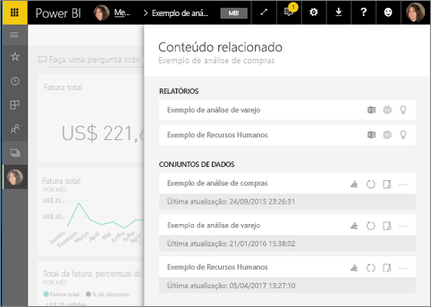
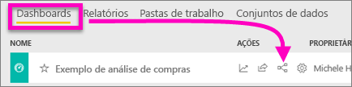
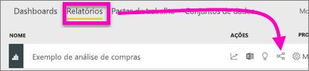
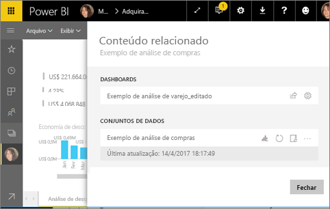
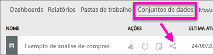
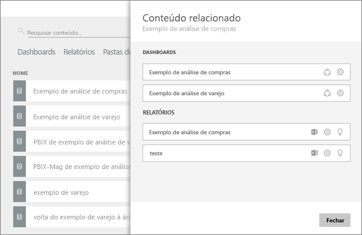

# Exibir conteúdo relacionado no serviço do Power BI
O painel **Conteúdo relacionado** mostra como o conteúdo do serviço do Power BI (dashboards, relatórios e conjuntos de dados) está interconectado.  E não para por aí: nesse painel, é possível realizar tarefas comuns como atualizar, renomear, gerar insights e muito mais. Selecione um dashboard ou relatório relacionado e abra-o no espaço de trabalho do Power BI.   

Como você provavelmente já descobriu, os relatórios são gerados a partir de conjuntos de dados, as visualizações de relatórios são consequentemente fixadas em dashboards e os elementos visuais dos dashboards nos redirecionam aos relatórios. Mas como saber quais dashboards hospedam visualizações do seu relatório de marketing? E como localizar esses dashboards? O seu dashboard de Compras utiliza visualizações de mais de um conjunto de dados? Nesse caso, que nomes receberam e como é possível abri-los e editá-los? O seu conjunto de dados de RH está sendo realmente usado em relatórios ou dashboards ou podem ser movidos sem romper nenhum link? Perguntas como essas podem ser todas respondidas no painel **Conteúdo relacionado**.  O painel não apenas exibe o conteúdo relacionado, mas também permite que você tenha controle sobre o conteúdo e navegue facilmente entre o conteúdo relacionado.

> [!NOTE]
> O recurso de conteúdo relacionado não funciona em conjuntos de dados de streaming.
> 
> 

## Exibir o conteúdo relacionado de um dashboard
Assista Exibirá o conteúdo relacionado de um dashboard. Em seguida, siga as instruções passo a passo abaixo do vídeo para experimentar sozinho com o conjunto de dados exemplo de Análise de compras.

<iframe width="560" height="315" src="https://www.youtube.com/embed/B2vd4MQrz4M#t=3m05s" frameborder="0" allowfullscreen></iframe>

É preciso ter no mínimo permissões de *exibição* em um dashboard para abrir o painel **Conteúdo relacionado**. Neste exemplo, estamos usando o [Exemplo de análise de compras](sample-procurement.md).

**Método 1**

Em um espaço de trabalho, selecione a guia **Dashboards** e, em seguida, selecione o ícone **Exibir relacionados** .

 

**Método 2**

Com um dashboard aberto, selecione    na barra de menus superior.

O painel **Conteúdo relacionado** é aberto. O painel mostra todos os relatórios com visualizações fixadas no dashboard e seus conjuntos de dados associados. Nesse dashboard, há visualizações fixadas de três diferentes relatórios, e os relatórios se baseiam em três diferentes conjuntos de dados.

Neste ponto, você pode controlar diretamente o conteúdo relacionado.  Por exemplo, selecione um nome de relatório para abri-lo.  Para relatórios listados, selecione um ícone para [analisar no Excel](service-analyze-in-excel.md), [renomear](service-rename.md) ou [obter insights](service-insights.md). Para um conjunto de dados, selecione um ícone para [criar um novo relatório](service-report-create-new.md), [atualizar](refresh-data.md), renomear, [analisar no Excel](service-analyze-in-excel.md), [obter insights](service-insights.md) ou abrir a janela **Configurações** do conjunto de dados.  

## Exibir o conteúdo relacionado de um relatório
É preciso ter no mínimo permissões de *exibição* em um relatório para abrir o painel **Conteúdo relacionado**. Neste exemplo, estamos usando o [Exemplo de análise de compras](sample-procurement.md).

**Método 1**

Em um espaço de trabalho, selecione a guia **Relatórios** e, em seguida, selecione o ícone **Exibir relacionados** .

 

**Método 2**

Abra o relatório no [Modo de exibição de leitura](service-reading-view-and-editing-view.md) e selecione o  na barra de menus superior.

O painel **Conteúdo relacionado** é aberto. O painel mostra o conjunto de dados associado e todos os dashboards com pelo menos um bloco fixado extraído do relatório. Neste relatório, há visualizações fixadas em dois dashboards diferentes.

Neste ponto, você pode controlar diretamente o conteúdo relacionado.  Por exemplo, selecione um nome de dashboard para abri-lo.  Em qualquer dashboard da lista, selecione um ícone para [compartilhar o dashoard com outras pessoas](service-share-dashboards.md) ou abrir a janela **Configurações** do dashboard. Para o conjunto de dados, selecione um ícone para [criar um novo relatório](service-report-create-new.md), [atualizar](refresh-data.md), renomear, [analisar no Excel](service-analyze-in-excel.md), [obter insights](service-insights.md) ou abrir a janela **Configurações** do conjunto de dados.  

## Exibir o conteúdo relacionado de um conjunto de dados
É preciso ter no mínimo permissões de *exibição* em um conjunto de dados para abrir o painel **Conteúdo relacionado**. Neste exemplo, estamos usando o [Exemplo de análise de compras](sample-procurement.md).

Em um espaço de trabalho, selecione a guia **Conjuntos de dados** e, em seguida, localize o ícone **Exibir relacionados** .

Selecione o ícone para abrir o painel **Conteúdo relacionado**.

Neste ponto, você pode controlar diretamente o conteúdo relacionado.  Por exemplo, selecione um nome de dashboard ou de relatório para abri-lo.  Em qualquer dashboard da lista, selecione um ícone para [compartilhar o dashoard com outras pessoas](service-share-dashboards.md) ou abrir a janela **Configurações** do dashboard. Para relatórios, selecione um ícone para [analisar no Excel](service-analyze-in-excel.md), [renomear](service-rename.md) ou [obter insights](service-insights.md).  

## Limitações e solução de problemas
* Se não houver espaço suficiente no navegador, não será possível ver uma opção de **Exibir relacionados**, mas ainda será possível ver o ícone Exibir relacionados . Selecione o ícone para abrir o painel **Conteúdo relacionado**.
* Para abrir o Conteúdo relacionado de um relatório, é preciso estar na [exibição de Leitura](service-reading-view-and-editing-view.md).
* O Conteúdo relacionado não está disponível no Power BI Desktop.
* O recurso Conteúdo relacionado não funciona em conjuntos de dados de streaming.

## Próximas etapas
* [Introdução ao serviço do Power BI](service-get-started.md)
* Mais perguntas? [Experimente a Comunidade do Power BI](http://community.powerbi.com/)

