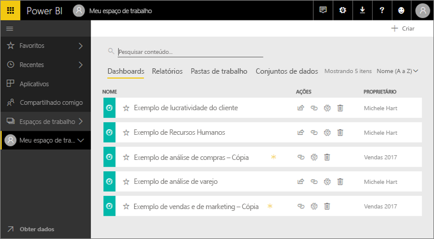
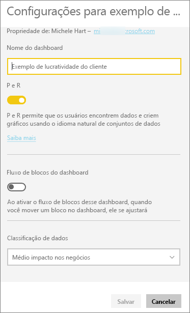
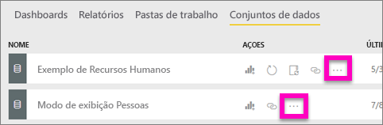
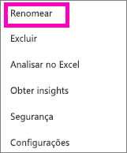
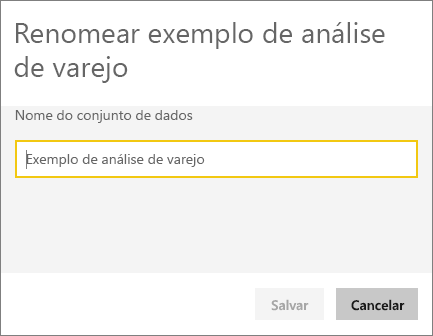
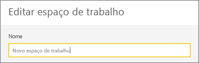
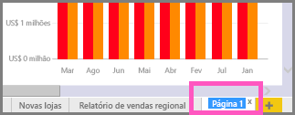
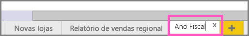

# Renomear quase tudo no serviço do Power BI
Este artigo ensina como renomear um dashboard, um relatório, uma página de relatório, uma pasta de trabalho, um conjunto de dados, um aplicativo e um espaço de trabalho no serviço do Power BI.

**Posso alterar o nome?**

| Tipo de conteúdo | Sou o autor ou criador | Compartilhou comigo |
| --- | --- | --- |
| Dashboard em um espaço de trabalho |Sim |Não |
| Relatório em um espaço de trabalho |Sim |Não |
| Pasta de trabalho em um espaço de trabalho |Sim |Não |
| Conjunto de dados em um espaço de trabalho |Sim |Não |
| Espaço de trabalho de aplicativo |Sim, se você for o proprietário ou tiver permissões de Administrador |Não |
| Aplicativos publicados |Não na Tela do aplicativo, mas o nome do aplicativo pode ser alterado no espaço de trabalho do aplicativo e publicado novamente com um novo nome, se você tiver permissões de Administrador |Não |
| Conteúdo do aplicativo (dashboard, relatório, pasta de trabalho, conjunto de dados) |Não na Tela do aplicativo, mas o conteúdo do aplicativo pode ser renomeado no espaço de trabalho do aplicativo e publicado novamente com um novo nome, se você tiver permissões de Administrador |Não |
| Conteúdo em **Compartilhado comigo** |Não |Não |

## Renomear um dashboard, um relatório ou uma pasta de trabalho
1. Inicie em um espaço de trabalho e selecione a guia **Dashboards**, **Relatórios** ou **Pastas de trabalho**. Focalize o item a ser renomeado e selecione o ícone de engrenagem . Se não houver nenhum ícone de engrenagem, você não tem permissões para renomear.
   
   
2. Na página de Configurações, digite o novo nome e selecione **Salvar**.
   
   

## Renomear um conjunto de dados
1. Inicie em um espaço de trabalho e selecione a guia **Conjuntos de dados**.
   
   
2. Focalize o item para renomear, selecione as reticências (...) e escolha **Renomear**.  
   
      
   
   > [!NOTE]
   > As opções na lista suspensa variam.
   > 
   > 
3. Na página de Configurações, digite um novo nome e selecione **Salvar**.
   
     

## Renomear um Espaço de trabalho de aplicativo
Qualquer pessoa com permissões de Administrador pode renomear um espaço de trabalho de aplicativo.

1. Inicie no espaço de trabalho que você deseja renomear.
2. No canto superior direito, selecione as reticências (...) e escolha **Editar espaço de trabalho**. Se essa opção não aparecer, você não tem permissões para renomear este espaço de trabalho. 
   
    
3. Digite um novo nome de espaço de trabalho e selecione **Salvar**.
   
   

## Renomear uma página em um relatório
Não gosta do nome de uma página em seu relatório do Power BI?  Um novo nome está a apenas um clique. As páginas podem ser renomeadas no [Modo de exibição de edição de relatório](service-interact-with-a-report-in-editing-view.md).

1. Abra o relatório no [Modo de Exibição de Edição](service-reading-view-and-editing-view.md).
2. Localize as guias da página de relatório na parte inferior da janela do Power BI.
   
    
3. Abra a página de relatório que deseja renomear selecionando a guia.
4. Clique duas vezes no nome na guia para realçá-la.  
   
    
5. Digite um novo nome para a página de relatório e selecione ENTER.
   
    

## Considerações e solução de problemas
* Se o item a ser renomeado foi compartilhado com você ou faz parte de um pacote de conteúdo, você não verá o ícone de engrenagem e não terá acesso às Configurações.
* Na guia **Conjuntos de dados**, se você não vir as reticências (...), expanda a janela do seu navegador.

Mais perguntas? [Experimente a Comunidade do Power BI](http://community.powerbi.com/)

