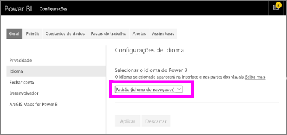
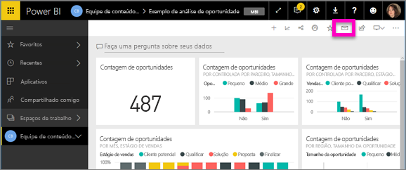
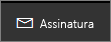
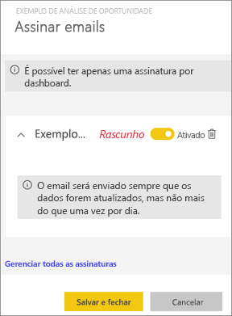
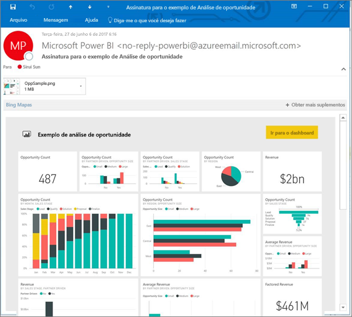
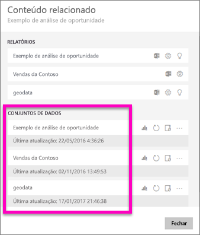
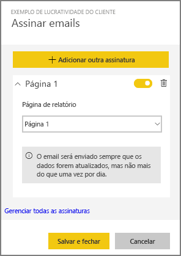
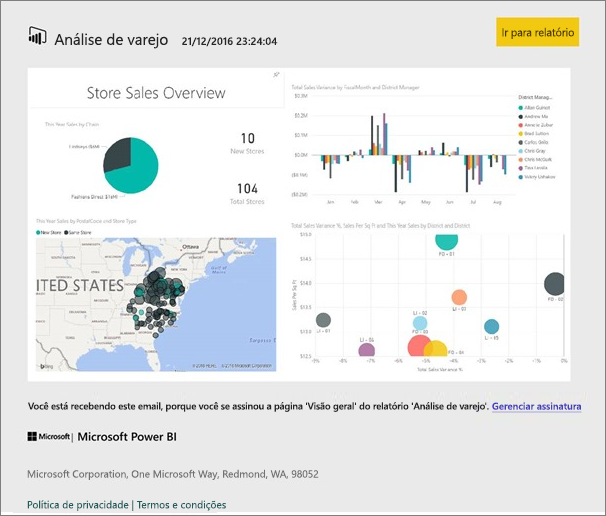
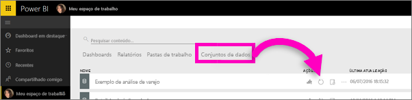
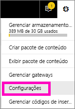

# Assinar um relatório ou um dashboard do Power BI
Nunca foi tão fácil manter-se atualizado sobre seus dashboards e relatórios mais importantes. Assine os dashboards e as páginas de relatório mais importantes para você e o Power BI enviará um email com um instantâneo para sua caixa de entrada. Informe ao Power BI a frequência com que deseja receber os emails: de uma vez por dia a uma vez por semana. O instantâneo e o email usarão o idioma definido nas configurações do Power BI. Se nenhum idioma for definido, o Power BI usa o idioma do navegador atual.

Para obter ou definir sua preferência de idioma, selecione o ícone de engrenagem  **> Configurações > Geral > Idioma**.

> [!NOTE]
> As assinaturas podem ser criadas somente no serviço do Power BI. Quando você receber o email, ele incluirá um link para “acessar o relatório/dashboard”. Em dispositivos móveis com aplicativos do Power BI instalados, a seleção desse link iniciará o aplicativo (ao contrário da ação padrão de abrir o relatório ou o dashboard no site do Power BI).
> 
> 

Assista a Sirui configurar uma assinatura de email para um relatório. Em seguida, siga as instruções passo a passo abaixo do vídeo para testá-la por conta própria.

<iframe width="560" height="315" src="https://www.youtube.com/embed/saQx7G0pxhc" frameborder="0" allowfullscreen></iframe>

## Requisitos
A **criação** de uma assinatura é um recurso do Power BI Pro e você deve ter permissões de exibição ou edição no conteúdo (dashboard ou relatório).

## Assinar um dashboard

1. Abra o dashboard.
2. Na barra de menus superior, selecione **Assinar** ou o ícone de envelope .
   
   
3. Use o controle deslizante amarelo para ativar e desativar a assinatura.  Definir o controle deslizante como Desativado não excluirá a assinatura. Para excluir a assinatura, selecione o ícone de cesto de lixo.
   
   
4. Selecione **Salvar e fechar** para salvar a assinatura. Você receberá um instantâneo de email do dashboard sempre qualquer um dos conjuntos de dados subjacentes for alterado. Se o dashboard for atualizado mais de uma vez por dia, você receberá apenas o instantâneo por email após a primeira atualização.
   
   
   
   > [!TIP]
   > Deseja ver o email agora mesmo? Dispare um email atualizando um dos conjuntos de dados associados ao dashboard. (Se não tiver permissões de edição para o conjunto de dados, peça para alguém que as tenha fazer isso para você.) Para descobrir quais conjuntos de dados estão sendo usados para criar o dashboard, no dashboard, selecione o ícone **Exibir relacionados**  para abrir **Conteúdo relacionado** e, em seguida, selecione o ícone de atualização . 
   > 
   > 
   
   

## Assinar uma página de relatório
1. Abra o relatório no [modo de exibição de Leitura](service-reading-view-and-editing-view.md).
2. Na barra de menus superior, selecione **Assinar**.
   
   
3. É possível assinar uma página de relatório por vez. Selecione a página de relatório específica no menu suspenso.
   
   
   
   Continue para adicionar páginas do relatório.
4. Use o controle deslizante amarelo para ativar e desativar a assinatura para cada página.  Definir o controle deslizante como Desativado não excluirá a assinatura. Para excluir a assinatura, selecione o ícone de cesto de lixo.
   
   
5. Selecione **Salvar e fechar** para salvar a assinatura. Você receberá um instantâneo por email de cada página do relatório quando esse for atualizado. Se o relatório não for atualizado, você não receberá um email do instantâneo nesse dia.  Se o relatório for atualizado mais de uma vez por dia, você receberá apenas o instantâneo por email após a primeira atualização.
   
   
   
   > [!TIP]
   > Deseja ver o email agora mesmo? Dispare um email abrindo o seu conjunto de dados e selecionando **Atualizar agora**. Se não tiver permissões de edição para o conjunto de dados, peça que alguém que as tenha faça isso para você.
   > 
   > 
   > 
   > 

## Como o agendamento de email para relatórios é determinado
A tabela a seguir descreve com que frequência você receberá um email. Tudo depende do método de conexão do conjunto de dados no qual se baseia o dashboard ou o relatório (DirectQuery, Conexão dinâmica, importado para o Power BI ou arquivo do Excel no OneDrive ou no SharePoint Online) e das opções de assinatura disponíveis e selecionadas (diária, semanal ou nenhuma).

|  | **DirectQuery** | **Live Connect** | **Atualização agendada (importar)** | **Arquivo do Excel no OneDrive /SharePoint Online** |
| --- | --- | --- | --- | --- |
| **Com que frequência o relatório/dashboard é atualizado?** |A cada 15 min |O Power BI verifica a cada 15 minutos e, se o conjunto de dados tiver mudado, o relatório será atualizado. |O usuário seleciona nenhuma, diária ou semanal. Diária pode ser até oito vezes ao dia. Semanal é, na verdade, um cronograma semanal que o usuário cria e define a atualização para apenas uma vez por semana ou para até uma vez por dia. |Uma vez a cada hora |
| **Quanto controle o usuário tem sobre o cronograma do email de assinatura?** |As opções são: diária ou semanal |Não há opções: os usuários receberão um email se o relatório for atualizado, mas não mais do que uma vez por dia. |Se o agendamento de atualização for diário, as opções serão diária e semanal.  Se o agendamento de atualização for semanal, a única opção será semanal. |Não há opções: usuário recebe um email sempre que o conjunto de dados for atualizado, mas não mais do que uma vez por dia. |

## Gerenciar suas assinaturas
Há dois caminhos que levam à tela para gerenciar suas assinaturas.  O primeiro é selecionar **Gerenciar todas as assinaturas** na caixa de diálogo **Assinar emails** (consulte a etapa 3 acima). O segundo é selecionar o ícone de engrenagem  do Power BI na barra de menus superior e escolher **Configurações**.

As assinaturas específicas exibidas dependerão de qual espaço de trabalho está ativo no momento.  Para ver todas as suas assinaturas de todos os espaços de trabalho ao mesmo tempo, verifique se **Meu Espaço de Trabalho** está ativo. Para obter ajuda para entender os espaços de trabalho, consulte [Espaços de trabalho no Power BI](service-create-distribute-apps.md).

Uma assinatura será encerrada se a licença Pro expirar, se o dashboard ou o relatório for excluído pelo proprietário ou se a conta de usuário usada para criar a assinatura for excluída.

## Considerações e solução de problemas
* No momento, a assinatura não está disponível para dashboards ou relatórios provenientes de pacotes de conteúdo ou de aplicativos do Power BI. Mas existe uma solução alternativa: faça uma cópia do relatório/dashboard e adicione assinaturas a essa versão.
* As assinaturas da página de relatório são vinculadas ao nome da página de relatório. Se você assinar uma página de relatório e renomeá-la, precisará recriar sua assinatura
* Para assinaturas de email em conjuntos de dados de conexão dinâmica, você só receberá emails quando os dados mudarem. Assim, se ocorrer uma atualização, mas os dados não mudarem, o Power BI não enviará um email.
* Assinaturas de email não dão suporte à maioria dos [visuais personalizados](power-bi-custom-visuals.md).  A única exceção é para os elementos visuais personalizados que foram [certificados](power-bi-custom-visuals-certified.md).  
* Assinaturas de email são enviadas com estados de segmentação e filtro padrão do relatório. Nenhuma mudança feita nos padrões antes de assinar aparecerá no email.    
* Ainda não há suporte para as assinaturas de email nas páginas de relatórios criadas pela conexão dinâmica do Power BI Desktop com o recurso de serviço.    
* Especificamente para assinaturas de dashboards, ainda não há suporte para alguns tipos de blocos.  Eles incluem: blocos de streaming, blocos de vídeo, blocos de conteúdo da Web personalizado.     
* Se você compartilhar um dashboard com um colega fora de seu locatário, ele não poderá assinar o dashboard nem suas páginas de relatório associadas. Portanto, se você for aaron@xyz.com, poderá compartilhar com anyone@ABC.com.  Mas anyone@ABC.com não poderá assinar o conteúdo compartilhado.    
* As assinaturas poderão falhar em dashboards ou relatórios com imagens extremamente grandes devido aos limites de tamanho de email.    
* O Power BI pausa a atualização automaticamente em conjuntos de dados associados a dashboards e relatórios que não foram visitados há mais de 2 meses.  No entanto, se você adicionar uma assinatura a um dashboard ou relatório, ele não ficará em pausa mesmo que não seja visitado.    
* Se você não estiver recebendo emails de assinatura, verifique se o nome UPN pode receber emails. [A equipe do Power BI está trabalhando para atenuar esse requisito](https://community.powerbi.com/t5/Issues/No-Mail-from-Cloud-Service/idc-p/205918#M10163), portanto, fique ligado. 

## Próximas etapas
* Mais perguntas? [Experimente perguntar à Comunidade do Power BI](http://community.powerbi.com/)    
* [Ler a postagem no blog](https://powerbi.microsoft.com/blog/introducing-dashboard-email-subscriptions-a-360-degree-view-of-your-business-in-your-inbox-every-day/)

