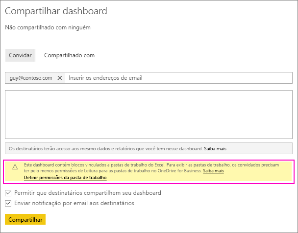
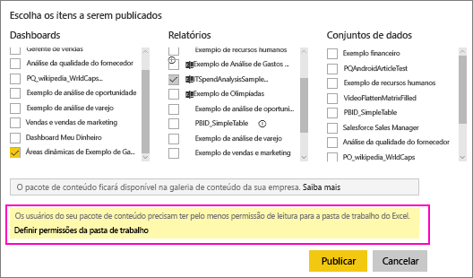
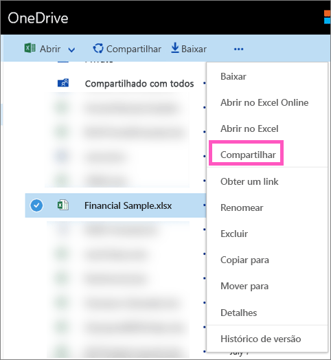

# Compartilhar um dashboard do Power BI que vincula-se a um arquivo do Excel no OneDrive
No Power BI, você pode [se conectar a pastas de trabalho do Excel no OneDrive for Business](service-excel-workbook-files.md) e fixar blocos em um dashboard por meio da pasta de trabalho. Quando você compartilha esse painel ou cria um pacote de conteúdo que o inclui:

* Seus colegas podem exibir os blocos sem precisar de permissões para a pasta de trabalho em si. Sendo assim, você pode criar um pacote de conteúdo e saber que os seus colegas podem ver os blocos criados na pasta de trabalho do Excel no OneDrive.
* Clicar no bloco abre a pasta de trabalho dentro do Power BI. A pasta de trabalho abrirá somente se seus colegas tiverem, pelo menos, [permissões de leitura](https://support.office.com/en-us/article/Share-documents-or-folders-in-Office-365-1fe37332-0f9a-4719-970e-d2578da4941c) à pasta de trabalho no OneDrive for Business.

## Compartilhar um painel que contém o bloco da pasta de trabalho
Para compartilhar um dashboard que é vinculado de volta a uma pasta de trabalho do Excel no OneDrive for Business, veja [Compartilhar um dashboard](service-share-dashboards.md). A diferença é que você tem a opção de modificar as permissões para a pasta de trabalho do Excel vinculada antes de compartilhar.

  

1. Insira os endereços de email de seus colegas.
2. Para permitir que os seus colegas exibam a pasta de trabalho do Excel no Power BI, selecione **Ir para OneDrive para Empresas para definir permissões de pasta de trabalho**.
3. No OneDrive, [modifique as permissões](https://support.office.com/en-US/article/Share-files-and-folders-and-change-permissions-9fcc2f7d-de0c-4cec-93b0-a82024800c07), conforme necessário.
4. Selecione **Compartilhar**.

>[!NOTE]
>Seus colegas não conseguirão fixar blocos adicionais dessa pasta de trabalho e não poderão fazer alterações na pasta de trabalho do Excel do Power BI.
> 
> 

## Criar um pacote de conteúdo organizacional com um dashboard que contém os blocos da pasta de trabalho
Ao [publicar um pacote de conteúdo](service-organizational-content-pack-create-and-publish.md), você fornece acesso a colegas individuais ou a grupos. Ao publicar um pacote de conteúdo que contém links da pasta de trabalho, você terá a opção de modificar as permissões da pasta de trabalho do Excel vinculada antes da publicação.

1. Na tela **Criar pacote de conteúdo** , insira os endereços de email, dê ao pacote de conteúdo um título e uma descrição e carregue uma imagem.
2. Selecione o painel e/ou um relatório vinculado à pasta de trabalho do Excel no OneDrive para Empresas.
   
    
3. Selecione **Ir para OneDrive para Empresas para definir permissões de pasta de trabalho**.
4. No OneDrive, [modifique as permissões](https://support.office.com/en-US/article/Share-files-and-folders-and-change-permissions-9fcc2f7d-de0c-4cec-93b0-a82024800c07), conforme necessário.
5. Selecione **Publicar**.

## Compartilhar um dashboard de um espaço de trabalho do Power BI
O compartilhamento de um dashboard de um espaço de trabalho do Power BI é semelhante ao compartilhamento de um dashboard de seu próprio espaço de trabalho, com a exceção de que os arquivos estão localizados em um site de espaço de trabalho do Office 365, em vez de seu OneDrive para Empresas privado. Modifique as permissões da pasta de trabalho do Excel antes de compartilhar o dashboard com pessoas fora do espaço de trabalho.

## Próximas etapas
* [Fixar um bloco em um dashboard do Power BI no Excel](service-dashboard-pin-tile-from-excel.md)
* [Conceitos básicos do Power BI](service-basic-concepts.md)
* Mais perguntas? [Experimente a Comunidade do Power BI](http://community.powerbi.com/)

