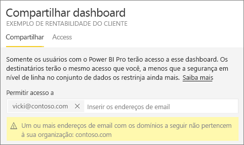
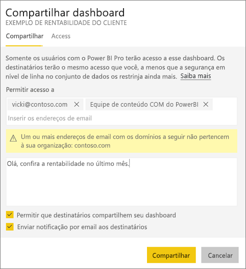
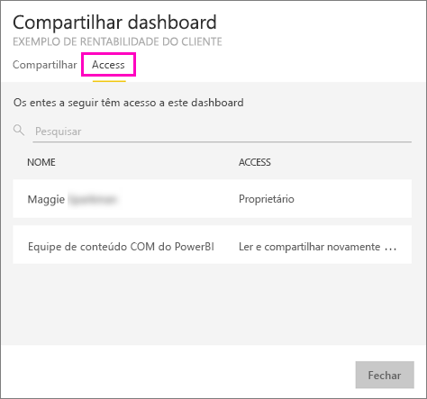
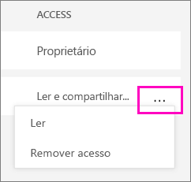

# Compartilhe seus dashboards do Power BI com colegas e outras pessoas
O *compartilhamento* é uma boa maneira de conceder acesso a algumas pessoas aos dashboards e relatórios. O Power BI oferece [várias maneiras de colaborar e distribuir seus dashboards](service-how-to-collaborate-distribute-dashboards-reports.md) e o compartilhamento é apenas uma delas.

Com o compartilhamento, se você compartilhar o conteúdo dentro ou fora de sua organização, você e os destinatários precisarão de uma [licença do Power BI Pro](service-free-vs-pro.md), ou então o conteúdo precisará estar em uma [capacidade Premium](service-premium.md). Sugestões? A equipe do Power BI sempre está interessada em seus comentários. Portanto, acesse o [site da Comunidade do Power BI](https://community.powerbi.com/).

Você pode compartilhar um dashboard do seu próprio Meu Espaço de Trabalho ou de um espaço de trabalho de aplicativo. Quando você compartilha um painel, as pessoas com as quais você o compartilha poderão exibi-lo e interagir com ele, mas não poderão editá-lo. Elas veem os mesmos dados que você no dashboard e nos relatórios, a menos que a [RLS (segurança em nível de linha)](service-admin-rls.md) seja aplicada. Os colegas com quem você o compartilha podem compartilhar o dashboard com os colegas deles, se você permitir. Pessoas de fora de sua organização também podem exibir e interagir com o dashboard, mas não podem compartilhá-lo. 

Você também pode [compartilhar um dashboard de qualquer um dos aplicativos móveis do Power BI](mobile-share-dashboard-from-the-mobile-apps.md). Você pode compartilhar dashboards do serviço do Power BI e dos aplicativos móveis do Power BI, mas não do Power BI Desktop.

## Vídeo: compartilhar um dashboard
Veja Amanda compartilhando seu dashboard com os colegas dentro e fora da empresa. Em seguida, siga as instruções passo a passo abaixo do vídeo para testá-la por conta própria.

<iframe width="560" height="315" src="https://www.youtube.com/embed/0tUwn8DHo3s?list=PL1N57mwBHtN0JFoKSR0n-tBkUJHeMP2cP" frameborder="0" allowfullscreen></iframe>

## Compartilhar um painel
1. Em Meu Espaço de Trabalho ou em um espaço de trabalho do aplicativo, abra um dashboard e selecione **Compartilhar** .
2. Na caixa superior, insira os endereços de email completos dos indivíduos, grupos de distribuição ou grupos de segurança. Você não pode compartilhar com listas de distribuição dinâmicas. 
   
   Você pode compartilhar com as pessoas cujos endereços estejam fora da organização, mas verá um aviso.
   
     
3. Adicione uma mensagem, se desejar. É opcional.
4. Para permitir que seus colegas compartilhem o dashboard com outras pessoas, marque a opção **Permitir que os destinatários compartilhem seu dashboard**.
   
   A permissão de compartilhamento por outras pessoas é chamada *novo compartilhamento*. Se você permitir, elas poderão compartilhar novamente por meio do serviço e dos aplicativos móveis do Power BI ou encaminhar o convite por email para outras pessoas em sua organização. O convite expira após um mês. As pessoas de fora da sua organização não podem compartilhar novamente. Como o proprietário do dashboard, você pode desligar o novo compartilhamento ou revogá-lo individualmente. Consulte [Impedir o compartilhamento de um dashboard ou impedir que outras pessoas compartilhem](service-share-dashboards.md#stop-sharing-a-dashboard-or-stop-others-from-sharing), abaixo.
5. Selecione **Compartilhar.**
   
     
   
   O Power BI envia um convite por email para os indivíduos, mas não para grupos, com um link para o dashboard compartilhado. Você verá uma notificação de **Êxito**. 
   
   Quando os destinatários de sua organização clicarem no link, o Power BI adicionará o dashboard às suas páginas de lista **Compartilhado comigo**. Eles podem selecionar seu nome para ver todos os dashboards que você compartilhou. 
   
   
   
   Quando os destinatários fora de sua organização clicarem no link, eles verão o dashboard, mas não no portal normal do Power BI. Consulte [Compartilhar um dashboard com pessoas fora de sua organização](service-share-dashboards.md#share-a-dashboard-with-people-outside-your-organization) abaixo para obter detalhes.

## Quem tem acesso a um dashboard que você compartilhou?
Às vezes, você precisa ver as pessoas com quem você compartilhou um dashboard e ver com quem elas o compartilharam.

1. Na lista de dashboards ou no próprio dashboard, selecione **Compartilhar** . 
2. Na caixa de diálogo **Compartilhar dashboard**, selecione **Acessar**.
   
    
   
    As pessoas externas à sua organização são listadas como **Convidado**.

## Impedir o compartilhamento de um dashboard ou impedir que outras pessoas compartilhem
Somente o proprietário do painel pode ativar e desativar o novo compartilhamento.

### Se você ainda não enviou o convite de compartilhamento
* Desmarque a caixa de seleção **Permitir que os destinatários compartilhem seu dashboard** na parte inferior do convite antes de enviá-lo.

### Se você já compartilhou o dashboard
1. Na lista de dashboards ou no próprio dashboard, selecione **Compartilhar** . 
2. Na caixa de diálogo **Compartilhar dashboard**, selecione **Acessar**.
   
    
3. Selecione as reticências (**...**) ao lado de **Ler e compartilhar novamente** e selecione:
   
   
   
   * **Ler** para impedir que a pessoa compartilhe-o com outras pessoas.
   * **Remover o acesso** para impedir que a pessoa veja o dashboard.

4. Na caixa de diálogo **Remover acesso**, decida se deseja remover o acesso ao conteúdo relacionado, também, como relatórios e conjuntos de dados. Se você remover os itens com um , convém remover o conteúdo relacionado porque ele não será exibido corretamente.

## Compartilhar um dashboard com pessoas fora de sua organização
Quando você compartilha um dashboard com pessoas fora de sua organização, elas recebem um email com um link para o dashboard compartilhado e precisam entrar no Power BI para vê-lo. Se não tiverem uma licença do Power BI Pro, elas podem inscrever-se para receber uma depois de clicar no link.

Depois de entrar, elas poderão ver o painel compartilhado em sua própria janela do navegador sem o painel de navegação à esquerda, e não no portal do Power BI normal. Elas precisam do indicador no link para acessar esse painel no futuro.

Elas não podem editar nenhum conteúdo nesse painel ou relatório. Elas podem interagir com os gráficos no relatório (realce cruzado) e alterar filtros/segmentações disponíveis nos relatórios conectados ao dashboard, mas não podem salvar suas alterações.

Somente os destinatários diretos podem ver o painel compartilhado. Por exemplo, se você enviou o email para Vicki@contoso.com, somente Valentina poderá ver o dashboard. Ninguém mais poderá ver esse painel, mesmo se tiver o link, e a Clara terá de usar o mesmo endereço de email para acessar o painel. Se ela se inscrever com qualquer outro endereço de email, não terá acesso ao painel.

As pessoas fora de sua organização não poderão ver os dados se a segurança em nível de linha ou de função for implementada nos modelos de tabela locais do Analysis Services.

Se você enviar um link em um aplicativo móvel do Power BI para pessoas fora de sua organização, quando elas clicarem no link, o dashboard será aberto em um navegador, não no aplicativo móvel do Power BI.

## Limitações e considerações
Coisas para se lembrar a respeito do compartilhamento de dashboards:

* Em geral, você e seus colegas veem os mesmos dados no dashboard. Portanto, se você tiver permissões para ver mais dados do que eles, eles poderão ver todos os seus dados no seu painel. No entanto, se a [RLS (segurança em nível de linha)](service-admin-rls.md) for aplicada ao conjunto de dados subjacente a um dashboard, as credenciais de cada pessoa serão usadas para determinar quais dados elas podem acessar.
* Todas as pessoas com quem você compartilha o dashboard podem vê-lo e interagir com os relatórios no [Modo de Exibição de Leitura](service-reading-view-and-editing-view.md). Elas não podem criar relatórios nem salvar alterações nos relatórios existentes.
* Ninguém pode ver ou baixar o conjunto de dados.
* Qualquer pessoa pode [atualizar os dados do dashboard](refresh-data.md) manualmente.
* Se você usar o Office 365 para email, poderá compartilhar com os membros de um grupo de distribuição inserindo o endereço de email associado ao grupo de distribuição.
* Os colegas que têm o mesmo domínio de email que você e os colegas cujos domínios são diferentes, mas que estão registrados no mesmo locatário, podem compartilhar o dashboard com outras pessoas. Por exemplo, digamos que os domínios contoso.com e contoso2.com estejam registrados no mesmo locatário. Se seu endereço de email for konrads@contoso.com, ravali@contoso.com e gustav@contoso2.com poderão compartilhar, desde que você tenha dado a eles permissão para compartilhar.
* Se seus colegas já tiverem acesso a um dashboard específico, você poderá enviar um link direto para esse dashboard apenas copiando a URL quando estiver no dashboard. Por exemplo: `https://powerbi.com/dashboards/g12466b5-a452-4e55-8634-xxxxxxxxxxxx`
* Da mesma forma, se seus colegas já tiverem acesso a um dashboard específico, você poderá [enviar um link direto para o relatório subjacente](service-share-reports.md). 

## Solucionar problemas de compartilhamento

### Destinatários do meu painel verão um ícone de bloqueio em um bloco ou uma mensagem "A permissão necessária"

As pessoas com as quais você compartilha poderão ver um bloco bloqueado em um painel ou uma mensagem "Permissão necessária" ao tentarem exibir um relatório.

Nesse caso, você precisa conceder a permissão para o conjunto de dados subjacente. Aqui está como.

1. Vá para a guia **Conjuntos de dados** na sua lista de conteúdo.

1. Selecione as reticências (**...**) ao lado do conjunto de dados > **Gerenciar permissões**.

    

3. Selecione **Adicionar usuário**.

    

1. Insira os endereços de email completos dos indivíduos, grupos de distribuição ou grupos de segurança. Você não pode compartilhar com listas de distribuição dinâmicas.

    

5. Selecione **Adicionar**.

### Não consigo compartilhar um painel

Para compartilhar um painel, você precisa ter permissão para compartilhar novamente o conteúdo subjacente – todos os relatórios e conjuntos de dados relacionados. Se você vir uma mensagem informando que não é possível compartilhar, peça ao autor do relatório para dar a você permissão para compartilhar novamente os relatórios e conjuntos de dados.

## Próximas etapas
* Tem comentários? Vá para o [site da comunidade do Power BI](https://community.powerbi.com/) para fazer sugestões.
* [Como devo colaborar e compartilhar relatórios e dashboards?](service-how-to-collaborate-distribute-dashboards-reports.md)
* [Compartilhar apenas um relatório do Power BI](service-share-reports.md)
* Dúvidas? [Experimente a Comunidade do Power BI](http://community.powerbi.com/).

