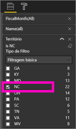
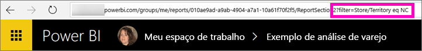

# Compartilhe relatórios do Power BI com seus colegas
O *compartilhamento* é uma boa maneira de conceder acesso a algumas pessoas aos dashboards e relatórios. O Power BI oferece [várias maneiras de colaborar e distribuir os relatórios](service-how-to-collaborate-distribute-dashboards-reports.md) e o compartilhamento é apenas uma delas.

Com o compartilhamento, você e os destinatários precisarão de uma [licença do Power BI Pro](service-free-vs-pro.md) ou então o conteúdo precisará estar em uma [capacidade Premium](service-premium.md). Sugestões? A equipe do Power BI sempre está interessada em seus comentários. Portanto, acesse o [site da Comunidade do Power BI](https://community.powerbi.com/).

Compartilhe um relatório com seus colegas no seu mesmo domínio de email, em seu próprio Meu Espaço de Trabalho ou em um espaço de trabalho do aplicativo. Quando você compartilha um relatório, as pessoas com quem você o compartilha podem exibi-lo e interagir com ele, mas não podem editá-lo. Elas veem os mesmos dados que você no relatório, a menos que a [RLS (segurança em nível de linha)](service-admin-rls.md) seja aplicada. 

## Compartilhar um relatório do Power BI
1. No serviço do Power BI, [crie um dashboard](service-dashboard-create.md) com pelo menos um bloco com links para o relatório que você quer compartilhar. 
   
    Mesmo que você queira compartilhar apenas o relatório, precisar criar um dashboard que contenha links para o relatório primeiro e depois compartilhá-lo. 

1. No canto superior direito do dashboard, selecione **Compartilhar**.

     
  
2. Direcione-o aos destinatários pretendidos. Se você não quiser enviar email sobre o dashboard, desmarque a caixa de seleção **Enviar notificação de email aos destinatários**.

     

4. Selecione **Compartilhar**.

      As pessoas com quem você compartilha o dashboard agora têm permissão para ver o relatório subjacente. 

1. Abra o relatório no serviço do Power BI, copie a URL da página de relatório e envie-a aos colegas de trabalho. 
   
    Quando eles selecionarem o link, o Power BI abrirá uma versão somente leitura do relatório.

## Compartilhe uma versão filtrada de um relatório
Se você deseja compartilhar uma versão filtrada de um relatório? Talvez um relatório que mostre apenas os dados para uma cidade específica, vendedor ou ano. Faça isso criando uma URL personalizada.

1. Abra o relatório no [Modo de Exibição de Edição](service-reading-view-and-editing-view.md), aplique o filtro e salve o relatório.
   
   Neste exemplo, estamos filtrando a [amostra de Análise de Varejo](sample-tutorial-connect-to-the-samples.md) para mostrar apenas valores em que **Território** é igual a **NC**.
   
   
2. Adicione o seguinte ao final da URL da página de relatório:
   
   ?filter=*tablename*/*fieldname* eq *value*
   
    O campo deve ser do tipo **string**, e *tablename* e *fieldname* não podem conter espaços.
   
   Em nosso exemplo, o nome da tabela é **Loja**, o nome do campo é **Território** e o valor que desejamos usar para filtrar é **NC**:
   
    ?filter=Store/Territory eq 'NC'
   
   
   
   O navegador adiciona caracteres especiais para representar barras, espaços e apóstrofes, portanto, você acabará com:
   
   app.powerbi.com/groups/me/reports/010ae9ad-a9ab-4904-a7a1-10a61f70f2f5/ReportSection2?filter=Store%252FTerritory%20eq%20%27NC%27

3. Envie essa URL para seus colegas. 
   
   Quando eles selecionarem o link, o Power BI abrirá uma versão somente leitura do relatório filtrado.

## Próximas etapas
* Tem comentários? Vá para o [site da comunidade do Power BI](https://community.powerbi.com/) para fazer sugestões.
* [Como devo colaborar e compartilhar relatórios e dashboards?](service-how-to-collaborate-distribute-dashboards-reports.md)
* [Compartilhar um dashboard](service-share-dashboards.md)
* Mais perguntas? [Experimente a Comunidade do Power BI](http://community.powerbi.com/).

