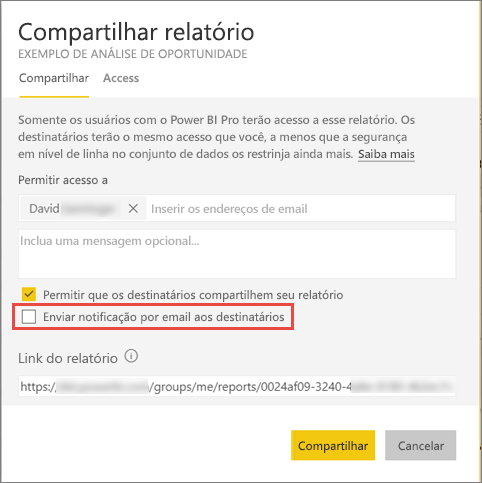

# Compartilhar um relatório do Power BI filtrado com seus colegas
O *compartilhamento* é uma boa maneira de conceder acesso a algumas pessoas aos dashboards e relatórios. O Power BI também oferece [várias outras maneiras para colaborar e distribuir seus relatórios](service-how-to-collaborate-distribute-dashboards-reports.md).

Com o compartilhamento, você e os destinatários precisarão de uma [licença do Power BI Pro](service-free-vs-pro.md) ou então o conteúdo precisará estar em uma [capacidade Premium](service-premium.md). Sugestões? A equipe do Power BI sempre está interessada em seus comentários. Portanto, acesse o [site da Comunidade do Power BI](https://community.powerbi.com/).

Você pode compartilhar um relatório com colegas de trabalho no mesmo domínio de email, da maioria dos lugares no serviço Power BI: seus Favoritos, Recentes, Compartilhado comigo (se o proprietário permite isso), Meu Espaço de Trabalho ou outros espaços de trabalho. Quando você compartilha um relatório, as pessoas com quem você o compartilha podem exibi-lo e interagir com ele, mas não podem editá-lo. Elas veem os mesmos dados que você no relatório, a menos que a [RLS (segurança em nível de linha)](service-admin-rls.md) seja aplicada. 

## Filtrar e compartilhar um relatório
Se você deseja compartilhar uma versão filtrada de um relatório? Talvez um relatório que mostre apenas os dados para uma cidade específica, vendedor ou ano. Faça isso criando uma URL personalizada.

1. Abra o relatório no [Modo de Exibição de Edição](service-reading-view-and-editing-view.md), aplique o filtro e salve o relatório.
   
   Neste exemplo, estamos filtrando a [amostra de Análise de Varejo](sample-tutorial-connect-to-the-samples.md) para mostrar apenas valores em que **Território** é igual a **NC**.
   
   
2. Adicione o seguinte ao final da URL da página de relatório:
   
   ?filter=*tablename*/*fieldname* eq *value*
   
    O campo deve ser do tipo **string**, e *tablename* e *fieldname* não podem conter espaços.
   
   Em nosso exemplo, o nome da tabela é **Loja**, o nome do campo é **Território** e o valor que desejamos usar para filtrar é **NC**:
   
    ?filter=Store/Territory eq 'NC'
   
   
   
   O navegador adiciona caracteres especiais para representar barras, espaços e apóstrofes, portanto, você acabará com:
   
   app.powerbi.com/groups/me/reports/010ae9ad-a9ab-4904-a7a1-xxxxxxxxxxxx/ReportSection2?filter=Store%252FTerritory%20eq%20%27NC%27

3. [Compartilhe o relatório](service-share-dashboards.md), mas desmarque a caixa de seleção **Enviar notificação por email para os destinatários**. 

    

4. Envie o link com o filtro que você criou anteriormente.

## Próximas etapas
* Tem comentários? Vá para o [site da comunidade do Power BI](https://community.powerbi.com/) para fazer sugestões.
* [Como devo colaborar e compartilhar relatórios e dashboards?](service-how-to-collaborate-distribute-dashboards-reports.md)
* [Compartilhar um dashboard](service-share-dashboards.md)
* Mais perguntas? [Experimente a Comunidade do Power BI](http://community.powerbi.com/).

