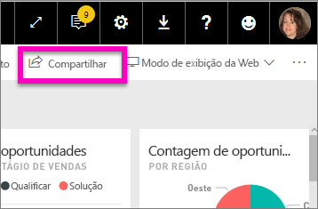
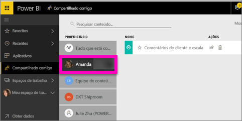

# Exibir os dashboards do Power BI que foram compartilhados comigo
## Compartilhado comigo

Quando um colega compartilha um dashboard com você, o título será adicionado à sua lista **Compartilhado comigo**. O dashboard só está disponível em **Compartilhado comigo** e não está disponível em um espaço de trabalho em **Aplicativos**.

Assista à Amanda explicar a lista de conteúdo **Compartilhado comigo** e demonstrar como navegar na lista e filtrá-la. Em seguida, siga as instruções passo a passo abaixo do vídeo para testá-la por conta própria. Para poder exibir os dashboards que são compartilhados com você, você precisa ter uma licença do Power BI Pro. Leia [O que é o Power BI Premium?](service-premium.md) para obter detalhes.

<iframe width="560" height="315" src="https://www.youtube.com/embed/G26dr2PsEpk" frameborder="0" allowfullscreen></iframe>

Você terá várias opções para interagir com o dashboard e com o relatório subjacente, dependendo das permissões que o proprietário lhe conceder. Isso inclui ser capaz de fazer cópias do dashboard, abrir o relatório [no Modo de exibição de leitura](service-reading-view-and-editing-view.md) e compartilhar novamente com outras colegas.

## Ações disponíveis na tela **Compartilhado comigo**
* Selecionar o ícone de estrela para [adicionar um dashboard como favorito](service-dashboard-favorite.md).
* [Remover um dashboard](service-delete.md)  
* Alguns dashboards podem ser compartilhados novamente  
* Além disso, se suas listas de dashboards se tornarem longas, [use o campo de pesquisa e classificação para encontrar o que precisa](service-navigation-search-filter-sort.md).
  
  > [!NOTE]
  > Para obter informações sobre classificações EGRC, selecione o botão de classificação ou [visite a Classificação de dados no dashboard](service-data-classification.md).
  > 
  > 
* Selecione o nome de um dashboard para abri-lo e explorá-lo. Depois de abrir o dashboard compartilhado, você pode usar P e R para fazer perguntas sobre os dados subjacentes ou selecionar um bloco para abrir e interagir com o relatório no Modo de exibição de leitura.

## Filtrar os dashboards compartilhados por proprietário
O conteúdo na tela **Compartilhado comigo** pode ser adicionalmente filtrado por proprietário do conteúdo. Por exemplo, se eu selecionar **Amanda**, verei somente o dashboard que a Amanda compartilhou comigo.

## Próximas etapas
[Power BI – conceitos básicos](service-basic-concepts.md)  
[Power BI Premium – o que é?](service-premium.md)  

Mais perguntas? [Experimente perguntar à Comunidade do Power BI](http://community.powerbi.com/)

