# Como explorar o serviço do Power BI

Se você já usa o serviço do Power BI há algum tempo, sem dúvida percebeu que fizemos algumas alterações significativas na interface do usuário.  A maioria dessas mudanças afeta a maneira como seu conteúdo (dashboards, relatórios, conjuntos de dados) é organizado e os caminhos (cliques) que você segue para executar tarefas com esse conteúdo. 

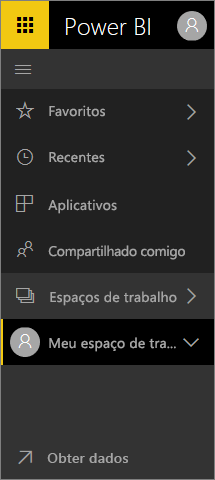

## Como fazer...
Para aqueles que estão familiarizados com a interface antiga do serviço do Power BI, este guia de referência o ajudará a descobrir como executar tarefas na nova interface. Sabemos que pode haver confusão no início, mas acredite: com o uso, você descobrirá muitos benefícios de economia de tempo no novo layout. 

**Guia de referência rápido**

| Ação | Novo caminho (atual) |
| --- | --- | --- |
| Adicionar um dashboard como favorito |Acesse Espaço de trabalho > Dashboards e selecione o ícone de estrela para torná-lo amarelo |
| Exibir uma lista de dashboards favoritos |Selecione **Favoritos** do painel de navegação à esquerda |
| Exibir uma lista de relatórios e dashboards visitados recentemente |Selecione **Recentes** do painel de navegação à esquerda |
| Exibir uma lista de dashboards compartilhados com você |Selecione **Compartilhado comigo** no painel de navegação à esquerda |
| Compartilhar um painel |Abra o dashboard e selecione **Compartilhar** ou crie e publique um aplicativo |
| Excluir um painel |Meu espaço de trabalho > Dashboards > ícone de Lixeira |
| Excluir um relatório |Meu espaço de trabalho > Relatórios > ícone de Lixeira |
| Excluir um conjunto de dados |Meu espaço de trabalho > Conjuntos de dados > ... > Excluir |
| Abra um dashboard |Acesse Espaço de trabalho > Dashboards e selecione o nome do dashboard |
| Abrir um relatório |Acesse Espaço de trabalho > Relatórios e selecione o nome do relatório |
| Abra um conjunto de dados |Acesse Espaço de trabalho > Conjuntos de dados e selecione o nome do conjunto de dados |
| Criar um painel |Na barra de navegação superior, selecione Criar > Dashboard |
| Criar um relatório |Na barra de navegação superior, selecione Criar > Relatório |
| Criar um conjunto de dados |Na barra de navegação superior, selecione Criar > Conjunto de dados |
| Criar um aplicativo |Espaços de trabalho > Criar espaço de trabalho do aplicativo |
| Exibir uma lista de todos seus dashboards, relatórios e conjuntos de dados |Espaços de trabalho > Meu espaço de trabalho |

## Por que mudamos a experiência de navegação do serviço do Power BI?
* simplificação de listas de dashboards, relatórios, pastas de trabalho e conjuntos de dados    
* adicionados os submenus de acesso rápido para: favoritos, mais recentes e seleção de espaço de trabalho    
* adicionada uma maneira de identificar conteúdo relacionado a dashboards, relatórios e conjuntos de dados    
* adição de uma área de conteúdo separada para pastas de trabalho    
* criação de uma área separada para seus dashboards favoritos    
* criação de uma área separada para o conteúdo que foi compartilhado com você 
* criação uma área separada para seu conteúdo mais recente criada  
* redução do número de cliques necessários para realizar tarefas – combinação das listas de conteúdo e as ações que você pode executar nesse conteúdo, na mesma tela. Por exemplo, alternar entre dashboards e relatórios.</td></tr></table>

Assista à Amanda conduzir você em um tour da nova experiência de navegação, explicando e demonstrando as melhorias.  Em seguida, siga as instruções passo a passo embaixo do vídeo para explorar por conta própria.

<iframe width="560" height="315" src="https://www.youtube.com/embed/G26dr2PsEpk" frameborder="0" allowfullscreen></iframe>

## Adicionamos alguns novos recursos
Siga as instruções passo a passo para explorar por conta própria.

### Exibir conteúdo (dashboards, relatórios, pastas de trabalho, conjuntos de dados, espaços de trabalho, aplicativos)
Vamos começar observando como o conteúdo básico (dashboards, relatórios, conjuntos de dados e pastas de trabalho) está organizado. Antes disso, todo o conteúdo era listado no painel de navegação à esquerda. Agora, você ainda tem essa opção, mas o padrão é exibir por tipo de conteúdo dentro do contexto de um espaço de trabalho. Selecione um espaço de trabalho no painel de navegação à esquerda (painel nav. esq.) e as guias do conteúdo associado (dashboards, relatórios, pastas de trabalho e conjuntos de dados) preencherão a tela do Power BI à direita.

Se você tiver o Power BI Gratuito, apenas um espaço de trabalho será exibido – **Meu espaço de trabalho**.

### Dashboards favoritos
Os **favoritos** permitem acessar rapidamente os dashboards que são mais importantes para você.  

1. Com o dashboard aberto, selecione **Adicionar a Favoritos** no canto superior direito.
   
   
   
   **Adicionar a Favoritos** muda para **Remover de Favoritos** e o ícone de estrela se torna amarelo.
   
   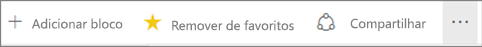
2. Para exibir uma lista de todos os dashboards adicionados aos favoritos, na barra de navegação esquerda, selecione a seta à direita de **Favoritos**. Como a barra de navegação esquerda é um recurso permanente do serviço do Power BI, você tem acesso a essa lista em qualquer lugar do serviço do Power BI.
   
    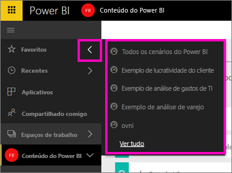
   
    A partir daqui, você pode selecionar um dashboard para abri-lo.
3. Para abrir o painel de **Favoritos**, no menu de navegação à esquerda selecione **Favoritos** ou selecione o ícone de Favoritos .
   
   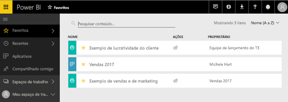
   
   Aqui você pode selecionar um dashboard para abri-lo, ver quem tem um dashboard, remover um dashboard de Favoritos ou compartilhar um com os colegas.
4. Outra maneira de marcar um dashboard como favorito é na guia **Dashboards**.  Basta abrir o espaço de trabalho que contém o dashboard e selecionar o ícone de estrela à esquerda do nome do dashboard.
   
   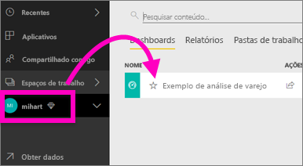

Para obter mais informações, consulte [Adicionar um dashboard como favorito](service-dashboard-favorite.md)

### Recentes
Acesse rapidamente os relatórios e dashboards acessados mais recentemente visitando o painel **Recentes**. Isso inclui o conteúdo de todos os espaços de trabalho.

  

De forma semelhante aos Favoritos, você pode acessar rapidamente o conteúdo recente em qualquer lugar do serviço do Power BI, selecionando a seta ao lado de **Recentes** na barra de navegação esquerda.

  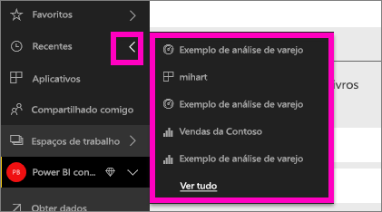

Para obter mais informações, consulte [Recentes no Power BI](service-recent.md)

### Aplicativos
Um aplicativo é uma coleção de dashboards e relatórios criados para fornecer métricas-chave, tudo isso em um só lugar. Você pode ter aplicativos internos para sua organização e também [aplicativos para serviços externos](service-connect-to-services.md), como o Google Analytics e o Microsoft Dynamics CRM. 

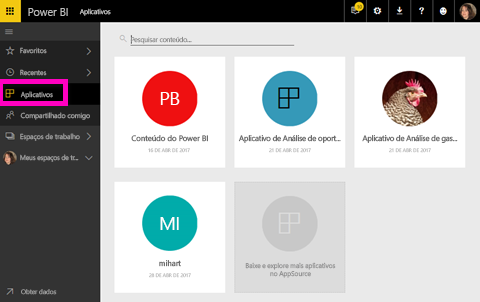

Para obter mais informações, consulte **Espaços de trabalho de aplicativo** (abaixo) e [O que são os aplicativos do Power BI](service-install-use-apps.md).

### Compartilhou comigo
**Compartilhou comigo** é o local de todos os dashboards que os colegas compartilharam com você.  Filtre pelo proprietário do dashboard, use o campo de pesquisa para encontrar o que é relevante e classifique os itens por data.  E quanto ao conteúdo compartilhado que você visita com frequência, é ainda mais fácil incluí-lo nos favoritos pela exibição **Compartilhado comigo**.

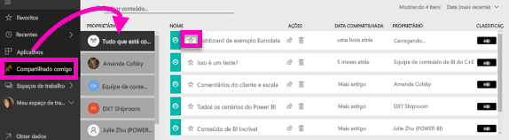

Para obter mais informações, consulte [Compartilhado comigo](service-shared-with-me.md)

### Trabalhando com espaços de trabalho
Em seguida, no painel de navegação à esquerda, estão os *espaços de trabalho*. Os espaços de trabalho podem ser considerados *contêineres* para o conteúdo do Power BI. Há dois tipos de espaços de trabalho: o **Meu Espaço de Trabalho** e os Espaços de trabalho de aplicativo.

Se você não for membro de um espaço de trabalho do aplicativo nem um administrador, talvez nenhum espaço de trabalho do aplicativo seja exibido na barra de navegação esquerda. E se você for um cliente do Power BI Gratuito, não verá nenhum espaço de trabalho do aplicativo.

#### Meu espaço de trabalho
O **Meu Espaço de Trabalho** armazena todo o conteúdo do qual você é proprietário. Pense nele como sua área restrita pessoal ou como área de trabalho para seu próprio conteúdo. Você pode compartilhar o conteúdo do Meu Espaço de Trabalho com seus colegas. No Meu Espaço de Trabalho, seu conteúdo é organizado em 4 guias: Dashboards, Relatórios, Pastas de trabalho e Conjuntos de dados.

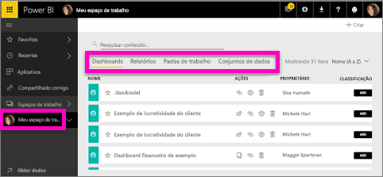

#### Espaços de trabalho de aplicativo
Os aplicativos e espaços de trabalho de aplicativo são um recurso do Power BI Pro. Se você é uma pessoa que cria dashboards e relatórios para outras pessoas, você usará os espaços de trabalho de aplicativo para fazer isso. Um espaço de trabalho de aplicativo é o local em que você criará o aplicativo, portanto, para criá-lo, você primeiro precisará criar o espaço de trabalho do aplicativo. Eles são a evolução dos espaços de trabalho de grupo – áreas de preparo e contêineres para o conteúdo no aplicativo.  Você e seus colegas podem colaborar em dashboards, relatórios e outro conteúdo que você pretende distribuir para um público maior ou até mesmo para toda a sua organização.

Para saber mais, acesse [Criar e distribuir um aplicativo no Power BI](service-create-distribute-apps.md#app-workspaces).

Assim como no **Meu Espaço de Trabalho**, seu conteúdo é organizado em quatro guias: Dashboards, Relatórios, Pastas de trabalho e Conjuntos de dados.

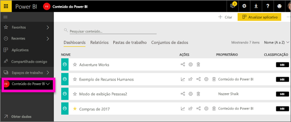

Alterne entre os espaços de trabalho, selecionando **Espaços de trabalho** no menu de navegação à esquerda.

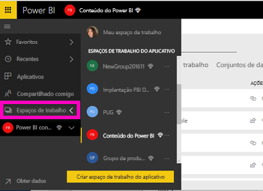

### Pesquisar e classificar conteúdo
A nova exibição de conteúdo torna mais fácil pesquisar, filtrar e classificar seu conteúdo. Para procurar um dashboard, relatório ou pasta de trabalho, digite na área de pesquisa. O Power BI filtra somente o conteúdo que tenha sua cadeia de caracteres de pesquisa como parte do nome.

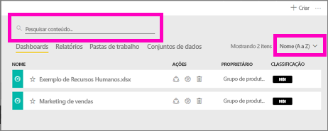

Você também pode classificar o conteúdo por nome ou por proprietário.  

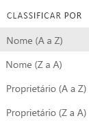

Para saber mais, consulte [Navegação do Power BI: pesquisar, classificar e filtrar](service-navigation-search-filter-sort.md)

## Próximas etapas
Tem dúvidas ou comentários? [Acesse o fórum da comunidade do Power BI](http://community.powerbi.com/t5/Navigation-Preview-Forum/bd-p/NavigationPreview)

