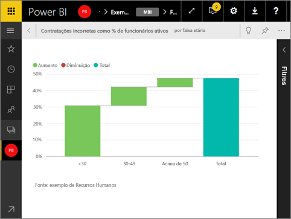

# Exibir um bloco do dashboard no modo de tela inteira
Os blocos devem primeiro estar no [Modo de foco](service-focus-mode.md) antes que possam ser exibidos no modo de Tela Inteira.

## O que é o modo de Tela Inteira?
Exiba seus [dashboards, relatórios](service-fullscreen-mode.md) e blocos sem a distração de menus e botões de navegação.  Você obtém uma visão completa e não adulterada de sua empresa no mesmo instante, o tempo todo. Isso, às vezes, é chamado de Modo de TV.

Alguns usos para o modo de Tela Inteira são:

* apresentar seu bloco em uma reunião ou conferência
* exibir seu bloco em um escritório, em uma tela grande ou projetor dedicado
* visualizar seu bloco em uma tela pequena
* examinar seu bloco no modo bloqueado – você pode tocar na tela ou focalizar o bloco sem abrir o relatório subjacente

## Para ativar (e desativar) o Modo de Tela Inteira
1. [Desencaixe o bloco e exiba-o no modo Foco](service-focus-mode.md).
   
    
   
    O bloco preenche a tela para que você veja mais detalhes. No modo Foco de um bloco do dashboard, é possível exibir e modificar os filtros que foram aplicados quando esse visual foi criado.
   
    
2. Na barra de menus superior, selecione o ícone  para exibir o bloco no modo de Tela Inteira.
3. No modo de Tela Inteira, o bloco preenche toda a tela e é exibido sem a distração de menus e botões de navegação.  Você obtém uma visão completa e não adulterada de seu bloco em um relance, o tempo todo. Isso, às vezes, é chamado de Modo de TV.
   
   
4. Quando você move o mouse, um menu é exibido. O menu permanecerá no canto inferior direito até que você saia do modo de Tela Inteira. Se ele desaparecer, basta mover o cursor ou tocar na tela.
   
    
   
   * Use o botão **Voltar** para navegar até a página anterior no navegador. Se a página anterior era uma página do serviço do Power BI, ela será exibida no modo de Tela Inteira.  O modo de Tela inteira será mantido até você fechar a Tela Inteira.
   * Para imprimir um bloco no modo de Tela Inteira, selecione o ícone de Impressão.
     
   * Para sair do modo de Tela Inteira, selecione o ícone **Fechar Tela Inteira** 

## Próximas etapas
[Dashboards no Power BI](service-dashboards.md)

[Modo de Tela Inteira para relatórios e dashboards](service-fullscreen-mode.md)

[Modo de foco no Power BI](service-focus-mode.md)

Mais perguntas? [Experimente a Comunidade do Power BI](http://community.powerbi.com/)

